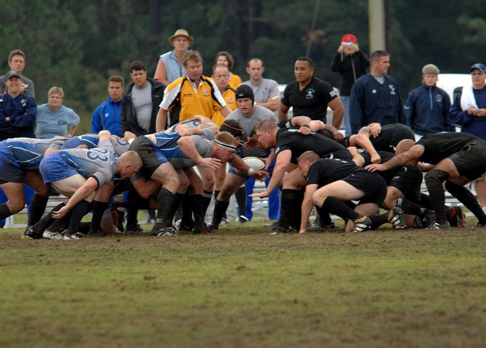
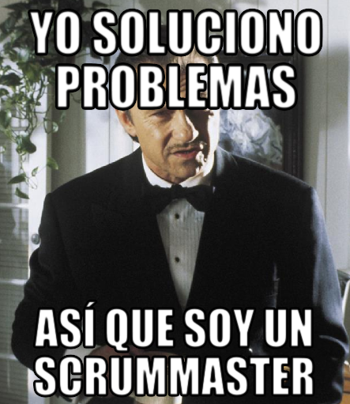
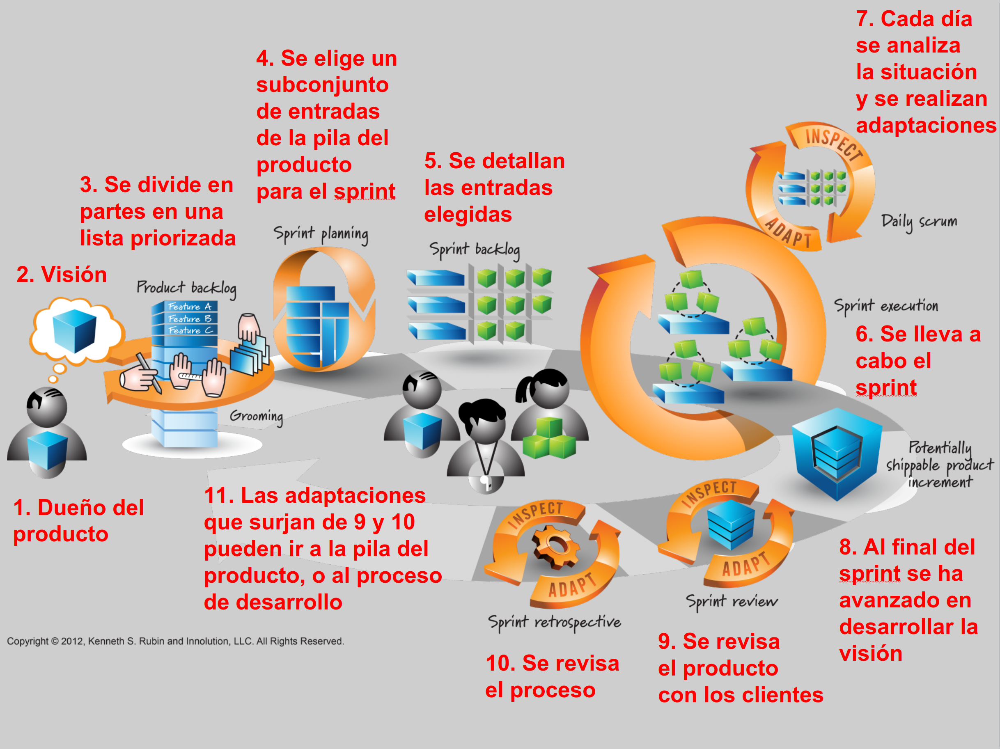

# 7i_GPS-S01-Scrum-Introducción


##  *Introducción a Scrum* **Gestión de Proyectos Software**

*Introducción a Scrum* **Gestión de Proyectos Software**

## Contenidos


-  <u>¿Qué es Scrum?</u>
    -  <u>Origen y razón de ser</u>
-  <u>¿Cuándo elegir Scrum?</u>
-  <u>Componentes de Scrum</u>
    -  <u>Roles, actividades y artefactos</u>

## ¿Qué es Scrum?


-  <u>Aproximación ágil al desarrollo de productos y servicios innovadores</u>
    -  <u>No necesariamente software</u>
-  <u>Se empieza con un lista priorizada de tareas para desarrollar un producto (</u> product backlog <u>, pila del producto)</u>
-  <u>Se va trabajando en las más importantes/prioritarias</u>

## ¿Qué es Scrum?


-  El trabajo se realiza en iteraciones de duración predeterminada ( timeboxed iterations )
    -  Entre una semana y un mes
-  Durante cada iteración, un equipo multidisciplinar ( cross-functional team ) hace todo el trabajo
    -  Diseño, implementación, pruebas...
-  Al final de cada iteración hay algo que se podría poner en producción ya
    -  Luego se pondrá o no se pondrá. Pero se podría

## ¿Qué es Scrum?


-  Al comienzo de cada iteración, el equipo planifica qué subconjunto de tareas abordará
-  Al final de cada iteración, el equipo revisa lo que se ha completado junto a clientes/usuarios
    -  Ese  feedback  permite alterar lo que se va a hacer luego y cómo se va a trabajar

## 




## El origen de Scrum


-  1986: “The New New Product Development Game” (Takeuchi and Nonaka)
    -  Honda, Canon, Fuji-Xerox usan un aproximación escalable y basada en equipos que se auto-organizan
    -  Ya aparece el rugby como metáfora (un equipo que busca  avanzar distancia , llevando el balón atrás y adelante)
-  1993: Jeff Sutherland y su equipo crean el proceso Scrum para desarrollo de software
    -  Teniendo en cuenta el artículo de 1986, desarrollo orientado a objetos, control de procesos empírico, desarrollo iterativo e incremental, investigación en procesos y productividad en software y sistemas complejos adaptativos
-  1997: Ken Schwaber publica el primer artículo sobre Scrum
    -  En este artículo Schwaber habla de “metodología Scrum”. A pesar de esto, hay gente que cree no se puede hablar de “metodología” al referirnos a Scrum
    -  El Scrum que describe en este artículo ya se parece a la versión que vamos a ver, pero se nota que está todavía un poco verde
    -  El manifiesto ágil, del que Schwaber es uno de los firmantes, es del año 2001, y eXtreme Programming (XP) nace en el 1999, así que Scrum les precede

## ¿Por qué Scrum?


-  Una empresa (Genomica) de informática en investigación genética reporta grandes mejoras
    -  1/10 parte del esfuerzo de desarrollo (en personas-mes)
    -  7 veces más características valiosas por unidad de tiempo que antes
    -  Y mayor satisfacción del cliente

## 


## ¿Por qué Scrum?


-  Hay que entenderlo en su contexto
-  Tenían un dominio complejo e innovador (informática para investigación genética)…
    -  Ideal para aplicar Scrum
-  …  y utilizaban un proceso dirigido por planificación y  con desarrollo en cascada  ( waterfall )
    -  Lo menos ideal para trabajar en algo complejo

## 


##  ¿Cuándo elegir Scrum?

¿Cuándo elegir Scrum?

## Cynefin framework


```
© 2014 Snowded, under a Creative Commons Attribution-Share Alike 3.0 Unported license
```


## Dominio Complejo


-  Cosas más impredecibles que predecibles
    -  Hay  unknown unknowns    
        -  Esas cosas que ni siquiera sabes que no las sabes
-  Ideas que compiten entre sí
    -  Y no necesariamente unas son correctas y otras incorrectas
-  Hacen falta soluciones creativas
-  Interacción y comunicación son esenciales
-  Trabajamos explorando diversas alternativas, evaluando cada una de estas y respondiendo en base a lo que sabemos hacer
    -  La exploración hace que afloren los  unknown unknowns
-  Un ejemplo de este dominio es el desarrollo de nuevos productos  innovadores
-  Scrum se adapta especialmente bien a este dominio


## Dominio Complicado


-  Hay buenas prácticas dominadas por expertos
    -  Las relaciones de causa y efecto no son obvias, hace falta un experto para encontrarlas
    -  Puede haber más de una respuesta correcta
-  Tenemos  known unknowns
    -  Hay cosas que no sabemos, pero sabemos cuáles son esas cosas
-  Trabajamos evaluando los hechos que se nos presentan, analizando distintas opciones para afrontarlos y luego respondiendo en base a lo que sabemos hacer 
-  Un ejemplo de este dominio es el mantenimiento (mejoras y corrección de errores) de software en producción o el dimensionamiento de un sistema web para dar soporte a distintos números de usuarios
-  Scrum puede servir, pero puede no ser la mejor opción en este dominio
    -  Suele ser preferible dejar estos problemas en manos de gente experimentada y darles libertad para trabajar


## Dominio Simple


-  Las relaciones causa-efecto son evidentes para cualquiera
-  Hay soluciones correctas conocidas una vez hemos determinado cuál es el problema
    -  Suelen ser obvias y nadie las discute
-  Trabajamos evaluando los hechos que se nos presentan, viendo de qué tipo son, y elaborando respuestas en base a lo que sabemos hacer
    -  Siempre nos aparecen los mismos tipos de cosas, así que es fácil tener soluciones ya establecidas para ellas
-  Un ejemplo de esto puede ser configurar y adaptar un software genérico para el n-ésimo cliente y conectarlo con sus sistemas
-  Scrum puede servir, pero puede no ser la opción más eficiente en este dominio
    -  La solución ideal es que haya un proceso definido, con pasos claros y repetibles


## Dominio Caótico


-  Hay una crisis y hay que responder rápido
-  No hay relaciones causa-efecto claras
-  Hay que tomar muchas decisiones sin tiempo para pensar
-  Trabajamos evaluando los hechos y elaborando respuestas en base a lo que sabemos hacer
    -  Pero actuar cuanto antes es crítico, así que generalmente no esperamos a tener una respuesta óptima o una evaluación detallada de la situación
-  Por ejemplo, estamos en el dominio caótico cuando la última versión que hemos desplegado en producción de nuestro software tiene un fallo crítico y no tenemos un mecanismo sencillo para volver a la versión anterior
-  Scrum no es la mejor solución
    -  Por ejemplo, no hay que ponerse a priorizar cosas, alguien tiene que hacerse cargo y actuar inmediatamente


## Desorden


-  Estás en este dominio si no sabes en qué otro dominio estás
-  No intentas aplicar Scrum a este dominio
    -  Lo que intentas es salir de ahí lo antes posible


## ¿Dónde está el desarrollo de software?


-  El desarrollo de software suele estar en el dominio complicado o el complejo
    -  Al menos algunas partes del desarrollo, quizás ciertos módulos críticos, suelen estar en estos dominios
    -  Pero no siempre    
        -  Hay trabajos que son más simples que otros

##  Componentes de Scrum

Componentes de Scrum

## ¿Qué es Scrum?


-  No  es un proceso estandarizado en el que siguiendo unos pasos definidos produces un producto en plazo, sin pasarte del presupuesto y satisfaciendo al cliente 
-  Sí  es un marco ( framework ) para organizar y gestionar trabajo, basado en unos  valores, principios y prácticas , que proporciona una base para que tu organización construya una aproximación propia

## 


## ¿Ceremonias?


-  En ocasiones, a las actividades de Scrum se las denomina ceremonias o rituales
-  Si pensamos en estas actividades como ceremonias, tenemos dos problemas
    -  El foco está donde no debe    
        -  Debería estar siempre en los principios y en los valores, no en las propias actividades
    -  La palabra ceremonia (o ritual) tiene connotaciones que en un contexto de ingeniería son negativas    
        -  Realizar unas actividades siguiendo unos pasos dados pero sin entender realmente lo que estamos haciendo, no nos permite darnos cuenta si las hacemos mal, ni adaptarlas a nuevas circunstancias, ni proponer mejoras

##  Roles

Roles

## Roles


-  El trabajo se hace en equipos Scrum
-  En cada equipo hay tres roles: dueño del producto ( product owner) , ScrumMaster y el equipo de desarrollo
    -  Puede haber otros, pero Scrum solo requiere estos
-  Dueña/o del producto
    -  Responsable de lo que se va a desarrollar y en qué orden
-  ScrumMaster
    -  Guía al equipo en la creación y el seguimiento de un proceso basado en Scrum
-  Equipo de desarrollo
    -  Encargados de determinar como llevar a cabo lo que el dueño del producto ha pedido

## 


## Roles


-  Con o sin gestores (managers, gerentes, directores...), todos los proyectos se gestionan
    -  Esa gestión puede recaer sobre todo en una única persona, o estar repartida entre el equipo     
        -  Esto último es más compatible con Scrum
    -  A veces esa gestión no es consciente y sistemática    
        -  Aunque debería
-  Los directores/as “tradicionales” tienen su papel y lo veremos cuando tratemos en profundidad sobre los roles
-  Pero el de director/a es un rol que Scrum ni define ni requiere

## Dueño/a del producto


-  Autoridad única que decide qué características y funcionalidad se desarrollan, y en qué orden
-  Tiene, y comunica al equipo, una visión clara de lo que se trata de construir

## ScrumMaster


-  Ayuda a todos a comprender y aceptar los valores, principios y prácticas de Scrum
-  Soluciona problemas que impiden al equipo usar Scrum efectivamente o que les impiden ser productivos
-  No tiene autoridad sobre el equipo
    -  No es la versión Scrum de la directora del proyecto

## 




## Equipo de desarrollo


-  Equipo multidisciplinar de gente que tiene que diseñar, construir y probar el producto 
    -  Desarrolladores/as, diseñadores/as gráficos, testers, documentalistas...
-  El equipo de desarrollo se auto-organiza
-  Habitualmente se hacen equipos de entre 5 y 9 personas
-  Si es un proyecto más grande, se hará entre varios equipos

##  Actividades y artefactos

Actividades y artefactos

## 




## Pila del producto (product backlog)


-  Una lista  priorizada  del trabajo a realizar
    -  Responsabilidad del dueño del producto
-  Al principio son, esencialmente, requisitos funcionales
    -  Los necesarios para implementar la visión
-  Pero luego se incluirán nuevos requisitos, cambios en características ya implementadas, errores que hay que solucionar, mejoras técnicas etc.
    -  Por eso no hablamos de requisitos simplemente, sino que normalmente diremos entradas de la pila o de PBI ( product backlog items )
-  El dueño del producto es responsable de la pila, pero mantendrá siempre un diálogo con el equipo para su mantenimiento
-  Se denomina  grooming  al mantenimiento de la pila
    -  Creación de entradas nuevas, refinado de las que hay, estimación y priorización
-  Hay que estimar el tamaño (coste) de cada entrada de la pila para ayudar a determinar su prioridad

## Sprint


-  Iteración de hasta un mes de duración en la que se realiza el trabajo en Scrum
    -  Se suceden hasta el fin del proyecto
-  El trabajo terminado en cada sprint debería crear algo de valor tangible para clientes/usuarios
-  La duración está predeterminada ( timeboxed )
-  Dentro de un sprint, no se permite cambiar ni el objetivo del mismo, ni al equipo Scrum
    -  Siempre que sea posible

## Planificación del Sprint


-  El dueño del producto y el equipo de desarrollo acuerdan un objetivo para el sprint ( sprint goal )
-  A partir del objetivo del sprint, el equipo de desarrollo revisa la pila del producto y determina qué entradas de alta prioridad puede llevar a cabo a un ritmo sostenible ( sustainable pace ) en ese sprint
-  El equipo de desarrollo divide las entradas de la pila del producto elegidas en tareas, que junto a estas entradas formarán el  sprint backlog  (pila del sprint)
    -  Las entradas de la pila y las tareas (tasks) son cosas distintas y debemos esforzarnos en no confundirlas
    -  La pila del producto y la pila del sprint son cosas distintas y debemos esforzarnos en no confundirlas
-  El equipo de desarrollo estimará el esfuerzo de cada tarea y, sumando eso, el esfuerzo total requerido para el sprint
    -  Típicamente en horas ideales
-  La planificación de un  sprint puede tardar hasta  dos horas por cada semana que dure el  sprint
    -  Aunque cogiendo un poco de práctica, un sprint típico se puede planificar bastante más rápido

## Ejecución del Sprint


-  Una vez se ha planificado el sprint, el equipo de desarrollo, apoyado por el ScrumMaster, lleva a cabo las tareas de la pila del sprint
    -  Hasta el punto de tenerlas a nivel de producción
-  El equipo de desarrollo se organizará como prefiera para llevar a cabo estas tareas

## Scrum Diario (Daily Scrum)


-  Cada día del  sprint , normalmente a la misma hora, el equipo de desarrollo tiene una reunión de duración predeterminada (15 minutos o menos)
    -  Es común que nadie se siente, para enfatizar la brevedad
-  Normalmente el ScrumMaster hace de “facilitador” de la reunión

## Scrum Diario (Daily Scrum)


-  Típicamente cada miembro del equipo de desarrollo contesta tres preguntas
    -  ¿Qué he logrado desde el último scrum diario?
    -  ¿En qué planeo trabajar hasta el próximo?
    -  ¿Qué cosas me dificultan hacer progresos?
-  Contestando esas tres preguntas, todo el mundo sabe lo que ocurre, cómo se está progresando y qué problemas hay que solucionar
-  Aquí no se resuelven problemas
    -  Los que surjan se pueden resolver más tarde entre los directamente involucrados

## Hecho


-  Los resultados de un  sprint  deben ser un incremento del producto potencialmente listo para ser usado ( potentially shippable product increment )
    -  Por ejemplo: diseñado, implementado, integrado, probado y documentado
    -  Una definición más agresiva podría llegar a considerar que al final de cada sprint se entrega una nueva versión/revisión a usuarios/as
-  En los primeros  sprints  de desarrollo de un producto innovador, se puede usar una definición un poco menos ambiciosa de “hecho”

## Revisión del Sprint


-  Sirve para inspeccionar y adaptar el  producto  que se está construyendo
-  Participa todo el equipo Scrum y todos los interesados ( stakeholders )
    -  Clientes, patrocinadores, inversores, miembros de otros equipos Scrum, la dirección de la empresa...
-  Se revisa lo que se acaba de completar en el contexto del esfuerzo de desarrollo general

## Retrospectiva del Sprint


-  Sirve para inspeccionar y adaptar el  proceso  que se sigue
-  El equipo Scrum discute lo que funciona y lo que no con Scrum y con otras técnicas que se apliquen
-  Se deciden las acciones para mejorar el proceso que se llevarán a cabo en el siguiente  Sprint

## Bibliografía


-  Kenneth S. Rubin.  Essential Scrum. A practical guide to the most popular agile process
    -  Chapters 1,2 (Introduction, Scrum Framework)

## 


