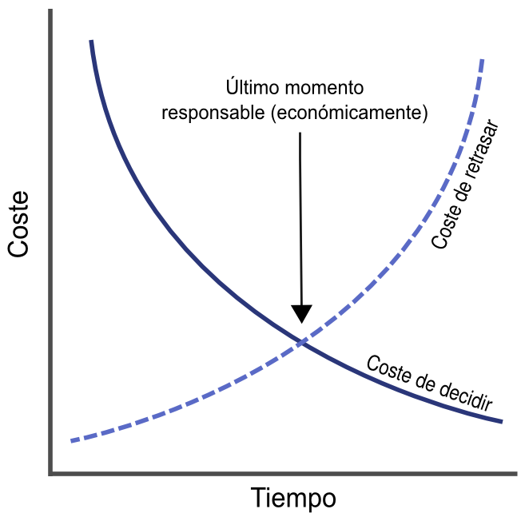
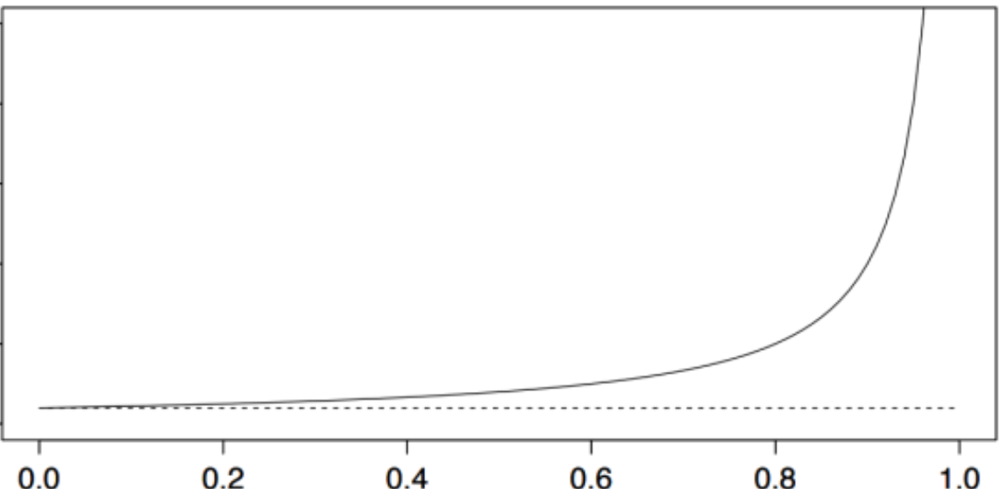

# 7i_GPS-S02-Scrum-PrincipiosÁgiles

##  *Principios ágiles en Scrum* **Gestión de Proyectos Software**

*Principios ágiles en Scrum* **Gestión de Proyectos Software**

## Contenidos

-  Desarrollo dirigido por planes
-  Principios ágiles en Scrum
    -  1. Variabilidad e incertidumbre
    -  2. Predicción y adaptación
    -  3. Trabajo en marcha
    -  4. Progreso
    -  5. Rendimiento

##  Desarrollo dirigido por planes

Desarrollo dirigido por planes

## Desarrollo dirigido por planes

-  Tradicional, secuencial, predictivo, prescriptivo…
    -  Analiza (comprende) → diseña → implementa → prueba → despliega/entrega
-  Se planifica todo lo que se querría en el producto final, y se determina cómo construirlo
-  Se asume que cuanto mejor sea la planificación, mejor se entenderá el problema y por lo tanto mejor se podrá llevar a cabo
-  Se adapta bien a problemas claramente definidos, predecibles y que no van a cambiar significativamente
    -  Porque habrá poco  feedback , y llegará tarde
-  El problema es que muchos desarrollos de productos son todo menos predecibles
    -  Especialmente al principio

## Desarrollo dirigido por planes

-  Este planteamiento parece que tiene sentido y que, por tanto,  debería  funcionar
    -  Si no funciona, se sigue insistiendo    
        -  “ Algo habremos hecho mal porque esto  debería  funcionar”
-  Pero cuando esto no funciona suele ser, en buena medida, porque este modelo  está basado en  creencias  que no suelen ser ciertas  en el desarrollo de productos (mínimamente innovadores)
    -  Especialmente una, que es la de que podemos predecir y entender por anticipado todo lo que es relevante para el desarrollo de ese producto

## 

## ¿De veras?

-  ¿Ya sabe tu clienta (quizás eres tú misma) todos los requisitos que va a tener tu producto?
    -  ¿Y te los puede explicar, con el detalle suficiente como para implementarlos, el primer día/semana/mes?
    -  ¿Y no va cambiar de opinión cuando vea el primer prototipo? Ah, no, que no le vas a enseñar ningún prototipo...     
        -  Pues cuando vea un producto de la competencia, o la próxima versión de Android...
-  ¿Ya sabes cuáles van a ser tus usuarios y cómo van a reaccionar a tu producto?
    -  ¿Reaccionarán todos igual, o variará por grupos, conocimientos, mercados...?
    -  Porque supongo que no quieres hacer un producto “fantástico” que nadie quiere

## ¿De veras?

-  ¿Conoces todas las tecnologías que vas a usar? ¿Y cómo van a evolucionar (o a dejar de hacerlo) mientras tú desarrollas tu producto?
-  ¿Nadie de tus equipos de desarrollo se va a ir a mitad del proyecto?
    -  ¿Tampoco vas a contratar a alguien nuevo?
-  Y aunque supieras todo lo anterior, ¿eres capaz de predecir antes de empezar todas las posibles interacciones y problemas que pueden surgir?
    -  Ni el conocimiento, ni la experiencia, ni herramientas, métodos o análisis de riesgos, te permiten anticipar todos los “ unknown unknowns ”

## En resumen

-  Tu producto es más complejo de lo que puedes entender al principio
-  Tienes un entorno que no puedes controlar ni predecir, pero que te influye mucho

## 

##  Principios ágiles en Scrum

Principios ágiles en Scrum

##  Principio 1. Variabilidad e incertidumbre

Principio 1. Variabilidad e incertidumbre

## Variabilidad e incertidumbre

-  Con Scrum puedes aprovechar la variabilidad y la incertidumbre en el desarrollo de productos para crear soluciones innovadoras
-  Como vamos a ver a continuación:
    -  Acepta la variabilidad útil
    -  Usa un desarrollo iterativo e incremental
    -  Aprovecha la variabilidad útil
    -  Reduce las incertidumbres

## Acepta la variabilidad útil

-  El desarrollo de productos no es como la fabricación de productos
-  En  fabricación  se toman unos requisitos fijos y se siguen unos pasos conocidos para fabricar productos que siempre son iguales
    -  Con cierta variedad limitada    
        -  Por ejemplo, la pintura o el tipo de llantas, en una cadena de montaje de automóviles
-  En  desarrollo  el objetivo es crear una única instancia de un producto
-  Esta instancia es análoga a una receta
    -  No queremos crear la misma receta dos veces
-  La variabilidad en el desarrollo aparece porque
    -  Cada desarrollo de producto es de un producto nuevo
    -  Y dentro de un único producto, cada una de sus características es distinta a las demás

## Desarrollo iterativo e incremental

-  Iterativo
    -  Entenderemos las cosas mal antes de entenderlas bien
    -  Por tanto planificamos múltiples pasadas para mejorar lo que hacemos hasta llegar a una buena solución
    -  Prototipo → prototipo mejorado → … → primera versión → … → versión final
    -  En Scrum trabajamos en sprints
-  Incremental
    -  El producto completo será un sistema complejo
    -  Por tanto dividimos el producto en partes pequeñas, y las vamos construyendo, probando y encajando, paso a paso
    -  En Scrum, en cada sprint se aborda un incremento del producto que estamos desarrollando

## Ley de Gall

A complex system that works is invariably found to have evolved from a simple system that worked. A complex system designed from scratch never works and cannot be patched up to make it work. You have to start over with a working simple system John Gall (1975),  Systemantics: How Systems Really Work and How they Fail , p.70 De cada sistema complejo que funciona se descubre invariablemente que ha evolucionado a partir de un sistema simple que ya funcionaba. Un sistema complejo diseñado de cero nunca funciona y no se puede parchear para hacer que funcione. Tienes que empezar de nuevo con un sistema simple que funciona

## Aprovecha la variabilidad

-  Scrum acepta que el proceso necesario para crear algo nuevo es complejo y desafía una definición completa a priori
    -  Esto es la variabilidad
-  Y aprovecha esto (variabilidad útil)
    -  Obteniendo  feedback  frecuentemente para asegurarse de que se construye el producto correcto y que se construye correctamente
-  Para ello se basa en la transparencia
    -  La información importante está disponible para quienes crean el producto y para quienes lo van a usar
-  La transparencia permite la inspección, que es el paso previo para la adaptación
    -  Y además mejora la comunicación y la confianza, tanto en el proceso como entre los miembros del equipo

## Reduce la incertidumbre

-  Las incertidumbres son las dudas sobre el producto que estamos desarrollando que inevitablemente vamos a tener, salvo que sea muy simple
    -  Hemos mencionado algunos ejemplos antes
-  Podemos clasificarlas en:
    -  Incertidumbre de fines    
        -  Sobre las características del producto final
    -  Incertidumbre de medios    
        -  Sobre el proceso y las tecnologías usados para desarrollar el producto
    -  Incertidumbre de clientes    
        -  Sobre quién usará el producto (común en productos muy innovadores)

## Reduce la incertidumbre

-  Las metodologías tradicionales se focalizan en eliminar la incertidumbre de fines definiendo completamente lo que se va a construir antes de empezar
    -  Y luego ya la de medios
-  El problema es que en el dominio complejo, ambas incertidumbres suelen estar estrechamente relacionadas
    -  Y también la de clientes

## Reduce la incertidumbre

-  Scrum aborda todas las incertidumbres al mismo tiempo
-  Gracias a la aproximación iterativa e incremental guiada por la inspección y adaptación continuas y a la transparencia
-  Esto permite sondear el entorno para identificar y aprender sobre los “ unknown unknowns”  según van surgiendo

##  Principio 2. Predicción y adaptación

Principio 2. Predicción y adaptación

## Predicción y adaptación

-  Con Scrum se intenta equilibrar el deseo de predecir con la necesidad de adaptarse. Para ello:
    -  Mantén opciones abiertas
    -  Acepta que no lo puedes entender todo bien por adelantado
    -  Favorece una aproximación adaptativa y explorativa
    -  Acepta el cambio de forma sensata
    -  Usa aprendizaje validado

## Mantén opciones abiertas

-  En desarrollo tradicional, hay decisiones que se tienen que tomar, revisar y aprobar antes de poder avanzar de fase
    -  Aún cuando solo se tenga un conocimiento limitado de la situación
-  Scrum no exige tomar decisiones prematuras porque lo dicte un proceso
    -  Se toman en el último momento responsable ( last responsible moment )
-  El último momento responsables es justo antes de que el coste de no tomar la decisión sea mayor que el de tomarla
    -  No hay un mecanismo para poder saber cuándo ha llegado este momento, pero simplemente comprender este concepto nos permite retrasar decisiones y por tanto mantener opciones abiertas

## 

## Acepta que no lo puedes entender todo por adelantado

-  Ya hemos visto antes (principio 1) que la incertidumbre es inevitable
-  En lugar de tratar de luchar contra ello, Scrum lo acepta con entusiasmo
    -  Con Scrum aceptamos con normalidad que mucho de lo que podrías querer saber ahora solo surgirá más adelante
-  Con Scrum, sí se documentan requisitos y planes por adelantado
    -  Pero solo lo necesario  para empezar a trabajar
    -  Entendiendo que completaremos los detalles cuando sepamos más sobre el producto que estamos creando

## Favorece una aproximación adaptativa y explorativa

-  El desarrollo tradicional se vasa en usar lo que sabes y predecir/estimar lo que no
-  En Scrum, en lugar de tratar de predecir/estimar, lo que haces es  explorar
    -  Explorar es obtener conocimiento haciendo algo    
        -  Crear un prototipo, una prueba de concepto, realizar un estudio o llevar a cabo un experimento

## Favorece una aproximación adaptativa y explorativa

-  La exploración tendrá un coste
    -  Si este coste es elevado, tratar de predecir el resultado a partir de lo que sabes, sin tener que hacer esa exploración, puede tener sentido económicamente hablando
-  Por fortuna, muchas cosas que quizás antes eran más costosas, hoy lo son mucho menos
    -  Por ejemplo, a menudo cuesta menos crear un prototipo para enseñarlo a potenciales usuarios y obtener  feedback,  que tratar de adivinar cómo van a reaccionar al producto
-  Generalmente no hay buenas razones para no realizar una  exploración   sistemática cuando los problemas complejos la requieren
    -  Esto es, esencialmente, el método científico-experimental

## Exploración sistemática: definición gráfica

 Photo CC-BY 2.0 by frankieleon https://www.flickr.com/photos/armydre2008/
-  Al principio, predecir dónde están los barcos del rival a partir de lo que sabes (casi nada) funciona muy mal
    -  Hasta encontrar un “tocado” vamos a ciegas
-  Pero a partir de un “tocado” exploramos sistemáticamente hasta hundir ese barco
    -  Hemos reducido el espacio de exploración a las casillas contiguas en vertical u horizontal hasta que completamos el “hundido”

## Acepta el cambio de forma sensata

-  La incertidumbre no es solo la que tenemos al principio. Los proyectos cambian durante el desarrollo
    -  En Scrum, ese cambio se acepta como lo normal y no como un problema
-  En metodologías tradicionales, los cambios son más caros conforme más tarde llegan dentro del proyecto
-  El objetivo en Scrum es intentar que el coste del cambio dependa menos del momento en el que ocurre. Para ello:
    -  Se producen muchos productos de trabajo...    
        -  Requisitos detallados, diseños, casos de prueba...
    -  ...pero con filosofía  just-in-time    
        -  Cuando hacen falta, y no antes
-  Así, cuando llega la necesidad del cambio hay menos cosas hechas que revisar y cambiar
    -  El coste del cambio depende más del tamaño del propio cambio que del momento en el que se produce    
        -  Aunque este coste seguirá siendo mayor en cambios más tardíos, tendremos más margen de tiempo hasta que los cambios resulten muy costosos que con metodologías tradicionales

## Acepta el cambio de forma sensata

-  En Scrum buscamos un equilibrio entre hacer trabajo por adelantado y adaptarnos a los cambios cuando lleguen
-  El equilibrio depende del producto y de las incertidumbres sobre el mismo
    -  El equilibrio está en algún punto entre “adivinar el futuro” (puramente predictivo) y “el caos” (puramente adaptativo)

## Usa aprendizaje validado (validated learning)

-  El aprendizaje validado es el que confirma o refuta una suposición
-  Hay que validar las suposiciones importantes pronto
    -  Sin validar, son un riesgo grave
    -  ¿El hardware está dimensionado adecuadamente? ¿Esta biblioteca de verdad tiene toda la funcionalidad necesaria? ¿La API externa está bien documentada?...
-  El aprendizaje es continuo
    -  Suposición (hipótesis) → experimento → resultados ( feedback) →  aprendizaje
    -  Además de la exploración que hemos mencionado antes, los scrums diarios o las revisiones de los sprints son mini-experimentos que realizamos periódicamente y que nos permiten ir validando hipótesis
-  Hay que organizar el trabajo para poder obtener  feedback  rápido
    -  Por ejemplo, si dos componentes tienen que interactuar no esperamos a terminarlos para empezar la integración, sino que empezamos a probarlo en cuanto hay un mínimo desarrollado

##  Principio 3. Trabajo en marcha ( work in progress / process )

Principio 3. Trabajo en marcha ( work in progress / process )

## Trabajo en marcha (Work in Progress/Process - WIP)

-  El WIP es todo el trabajo empezado que aún no se ha terminado
-  En general queremos tener un WIP bajo
    -  Aunque la cantidad óptima de WIP depende de muchos factores y cambiará durante el proyecto
-  Para optimizar tus resultados gestionando correctamente el WIP, hay varios elementos que puedes considerar
    -  Usa lotes de tamaños sensatos
    -  Reconoce el inventario y gestiónalo para que circule bien
    -  Focalízate en el trabajo parado, no en los trabajadores parados
    -  Considera el coste del retraso

## ¿Por qué un WIP bajo? La ley de Little

-  El número medio de clientes en un sistema (L) es igual a la tasa de llegada ( λ ) multiplicada por el tiempo medio que el cliente pasa en el sistema (W)
    -  L =  λ * W
-  También se puede expresar como que el número medio de clientes en un sistema (L) es igual al tiempo medio que el cliente pasa en el sistema (W) multiplicado por la productividad del mismo ( throughput ) (X)
    -  L = W * X
    -  La productividad es la tasa de salida del sistema (que no siempre coincide con la de llegada)
-  Un ejemplo: si llegan 12 clientes por hora a nuestra tienda ( λ ), y están de media 15 minutos (W), el número medio de clientes en la tienda en cualquier momento será de L = 12 * 0,25 = 3
    -  Aunque es razonablemente intuitivo, es sorprendente que esta relación no se vea afectada por la distribución del proceso de llegadas, la distribución o el orden de servicio a los clientes etc.
    -  Se aplica a todo tipo de sistemas

## ¿Por qué un WIP bajo? La ley de Little

-  Si queremos calcular el tiempo medio que pasan los clientes en el sistema (W) podemos escribir la ecuación como W = L /  λ o bien como W = L / X
-  Nuestro problema es saber el tiempo que nos cuesta completar las tareas que tenemos
    -  Los clientes son las tareas y el tiempo que pasan en nuestro sistema es el tiempo que tardamos en llevarlas a cabo
-  Podemos escribir la última ecuación usando otra terminología: Tiempo de ciclo = WIP / X
    -  Tiempo de ciclo (*): Tiempo medio que cuesta completar una tarea desde que nos ponemos a trabajar en ella
    -  WIP: número de tareas en las que estamos trabajando en un momento dado
    -  X: el número de tareas que se completan por unidad de tiempo
-  Por ejemplo, si trabajas en 12 tareas a la vez (WIP), y completas 12 tareas al mes (X), el Tiempo de Ciclo será de 1 mes
    -  Es decir, cada tarea tarda 1 mes en ser completada (en media)
-  Si decides trabajar solo en 6 tareas a la vez ( reduces tu WIP a la mitad ), y no cambias nada más, el Tiempo de Ciclo pasará a ser de medio mes.  Harás las mismas tareas en un mes, 12, pero cada una tardará en completarse la mitad del tiempo  (en media) (*) El término “tiempo de ciclo” se usa para distintos conceptos (algunos de ellos parecidos entre sí), así que cuando lo encontréis en algún sitio, aseguraos de que sabéis a qué se refieren en ese contexto

## Usa lotes de tamaños sensatos

-  Un lote es, en esencia, un subconjunto
    -  Por ejemplo, si tenemos 10 tareas por hacer, podemos focalizarnos en 5 de ellas primero, y cuando acabemos con esas en las otras 5    
        -  Las hemos dividido en dos lotes
-  En desarrollo secuencial, si se trabaja por fases, es mejor terminar una fase antes de empezar otra
    -  P.ej., capturar todos los requisitos primero antes de empezar la fase de análisis
    -  El tamaño del lote en este caso es de un 100%
-  Esto se basa en las economías de escala de la fabricación de productos
    -  El coste de producir una unidad es menor conforme aumenta el número de unidades (el tamaño del lote)
-  Pero lotes más pequeños tienen muchos beneficios

## Beneficios de los lotes pequeños

-  Menor tiempo de ciclo
    -  Un lote más pequeño es menos WIP ( Work in Progress ), y hemos visto antes, por la Ley de Little, que menos WIP implica menos tiempo de ciclo    
        -  Conseguimos resultados entregables antes
-  Mayor fluidez
    -  Pensad en un restaurante donde entran y salen pequeños grupos    
        -  A todo el mundo se le sirve pronto, hay fluidez
    -  Ahora imaginad que llega un autobús con turistas (lote grande), y el efecto que produce en el tiempo de servicio al resto de clientes
-  Feedback  acelerado
    -  Al reducir el tiempo de ciclo tenemos resultados entregables antes, así que podemos obtener  feedback  sobre estos resultados antes

## Beneficios de los lotes pequeños

-  Sobrecarga reducida
    -  Manejar lotes grandes tiene una sobrecarga    
        -  P.ej., mantener una lista de 300  items  de trabajo pendientes requiere más esfuerzo que una lista de 30
-  Motivación y urgencia incrementadas
    -  Los lotes pequeños proporcionan foco y sentido de la responsabilidad
-  Menor error en la estimación de costes y plazos
    -  Cuando nos equivocamos en lotes grandes, nos equivocamos por mucho    
        -  En una escala menor, los errores son más pequeños
        -  Y podemos aprender de los errores en los primeros lotes para hacerlo mejor en los siguientes

## Reconoce el inventario y gestiónalo para que circule bien

-  El inventario tiene un alto coste asociado
    -  En este aspecto, la fabricación y el desarrollo de productos sí que coinciden
    -  El inventario pierde valor mientras lo tenemos almacenado    
        -  Y almacenarlo tiene un coste
    -  Si hay cambios en el diseño del producto, el inventario almacenado ya no sirve
-  En el desarrollo de productos no es obvio ver que tenemos inventario
    -  Se trabaja con muchos bienes inmateriales (digitales) que parece que “no estorban”
    -  P.ej., en Scrum, nuestro inventario principal son las entradas de la pila del producto (PBI)    
        -  Necesitamos PBI para trabajar, pero no las necesitamos todas el primer día
        -  Si tenemos demasiadas, cuando el cliente pida cambios tendremos un problema más grande
        -  Si no tenemos suficientes, en algún momento el proyecto se queda parado        
            -  A la espera de que haya PBI nuevas

## Focalízate en el trabajo parado, no en los trabajadores parados

-  Trabajo parado
    -  Lo que queremos hacer pero algo nos lo impide    
        -  Quizás tenemos que esperar a que otros terminen su parte
        -  Quizás es que tenemos demasiado trabajo al mismo tiempo
-  Trabajadores parados
    -  Los que tienen disponible tiempo para hacer más cosas de las que hacen

## Focalízate en el trabajo parado, no en los trabajadores parados

-  En una empresa tradicional, si contratas a alguien para hacer algo, lo quieres el 100% del tiempo trabajando en eso
    -  Si no lo está, le buscas más trabajo, aunque sea en distintos proyectos o haciendo otras cosas
-  Eso reduce el desperdicio que supone tener un trabajador parado, pero incrementa el desperdicio que supone tener trabajo parado
    -  Porque cuando vas a encargarle algo, resulta que siempre está ocupado con otra cosa y te toca esperar
    -  Esto en general no compensa
-  Una analogía para ilustrar el punto anterior: cuando el PC está ocupado al 100% (procesador y memoria), ¿qué ocurre?
    -  Se enlentece enormemente
-  Una regla aproximada es que un sistema (en este caso sería un trabajador) ocupado por encima del 80/85% de su capacidad se empieza a sobrecargar muy rápido
    -  Cuando lo analizamos, veremos un diagrama en forma de “palo de Hockey”

## Considera el coste del retraso

-  El coste del retraso es el coste económico de retrasar trabajo, o el de retrasarse en alcanzar algún hito
    -  P.ej., retrasarnos en sacar nuestro producto al mercado tiene un coste económico    
        -  Cuanto más tardemos en sacarlo, más tardaremos en tener ingresos, y los ingresos que no obtenemos son un coste

##  Principio 4. Progreso

Principio 4. Progreso

## Progreso

-  Mide el progreso validando resultados del trabajo
    -  Haber terminado una fase de tu plan y empezado con la siguiente no significa un progreso real
    -  Terminar a tiempo y dentro del presupuesto sin alcanzar las expectativas del cliente no es un éxito real
    -  Scrum mide el progreso creando y validando  resultados    
        -  Entregados al cliente y validados por este
-  Hay que focalizarse pues en entregar valor
    -  Con un plan tradicional, la entrega de valor se hace al final    
        -  Si el proyecto fracasa y se queda parado a mitad, no habrás entregado nada en absoluto
    -  En Scrum, las características más valiosas para el cliente son las que se abordan antes    
        -  Los clientes reciben resultados desde el principio, y además relacionados con lo que creen que es más valioso para ellos
    -  Hay artefactos intermedios que no se entregan (p.ej., documentos de diseño) y son valiosos, pero solo en la medida en que son útiles para ayudarte a entregar resultados

##  Principio 5. Rendimiento

Principio 5. Rendimiento

## Rápido, pero sin apresurarse

-  Hemos visto que Scrum busca entregar rápido, obtener  feedback  rápido y dar valor al cliente pronto
-  Rápido no significa apresurado
    -  El objetivo es ir a un ritmo sostenible ( sustainable pace )    
        -  El que puede mantenerse por un largo periodo de tiempo
        -  Apresurarse disminuye la calidad

## Calidad

-  En desarrollo dirigido por planes se asume que la calidad del producto llega, al menos en parte, por seguir el plan
    -  Pero no se verifica realmente hasta que se integra    
        -  Que suele ser al final
-  En Scrum, la calidad del producto se prueba y verifica en cada sprint
    -  Cada incremento de valor se crea como si fuera a ponerse inmediatamente en manos del cliente    
        -  Definición de hecho
    -  Los clientes lo revisan todo con frecuencia    
        -  Reunión de revisión en cada sprint

## La mínima ceremonia que sea suficiente

-  El desarrollo dirigido por planes suele ser ceremonioso (firma, sello, aprobación por un comité...) y estar centrado en documentos
-  Scrum está centrado en el valor, así que no se enfatiza la “burocracia”
    -  Se evita especialmente la formalidad innecesaria    
        -  Que es la que tiene un coste pero añade poco o nada de valor
    -  Ejemplos de cosas que se evitan en Scrum:    
        -  Hacer cosas solo porque las dicta un proceso
        -  Tener que aprobar cosas por comité antes de empezar otras fases
        -  Tener que registrar cualquier petición de cambio (por mínima que sea) en una aplicación (Jira...)
-  La ceremonia mínima suficiente no es la misma para una nueva red social que para un marcapasos

## La mínima ceremonia que sea suficiente

-  Scrum no está en contra de la documentación
    -  Solo está en contra de la documentación que no añade valor
-  Documentación que sí añade valor:
    -  La entregable al cliente (manuales, instrucciones de instalación...)
    -  La que captura discusiones, decisiones o acuerdos importantes    
        -  Respecto al diseño del sistema, la estrategia del producto etc.
    -  La que facilita a nuevos miembros del equipo ponerse en marcha rápidamente    
        -  P. ej., la documentación de una API o una biblioteca desarrollada internamente
    -  La que es exigida por ley en nuestro mercado/producto
    -  ...

## Bibliografía

-  Kenneth S. Rubin.  Essential Scrum. A practical guide to the most popular agile process
    -  Chapter 3 (Agile Principles)

