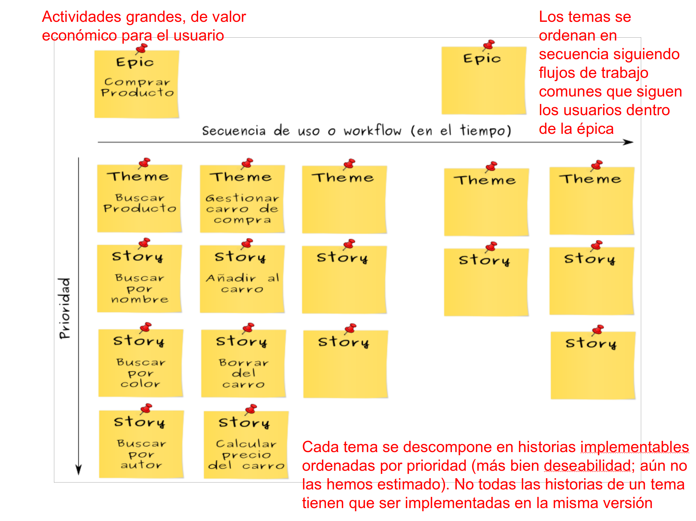

# 7i_GPS-S03-Scrum-RequisitosHistoriasUsuario

##  *Scrum – Requisitos e historias de usuario* **Gestión de Proyectos Software**

*Scrum – Requisitos e historias de usuario* **Gestión de Proyectos Software**

## Contenidos

-  Requisitos
-  Historias de usuario
    -  Las tres ces
    -  Nivel de detalle
    -  Los criterios INVEST
-  Requisitos no funcionales y adquisición de conocimiento
-  Conseguir historias

##  Requisitos

Requisitos

## Requisitos

-  En desarrollo tradicional, los requisitos se detallan al principio y se intenta que sean inmutables
-  En Scrum se negocian continuamente durante el desarrollo y se entregan al equipo de desarrollo  just-in-time  y justo con lo necesario para que trabajen
-  En desarrollo tradicional, un cambio de requisitos puede implicar un proceso formal de cambio
    -  Por tanto, se considera que es algo caro y poco deseable
    -  Sin embargo, es común que un cliente no se dé cuenta de que quiere algo hasta bien avanzado el desarrollo
-  En Scrum los requisitos son un grado de libertad  que se puede manipular para alcanzar los objetivos
    -  La capacidad de adaptar los requisitos a nuevas necesidades  es uno de los principales beneficios de las metodologías ágiles    
        -  Cuanto más innovador sea tu producto, más te beneficias de esto

## Requisitos en Scrum

-  En lugar de crear requisitos detallados al principio, se crean entradas ( items ) de la pila del producto   (PBI –  product backlog items )  
    -  Al principio son poco más que huecos con una idea ( placeholders ) que más tarde rellenaremos con los requisitos detallados
    -  Cada una representa algo valioso y deseable
-  Las PBI al principio son grandes y poco detalladas 
    -  Con el tiempo se refinarán en PBI más detalladas
    -  Las que vayamos a hacer en algún momento tendrán que ser lo bastante pequeñas y detalladas como para ser movidas a un sprint, donde se diseñarán, implementarán y probarán    
        -  Durante el sprint se detallarán aún más
-  Las PBI se representan a menudo como historias de usuario (HU,  user stories )
    -  No siempre

## Conversaciones

-  Los requisitos facilitan una comprensión compartida de lo que hay que crear
    -  Quien entiende lo que quiere se lo comunica a quien lo tiene que crear
-  El desarrollo tradicional se basa en requisitos escritos y con vocación de permanencia
-  Scrum se apoya más en conversaciones verbales frecuentes
    -  Comunicación bidireccional,  feedback  rápido y ancho de banda grande
    -  Esto no reemplaza a todos los documentos    
        -  P.ej., la pila del producto es un documento vivo

## Refinado progresivo

-  En el desarrollo tradicional todos los requisitos están al mismo nivel de detalle al mismo tiempo
    -  Hay que decidir todos los detalles al principio, que es cuando sabemos menos sobre el proyecto
    -  Todos los requisitos son igual de prioritarios    
        -  No hay una forma fácil de saber por dónde empezar
    -  Los cambios, o descartes, requieren tirar esfuerzo a la basura    
        -  Cambiar o descartar algo que habíamos especificado cuidadosamente hace que ese esfuerzo de especificación se desperdicie
    -  Se desalienta la posibilidad de clarificar y mejorar cosas porque se supone que los requisitos están completos y que, por tanto, ya no hace falta tocarlos más
-  En Scrum los requisitos en los que se va a trabajar antes serán más pequeños y detallados que aquellos que no se abordarán de momento
    -  El refinado progresivo desagrega grandes requisitos poco detallados en pequeños requisitos más detallados conforme hacen falta ( just-in-time )
-  Una pila de producto con todas las entradas completamente detalladas y donde nunca se cambian las prioridades de nada es, esencialmente, un documento de requisitos tradicional con otro nombre
    -  Si nos encontramos con una pila de este tipo, puede ser una señal de que se está intentando aplicar Scrum sin haber entendido sus principios, o al tipo de problema menos adecuado para Scrum

##  Historias de usuario

Historias de usuario

## Historias de usuario (HU)

-  Son un formato para expresar el valor deseado para muchos tipos de entradas en la pila del producto, especialmente características (requisitos funcionales)
    -  Entendibles desde el punto de vista de negocios y técnico
-  Estructuralmente simples, proporcionan  un punto de partida  para una conversación
-  Se pueden mantener con distintos niveles de detalle
    -  Son fáciles de refinar progresivamente
-  No son la única forma de representar entradas en la pila del producto
    -  “ Como  usuario,  quiero  que el sistema no corrompa la base de datos  para  que mis datos no se pierdan” no parece la forma más adecuada de describir eso
-  Son una aproximación ligera que encaja bien con los principios ágiles
-  En algunos sitios llaman historias de usuario (o simplemente historias) a lo que aquí llamamos PBI o entradas de la pila
    -  Pero no todas las PBI se expresan bien como historias, así que aquí prefiero que las distingamos    
        -  Algunas/muchas PBI serán HU, pero no todas

##  Las tres ces:  card ,  conversation ,  confirmation

Las tres ces:  card ,  conversation ,  confirmation

## Tarjeta (Card)

-  Muchas veces las historias de usuario se escriben al principio en tarjetas o en  notas adhesivas
    -  Pequeñas, para forzar la brevedad
-  Capturan la esencia de un requisito y permiten que luego se desarrollen discusiones más detalladas
-  Una plantilla común:
    -  Como <rol o clase de usuario/a> 
    -  Quiero <un objetivo> 
    -  Para <un beneficio>

## Tarjeta - Ejemplo

-  Como  persona que cada día tiene que trabajar en un sitio distinto,  quiero  ver críticas de restaurantes cercanos a mi localización actual,  para  poder decidir dónde ir a comer sin tener que perder mucho tiempo

## Conversación

-  Los detalles de un requisito se sacan a la luz a través de una conversación entre el equipo de desarrollo, el dueño del producto y posibles clientes, inversores etc.
    -  La historia de usuario sirve de recordatorio de que esa conversación está pendiente
-  Esa conversación no es un evento que sucede una vez. Es un  diálogo   permanente
    -  Cuando se escribe la historia inicial, cuando se refina, cuando se estima, cuando se planifica el sprint, y cuando se diseña, construye y prueba durante el sprint
-  La conversación es, en buena parte, verbal, pero  se suele complementar con documentos
    -  Boceto de GUI
    -  Reglas de negocio que se dejan por escrito 
    -  Algún documento externo    
        -  Un artículo científico-técnico, una ley o reglamento que hay que cumplir...

## Confirmación

-  Una historia de usuario contiene unas condiciones de satisfacción
    -  Criterios de aceptación que clarifican el comportamiento deseado
-  Se pueden escribir por detrás de la tarjeta
-  Deberían usarse como base para diseñar tests de aceptación  de alto nivel  para esa historia

## Confirmación - Ejemplo

-  Como  usuario del foro,  quiero  subir ficheros de contenidos  para  poder compartirlos con mis colegas
-  Condiciones de satisfacción
    -  Verificar con ficheros de texto: .txt, .pdf y .doc
    -  Verificar con ficheros de imagen: .jpg, .gif y .png
    -  Verificar con ficheros de video .mp4 de menos de 1GB
    -  Verificar que no se pueden subir ficheros .exe para prevenir que se compartan virus
    -  Etc.
-  Recuerda que son de alto nivel
    -  Cada una de las anteriores derivará típicamente en varios tests más específicos    
        -  Subir un fichero de 1 KB, de 1 MB y de 30 MB de cada tipo, descargarlo, comprobar que no se ha corrompido etc.
        -  Idealmente, estos tests más específicos se automatizarán

##  Nivel de detalle de las historias

Nivel de detalle de las historias

## Nivel de detalle

-  Es difícil planificar un producto completo con historias de usuario del tamaño que se puede abordar en un sprint
    -  Tendríamos muchas historias desde el primer día y serían muy pequeñas    
        -  Esto nos acabaría llevando de vuelta al documento de requisitos tradicional
    -  Por fortuna podemos escribir historias de usuario con distintos niveles de abstracción
-  Épicas ( epics )
    -  Historias que probablemente requerirán muchos meses, y que posiblemente se vayan a dividir entre varios lanzamientos del producto
    -  Nos permiten dar una visión global
-  Características ( features )
    -  Demasiado grandes para un solo sprint, pero más concretas que las épicas
-  Historias implementables ( implementable stories )
    -  Podemos abordar varias de estas en cada sprint
    -  A veces se llaman  sprintable stories

## Épica - Ejemplo

-  Como  usuario típico,  quiero  entrenar el sistema sobre los tipos de productos que prefiero  para  que sepa como filtrar mejor mis búsquedas

## Nivel de detalle

-  Por debajo de las historias sprintables, el siguiente nivel de detalle son las tareas ( tasks )
    -  Cada PBI que se aborda en un sprint se dividie en tareas durante la planificación de ese sprint
    -  No se expresan en el formato de historia de usuario
    -  Cada una la puede hacer una única persona, o quizás dos, en unas horas
    -  Especifican cómo construir algo y no qué construir    
        -  El qué construir debe estar claro en las historias

##  Escribir buenas historias: los criterios INVEST

Escribir buenas historias: los criterios INVEST

## Los criterios INVEST

-  Los criterios INVEST se usan para evaluar si una historia de usuario cumple su propósito
    -  Independent
    -  Negotiable
    -  Valuable
    -  Estimatable
    -  Small    
        -  Más que pequeña, sería lo más pequeña posible que sirva para su objetivo        
            -  El tamaño no será igual para una épica, que para una historia  sprintable
    -  Testable

## Independiente

-  Las historias de usuario deberían ser independientes o, al menos, estar poco acopladas entre si
    -  La interdependencia complica la estimación, la priorización y la planificación
-  Si tenemos dos historias interdependientes podemos:
    -  Intentar fusionarlas    
        -  Solo si no nos queda algo muy grande 
    -  Crear una tercera historia que saque la parte que es común a esas dos
    -  Trocearlas en historias más pequeñas, buscando que estas sean más independientes
-  A veces tendremos que vivir con historias interdependientes
    -  Intentaremos abordarlas en el mismo sprint
    -  Si no, como último recurso que debería ser muy ocasional, tendremos que aceptar que en algún sprint empezaremos algo que solo podremos acabar en algún sprint posterior

## ¿Independientes?

-  Como  programador/a,  quiero  poder ver simultáneamente partes alejadas de un mismo fichero fuente en el editor  para  poder analizar mejor su estructura
-  Como  programador/a,  quiero  poder dividir el editor en  frames   para  poder tener diferentes vistas simultáneas del código de la aplicación que desarrollo

## Negociable

-  Los detalles deberían ser negociables
    -  Entre otras cosas, esto contribuye a que dueño de producto y equipo de desarrollo colaboren mejor y tengan más confianza mutua
-  Las historias no son contratos cerrados
    -  Son formas de recordar que hay que tener las conversaciones donde se concretarán
-  Capturan la esencia de la funcionalidad deseada y por qué se desea
    -  Pero dejan sitio para negociar los detalles
-  Algunas cosas no se pueden negociar
    -  Por ejemplo, requisitos legales

## Valiosa

-  Para clientes, usuarios, inversores...
    -  Los clientes eligen el producto y pagan por él
    -  Los usuarios lo usan
    -  Los inversores han prestado dinero y quieren obtener un beneficio económico
-  Una historia que no es valiosa para nadie no tiene sitio en la pila
    -  Corolario: todas las historias de la pila deben ser valiosas
-  Las historias “técnicas” pueden ser valiosas e ir a la pila
    -  Aunque es más típico que vayan a la definición de hecho o acaben formando parte de otras historias, como criterios de aceptación o como parte de las tareas en las que las dividiremos para implementarlas

## ¿Valiosa?

-  Como  desarrollador,  quiero  migrar el sistema a la última versión de PostgreSQL  para  evitar seguir trabajando con una versión que ya no se mantiene
-  Notad que es una “historia técnica”

## Estimable

-  El tamaño de las historias debe poder ser estimado por el equipo
-  Este tamaño se refiere al esfuerzo de desarrollo que hace falta para completarlas
-  El tamaño de una historia es necesario
    -  El dueño del producto necesita saberlo para priorizar
    -  El equipo Scrum lo necesita para saber si la historia tiene que ser desagregada antes de poder meterla en un sprint
-  Si el equipo no es capaz de estimar una historia, o bien es demasiado grande o bien es demasiado ambigua
    -  Habrá que partirla en historias más manejables y detallarlas más
    -  Si faltan conocimientos o tenemos incertidumbres, habrá adquirir estos conocimientos (explorar)

## Pequeña (del tamaño adecuado)

-  El tamaño adecuado depende de cuándo pensamos ponernos con ella
    -  Si son para un sprint, hay que tener en cuenta que en un sprint queremos trabajar en varias historias a la vez    
        -  Porque si solo trabajamos en una, y no la terminamos, no entregaríamos absolutamente nada valioso en ese sprint
        -  Si trabajamos en varias, malo será que no podamos acabar ninguna de ellas
-  Una historia puede ser grande (es decir, va a costar mucho esfuerzo desarrollarla) si no planeamos trabajar en ella hasta dentro de un año
    -  Sería una pérdida de tiempo ponernos a detallarla ahora

## Testeable

-  De forma binaria
    -  O pasa o no pasa
-  Esto requiere buenos criterios de aceptación
-  Es la única forma de saber con certeza si la historia se ha hecho o no
-  Diseñar tests ayuda a estimar el tamaño de una historia
    -  Diseñar tests concretos suele saca a la luz detalles de la historia en los que no habíamos pensado bien
-  Algunas historias no se pueden testear
    -  Una épica no tendrá tests asociados    
        -  No pasa nada, no la vamos a construir directamente, antes la partiremos en historias más pequeñas
-  Otras historias no podrán testearse de forma práctica
    -  99,99% de  uptime  en producción no se puede testear definitivamente, es algo que hay que ir midiendo constantemente
    -  Aún así, tener este criterio de aceptación/entrada en la definición de hecho es útil, porque guiará el diseño de la aplicación

## ¿Testeable?

-  Como  programador,  quiero  que el buscador de código me haga sugerencias basadas en mis búsquedas previas en ese proyecto  para  agilizar mi trabajo
-  ¿Qué criterios de aceptación necesitamos para que sea testeable?

##  Requisitos no funcionales y adquisición de conocimiento

Requisitos no funcionales y adquisición de conocimiento

## Requisitos no funcionales

-  Se pueden escribir como historias si ese formato nos resulta conveniente, pero no hace falta
-  En general no irán como entradas de la pila del producto porque son requisitos globales
    -  Afectan al diseño y prueba de muchas de (o todas) las historias en la pila del producto
-  Como norma general hay que intentar incluirlos en la definición de hecho del equipo
    -  Así se comprueban en cada sprint para cada característica desarrollada

## ¿Entrada en la pila o definición de hecho?

-  Ninguna acción del usuario tardará más de 1 segundo en proporcionarle una realimentación (aunque no sea necesariamente la respuesta que busca)

## ¿Entrada en la pila o definición de hecho?

-  El usuario tendrá a su disposición combinaciones de teclas para poder invocar más rápidamente las funciones más comunes del programa

## ¿Entrada en la pila o definición de hecho?

-  El usuario podrá modificar las combinaciones de teclas que invocan las funciones más comunes del programa

## Historias de adquisición de conocimiento

-  A veces necesitamos aprender algo nuevo y muchas veces la mejor forma es explorar
    -  Hacer prototipos, pruebas de concepto, experimentos, estudios...
-  Explorar es una forma de comprar información
    -  Esta exploración tiene un coste    
        -  Principalmente el tiempo de las personas que hacen la exploración
    -  Ese coste es el precio que pagamos por lo que hemos aprendido
-  Se pueden representar perfectamente como historias de usuario y ser entradas en la pila del producto

## Historias de adquisición de conocimiento - Ejemplo

-  Como  desarrollador,  quiero  prototipar dos alternativas para el nuevo motor de filtrado  para  saber cuál es mejor a largo plazo
-  Condiciones de satisfacción
    -  Comparar la velocidad de los 2 prototipos en búsquedas típicas
    -  Comparar la velocidad de los 2 prototipos conforme aumenta el tamaño de los datos sobre los que se busca para analizar su escalabilidad
    -  Escribir un breve informe describiendo los experimentos, los resultados y una recomendación razonada

## Historias de adquisición de conocimiento

-  Explorar no es gratis y hay que estimar el coste
    -  P.ej, si esa exploración va a costarnos un sprint en el que trabajarán X miembros del equipo, el financiero de la empresa nos calculará los € que serán
-  Luego estimamos el valor (en €) de la información que obtendremos
    -  Que es el coste que tendría tomar una decisión equivocada por no haber contar con esta información    
        -  Estimar esto tampoco es sencillo, pero en general consiste en estimar cuánto tiempo vamos a perder si nos equivocamos al elegir, y cuantificar este tiempo en base a nuestros costes laborales
-  El dueño del producto compara, y decide si esta historia tiene sitio en la pila, y su prioridad

## Calcula el coste

-  Estimamos que el coste de la exploración que necesitamos para elegir bien entre el componente A y el componente B es de 1000€
-  Si elegimos mal, el coste de empezar de nuevo es de 5000€
-  ¿Hacemos la exploración?

## Calcula el coste

-  Estimamos que la exploración que necesitamos para elegir entre el componente A y el componente B es de 1000€
-  Si elegimos mal, el coste de empezar de nuevo es de 1500€
-  ¿Hacemos la exploración?

## Respuesta

-  Coste esperado de explorar = 1000€
-  Coste esperado de no explorar = 0.5 * 0€ + 0.5 * 1500€ = 750€
    -  Si no exploramos hay un 50% de probabilidades de elegir bien (con coste 0€) y un 50% de elegir mal (y el coste son 1500€)
-  Si somos neutrales con respecto al riesgo y racionales  elegimos no explorar , porque el coste esperado es menor

## Calcula el coste

-  Estimamos que la exploración que necesitamos para elegir entre el componente A, el componente B y el componente C es de 1500€
-  Si elegimos mal, el coste es de 1500€
    -  Asumamos que el peor caso es que elegimos mal, pagamos este coste, volvemos a elegir mal y volvemos a pagar este coste
-  ¿Hacemos la exploración?

## Respuesta

-  Coste esperado de explorar = 1500€
-  Coste esperado de no explorar = 1/3 * 0€ + 1/3 * 1500€ + 1/3 * 3000€ = 1500€
    -  Si no exploramos hay una probabilidad de 1/3 de elegir bien a la primera (con coste 0€), 1/3 de elegir bien a la segunda (coste de 1500€) y 1/3 de elegir bien a la tercera (coste de 3000€)
-  Si somos neutrales con respecto al riesgo y racionales  elegimos explorar , porque a igualdad de coste esperado preferimos no correr riesgos
    -  Si tenemos cierta preferencia por el riesgo (p.ej., nos encantaría pagar 0 euros), sería racional elegir no explorar

## 
-  Conseguir historias

-  Conseguir historias

## Conseguir historias

-  Limitarnos a preguntar a los futuros clientes y/o usuarios es difícil
    -  Incluso si saben lo que quieren y lo saben expresar (que a veces no es fácil), pueden cambiar luego de opinión
-  Es mejor hacerles parte de un equipo que determina qué construir y constantemente revisa lo que se está construyendo

## Taller de escritura de historias de usuario

-  Pensar colectivamente en el valor de negocio que se desea
    -  El equipo Scrum, junto a futuros clientes, usuarios, inversores...
-  El objetivo es crear historias para lo que el producto o servicio tiene que hacer
-  De unas horas a unos días, y generalmente con un foco específico
    -  P.ej., historias para la próxima versión del producto
-  Si es a principio de proyecto es útil definir distintos roles de usuario
    -  Los del “ Como  <rol de usuario x> …”
-  Y asociar estos roles con personas prototipo
    -  Con un nombre propio, una descripción e incluso una foto    
        -  Eso nos ayuda a ponernos en su lugar y a pensar en sus necesidades
-  Las historias pueden pensarse  top-down  (partiendo de una épica y luego desagregando),  bottom-up , o con mezcla de ambas

## Mapeo de historias

-  Esta técnica descompone la actividad de los usuarios a alto nivel en pasos detallados
-  Proporciona una vista bidimensional de las historias, que puede ser un buen complemento a la vista unidimensional de la pila del producto
-  Aunque no se use formalmente, la idea de los flujos de trabajo (los pasos, la navegación) que siguen los usuarios en nuestra aplicación puede ayudar a entender el sistema

## 

## Bibliografía

-  Kenneth S. Rubin.  Essential Scrum. A practical guide to the most popular agile process
    -  Chapter 5 (Requirements and User Stories)

