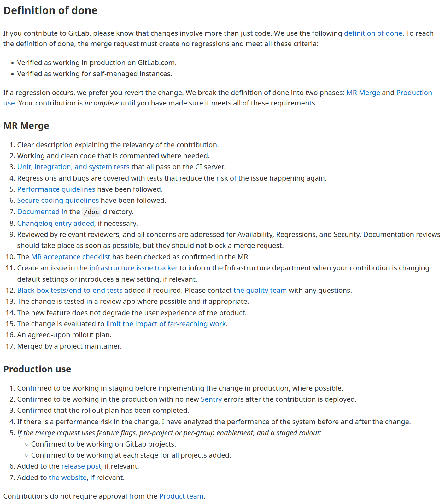

# 7i_GPS-S03-Scrum-Sprints

##  *Scrum - Sprints* **Gestión de Proyectos Software**

*Scrum - Sprints* **Gestión de Proyectos Software**

## Contenidos

-  Sprints
-  Duración limitada
-  Duración corta
-  Duración consistente
-  No se cambian los objetivos
-  Definición de hecho

## Sprints

-  Scrum organiza el trabajo en iteraciones de hasta un mes de duración llamadas sprints
    -  Duración limitada ( timeboxed ), corta y consistente
    -  Con un objetivo que no debería cambiar una vez se empieza
    -  Deben acabar alcanzando el estado que el equipo acuerde como “hecho”

## Actividades en un sprint

-  Planificación
-  Ejecución
-  Revisión
-  Retrospectiva

##  Duración limitada ( timeboxed )

Duración limitada ( timeboxed )

## Duración limitada (timeboxed)

-  Fechas de inicio y fin predefinidas e inmutables
-  Permite limitar la cantidad de trabajo en marcha ( work in process, WIP )
    -  Se trabaja solo en lo que se planea que se puede comenzar y terminar durante el sprint; eso limita el WIP
-  Obliga a priorizar, eligiendo una cantidad pequeña de trabajo que sea lo más importante
-  Demuestra progreso
    -  Tenemos una fecha conocida y cercana donde habrá partes del trabajo valiosas ya completadas
    -  Esto es mucho más fiable como medida de progreso que, p.ej., la conformidad con un plan
-  Evita el perfeccionismo innecesario
    -  Lo perfecto es enemigo de lo suficientemente bueno

## Duración limitada (timeboxed)

-  Motiva el cierre
    -  Las cosas se terminan cuando tienen una fecha de finalización establecida
-  Mejora la predictibilidad
    -  Cada vez es más fácil predecir lo que podemos hacer en un sprint, porque hemos hecho muchos otros de la misma duración antes

##  Duración corta

Duración corta

## Duración corta

-  Facilita la planificación
    -  Es más fácil y preciso hacer planes para unos días o unas pocas semanas que para seis meses o un año
-  Tenemos  feedback  pronto
    -  Al final de cada corto sprint tenemos  feedback  con los clientes, patrocinadores etc.
-  Mejora el retorno de la inversión
    -  Al generar mejoras de producto antes, y más frecuentemente, también podemos empezar a generar antes los beneficios debidos a esas mejoras
-  Error acotado
    -  ¿Cómo de mal lo puedes hacer en un sprint de dos semanas? En el peor de los casos, si lo hicieras todo mal habrás perdido tan solo dos semanas

## Duración corta

-  Entusiasmo renovado
    -  Es común que el interés y el entusiasmo disminuyan conforme tenemos que esperar más una gratificación    
        -  Sin progreso visible y sin ver el final cerca, perdemos interés
    -  Los sprints cortos permiten entregar cosas que funcionan frecuentemente    
        -  Esto es gratificante y por tanto mantiene más alto el interés del equipo
-  Puntos de control frecuentes
    -  Los gerentes, los clientes, los dueños del producto etc. tienen más puntos de control que con otras metodologías    
        -  Más oportunidades de inspeccionar y adaptarse a un entorno complejo
    -  La revisión del sprint nos permite basar decisiones en hechos    
        -  Siendo estos hechos la funcionalidad completada durante el sprint

##  Duración consistente

Duración consistente

## Duración consistente

-  Como regla, un equipo debería elegir una duración consistente (siempre igual) para sus sprints en un proyecto y no cambiarla sin una muy buena razón
    -  Podemos querer cambiar hacia sprints más cortos conforme cogemos experiencia
    -  Las vacaciones llegan y es más práctico tener un sprint de tres semanas antes de Agosto que los normales de dos
    -  El lanzamiento del producto es la semana que viene, así que no tiene sentido mantener los sprints habituales de dos semanas
    -  Etc.

## Duración consistente

-  No poder acabar el trabajo previsto en el sprint actual  no  es una buena razón para cambiar su duración
    -  Es un síntoma de algún problema y una oportunidad para mejorar
-  En la práctica, una semana suelen ser cinco días
    -  Si hay algún día de fiesta de por medio en un sprint de una semana, se podrá hacer menos trabajo en ese sprint, pero su duración no cambia
-  Tener sprints de la misma duración nos proporciona  cadencia
    -  Un ritmo regular y predecible
    -  Esto facilita habituarse a una forma de trabajar    
        -  Los lunes solemos hacer tal…, para los miércoles generalmente ya hemos hecho cual...
    -  También permite mantener más constante la intensidad del trabajo    
        -  En un proyecto tradicional, el trabajo es más intenso más cerca del final
    -  Facilita la agenda    
        -  Es más fácil organizar reuniones cuando sabemos las fechas de las próximas N con anticipación
    -  Facilita coordinar a varios equipos en el mismo proyecto

## Duración consistente

-  La duración consistente facilita la planificación
    -  Tras haber hecho varios sprints de la misma duración, podremos estimar bastante bien la cantidad de trabajo que un equipo puede terminar en cada sprint ( velocity )    
        -  Con iteraciones de duración variable se complica esta estimación
    -  Si tenemos una fecha de lanzamiento/entrega predefinida, sabemos fácilmente cuántos sprints tendremos hasta esa fecha

##  No se cambian los objetivos en un sprint

No se cambian los objetivos en un sprint

## Objetivo de un sprint

-  El objetivo describe el propósito y valor del sprint
-  Idealmente es algo claro y único. Ejemplos:
    -  Implementar la generación inicial de informes
    -  Cargar y revisar los datos para el mapa de Europa
    -  Demostrar la capacidad de enviar un mensaje a través de una pila integrada de software, firmware y hardware
-  Pero también puede tener varias partes 
    -  Que la impresión básica funcione y que se pueda buscar por fecha

## Compromiso mutuo

-  Durante la planificación de un sprint, el equipo de desarrollo ayuda a decidir el objetivo del sprint
    -  Este objetivo se usa para elegir las entradas de la pila del producto que se pueden completar en el sprint    
        -  A su vez estas entradas permiten refinar el objetivo del sprint
-  El objetivo del sprint es un  compromiso  entre el equipo de desarrollo y el dueño del producto
    -  El equipo cumplirá el objetivo y el dueño no lo cambiará durante el sprint
-  El objetivo del sprint no debe cambiar, pero puede ser clarificado
    -  Una clarificación proporciona detalles adicionales para ayudar al equipo

## Consecuencias del cambio

-  Scrum acepta el cambio, pero cuando es equilibrado y económicamente sensato
-  El coste del cambio aumenta conforme invertimos más en un trabajo
    -  Con un sprint empezado, ya hemos hecho una inversión en las tareas de la pila del sprint    
        -  Como mínimo planificarlas
        -  A mitad del sprint ya habremos diseñado/implementado y probado cosas
    -  Cualquier cambio a mitad de sprint exigirá replanificar el resto del sprint
    -  El equipo se desmotivará si el dueño del producto puede incumplir sus compromisos en cualquier momento
    -  Es difícil concentrarse en una tarea si en cualquier momento te pueden decir que esa tarea ya no es necesaria

## Ser pragmático

-  No cambiar el objetivo de un sprint es una regla
-  Pero puede ocurrir algo que haga que el objetivo se convierta en irrelevante. Lo lógico será cambiarlo
    -  Un competidor acaba de lanzar un producto. Nuestro objetivo para el sprint actual pasa a ser económicamente inviable
    -  Un sistema en producción falla y hace falta gente de nuestro equipo para solucionarlo inmediatamente

## Terminación anormal de un sprint

-  Si el objetivo del sprint se convierte en inválido, el equipo Scrum puede decidir terminar anormalmente el sprint
    -  No hay incremento de producto potencialmente entregable y por tanto no se puede hacer la revisión con el cliente 
    -  Así que se pasa a la retrospectiva y a planificar el siguiente sprint
-  Muchas veces será económicamente más sensato terminar el sprint normalmente
    -  Sobre todo si queda poco para el final
    -  Puede ser preferible retirar algo de la pila del sprint en lugar de terminar el sprint anormalmente (hay que ver qué es más costoso)
-  Terminar anormalmente anula las ventajas que tiene la duración consistente de los sprints
    -  Es un último recurso

## Terminación anormal

-  Si se decide terminar anormalmente, hay que determinar la longitud del siguiente sprint. 3 opciones
    -  1. Mantener la duración original, alterando las fechas de inicio y fin
    -  2. Acortar el siguiente sprint para terminar en la fecha prevista del terminado anormalmente
    -  3. Alargar el siguiente sprint para incluir lo que falte del terminado anormalmente y el siguiente

## Terminación anormal

12 3

##  Definición de hecho

Definición de hecho

## Definición de hecho

-  El resultado de un sprint debería ser un incremento del producto potencialmente entregable al cliente
    -  Aunque no se vaya a entregar en cada sprint
-  Potencialmente entregable es un estado de confianza en lo que se ha hecho
    -  No hay nada sustancial que no se haya tenido en cuenta
-  El equipo Scrum tiene que acordar qué significa para ellos hecho

## Definición de hecho

-  Algo está hecho (potencialmente entregable) cuando una lista de tareas se ha realizado exitosamente. Por ejemplo:
    -  Diseño revisado, código completo y verificado (estándar de codificación, comentado, revisado), documentación de usuario actualizada, tests pasados (unitarios, de integración, de regresión, de plataforma, de idioma), cero errores detectados, tests de aceptación por el dueño de producto pasados y está funcionando en los servidores de producción
-  La lista anterior depende del tipo de producto, tecnologías, la organización que lo crea y posibles impedimentos actuales
-  En todo caso siempre se tiene que entregar algo de valor para el cliente
-  Si algún elemento no pasa la lista entera, no está hecho
    -  Por ejemplo, si queda un bug en alguna entrada de la pila del sprint, esta se devuelve a la pila del producto y se abordará en otro sprint

## Definición de hecho

-  Hecho puede incluir alguna tarea muy costosa, que no cabe en un sprint
    -  Si es por falta de automatización, habrá que resolverlo
    -  Si no, habrá que aceptar que algunas cosas se comiencen en un sprint y se acaben en el siguiente    
        -  Por ejemplo podemos requerir que se pase un test de carga/estrés de 2 semanas cuando trabajamos con sprints de 1
-  La definición de hecho puede cambiar con el tiempo
-  Muchos equipos empiezan con una definición de hecho que no permitiría entregar al cliente
    -  Y una vez tienen una base de producto desarrollada, refinan la definición de hecho
-  A veces hay que alterar temporalmente algún aspecto de la definición de hecho
    -  Por ejemplo, si hecho implica “probado en un dispositivo real” que aún no ha llegado, se puede cambiar temporalmente a “probado en el emulador”

## Hecho frente a aceptado

-  El dueño del producto establece unas condiciones de satisfacción (criterios de aceptación) para cada entrada de la pila del producto
    -  Que luego se validan con tests de aceptación (posiblemente automáticos)
    -  Pasar estos tests puede planificarse como una tarea dentro del sprint en el que esa entrada de pila se implementa    
        -  Tanto si son automáticos como si son manuales, pasarlos va a requerir algo de tiempo de alguien, aunque solo sea para comprobar los resultados
-  Los criterios de aceptación son adicionales a la definición de hecho 
    -  Una entrada de la pila del producto tiene que pasar sus criterios de aceptación  y  la definición de hecho para estar completa/aceptada    
        -  Frente a estar “simplemente” hecha
    -  Muchos equipos incluyen como una entrada más de la definición de hecho “criterios de aceptación pasados”    
        -  En ese caso toda entrada de la pila hecha también estará completa/aceptada

## Definición de hecho en Gitlab

## Bibliografía

-  Kenneth S. Rubin.  Essential Scrum. A practical guide to the most popular agile process
    -  Chapter 4 (Sprints)

