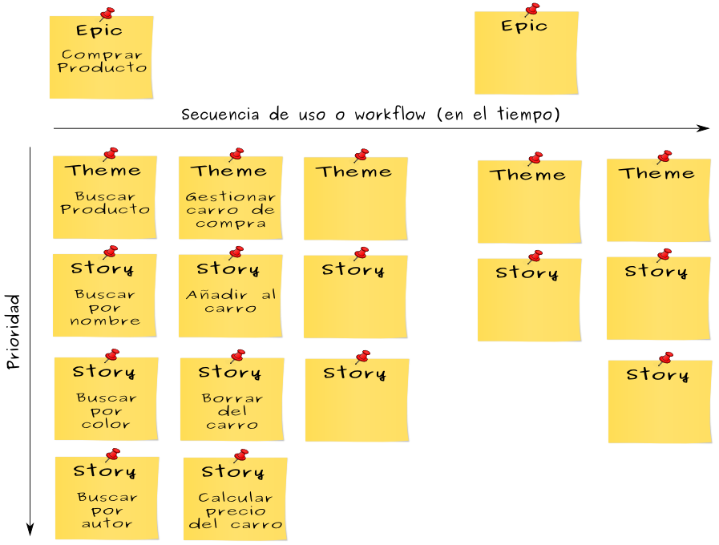

# 7i_GPS-S04-Scrum-RequisitosHistoriasUsuario

##  *Scrum – Requisitos e historias de usuario* **Gestión de Proyectos Software**

*Scrum – Requisitos e historias de usuario* **Gestión de Proyectos Software**

## Contenidos

-  Requisitos
-  Historias de usuario
    -  Las tres ces
    -  Nivel de detalle
    -  Los criterios INVEST
-  Requisitos no funcionales y adquisición de conocimiento
-  Conseguir historias

##  Requisitos

Requisitos

## Requisitos

-  En desarrollo tradicional, los requisitos se detallan al principio y se intenta que sean inmutables
-  En Scrum se negocian continuamente durante el desarrollo y se entregan al equipo de desarrollo  just-in-time  y justo con lo necesario para que trabajen
-  En desarrollo tradicional, un cambio de requisitos puede implicar un proceso formal de cambio
    -  Por tanto, se considera que es algo caro, y poco deseable
    -  Sin embargo, es común que un cliente no se dé cuenta de que quiere algo hasta bien avanzado el desarrollo
-  En Scrum los requisitos son un grado de libertad  que se puede manipular para alcanzar los objetivos
    -  La capacidad de adaptar los requisitos a nuevas necesidades  es uno de los principales beneficios de las metodologías ágiles    
        -  Cuanto más innovador sea tu producto, más te beneficias de esto

## Requisitos en Scrum

-  En lugar de crear requisitos detallados al principio, se crean entradas ( items ) de la pila del producto   (PBI –  product backlog items )  
    -  Al principio son poco más que huecos con una idea ( placeholders ) que más tarde rellenaremos con los requisitos detallados
    -  Cada una representa algo valioso y deseable
-  Las PBI al principio son grandes y poco detalladas 
    -  Con el tiempo se refinarán en PBI más detalladas
    -  Las que finalmente vayamos a hacer, en algún momento deberán ser lo bastante pequeñas y detalladas como para ser movidas a un sprint, donde se diseñarán, implementarán y probarán    
        -  Durante el sprint se detallarán aún más
-  Las PBI se representan a menudo como historias de usuario ( user stories )
    -  No siempre

## Conversaciones

-  Los requisitos facilitan una comprensión compartida de lo que hay que crear
    -  Quien entiende lo que quiere se lo comunica a quien lo tiene que crear
-  El desarrollo tradicional se basa en requisitos escritos y con vocación de permanencia
-  Scrum se apoya más en conversaciones verbales frecuentes
    -  Comunicación bidireccional,  feedback  rápido y ancho de banda grande
    -  Esto no reemplaza a todos los documentos. La pila del producto es un “documento vivo”

## Refinado progresivo

-  En el desarrollo tradicional todos los requisitos están al mismo nivel de detalle al mismo tiempo
    -  Hay que predecir todos los detalles al principio, que es cuando sabemos menos
    -  Todos los requisitos son igual de prioritarios, no sabemos por dónde empezar
    -  Los cambios, o descartes, requieren tirar esfuerzo a la basura    
        -  Cambiar o descartar algo que habíamos especificado cuidadosamente hace que ese esfuerzo se desperdicie
    -  Se desalienta la posibilidad de clarificar y mejorar cosas porque se supone que los requisitos están “completos” y que ya no hay que tocarlos más
-  En Scrum, los requisitos en los que se va a trabajar antes serán más pequeños y detallados que aquellos que no se abordarán de momento
    -  El refinado progresivo desagrega grandes requisitos poco detallados en pequeños requisitos más detallados conforme hacen falta ( just-in-time )
-  Una pila de producto con todas las entradas detalladas y estimadas y donde nunca se cambian las prioridades es esencialmente un documento de requisitos tradicional con otro nombre
    -  Si nos encontramos con una pila de este tipo, puede ser una señal de que se está intentando aplicar Scrum sin haber entendido sus principios, o al tipo de problema menos adecuado para Scrum

##  Historias de usuario

Historias de usuario

## Historias de usuario

-  Son un formato para expresar el valor deseado para muchos tipos de entradas en la pila del producto, especialmente características (requisitos funcionales)
    -  Entendibles desde el punto de vista de negocios y técnico
-  Estructuralmente simples, proporcionan  un punto de partida  para la conversación
-  Se pueden escribir a distintos niveles de detalle y son fáciles de refinar progresivamente
-  No son la única forma de representar entradas en la pila del producto
    -  “ Como  usuario,  quiero  que el sistema no corrompa la base de datos  para  que mis datos no se pierdan” no parece la forma más adecuada de describir eso
-  Son una aproximación ligera que encaja bien con los principios ágiles

##  Las tres ces:  card ,  conversation ,  confirmation

Las tres ces:  card ,  conversation ,  confirmation

## Tarjeta (Card)

-  Muchas historias de usuario se escriben en tarjetas o en  notas adhesivas
    -  Pequeñas, para forzar la brevedad
-  Capturan la esencia de un requisito y permiten que luego se desarrollen discusiones más detalladas
-  Una plantilla común (no es la única):
    -  Como <rol o clase de usuario> 
    -  Quiero <un objetivo> 
    -  Para <un beneficio>

## Tarjeta - Ejemplo

-  Como  usuario típico,  quiero  ver críticas no sesgadas de restaurantes cercanos a una dirección,  para  poder decidir dónde ir a cenar

## Conversación

-  Los detalles de un requisito se sacan a la luz en una conversación entre el equipo de desarrollo, el dueño del producto y los clientes, inversores etc.
    -  La historia de usuario es una promesa de que se tendrá esa conversación
-  Esa conversación no es un evento que sucede una vez. Es un  diálogo   permanente
    -  Cuando se escribe la historia, cuando se refina, cuando se estima, cuando se planifica el sprint, y cuando se diseña, construye y prueba durante el sprint
-  En buena parte son verbales, pero  se suelen complementar con documentos
    -  Pueden derivar en un borrador de interfaz de usuario, o una elaboración de ciertas reglas de negocio que se escriben, o referenciar algún documento (p.ej. un artículo) para consultar más adelante

## Confirmación

-  Una historia de usuario contiene unas condiciones de satisfacción
    -  Criterios de aceptación que clarifican el comportamiento deseado
-  Se pueden escribir por detrás de la tarjeta
-  Deberían usarse como base para diseñar tests de aceptación  de alto nivel  para esa historia

## Confirmación - Ejemplo

-  Como  usuario de la wiki,  quiero  subir ficheros  para  poder compartirlos con mis colegas
-  Condiciones de satisfacción
    -  Verificar con ficheros de texto, .txt y .doc
    -  Verificar con ficheros de imagen, .jpg, .gif y .png
    -  Verificar con ficheros de video .mp4 de menos de 1GB
    -  Verificar que no se pueden subir ficheros con DRM
-  Recuerda que son de alto nivel
    -  Cada una de las anteriores derivará en varios tests más específicos    
        -  Subir un fichero de 1k, de 1 MB y de 30MB de cada tipo, descargarlo, comprobar que no se ha corrompido etc.

##  Nivel de detalle de las historias

Nivel de detalle de las historias

## Nivel de detalle

-  Es difícil planificar a alto nivel con historias de usuario del tamaño que se puede abordar en un sprint
    -  Por fortuna podemos escribir historias de usuario con distintos niveles de abstracción
-  Épicas ( epics )
    -  Historias de muchos meses, que incluyen uno o varios lanzamientos de producto
    -  Visión global
-  Características ( features )
    -  Demasiado grandes para un solo sprint
-  Historias implementables ( implementable stories )
    -  Caben en un sprint
    -  A veces se llaman  sprintable stories

## Épica - Ejemplo

-  Como  usuario típico,  quiero  entrenar el sistema sobre los tipos de productos que prefiero  para  que sepa como filtrar mejor mis búsquedas

## Nivel de detalle

-  A veces se usa el término tema ( theme ) para referirse a una colección de historias relacionadas
-  Y por otra parte, las tareas ( tasks ) son el nivel que hay por debajo de las historias
    -  Cada PBI que se lleva a un sprint se parte en tareas durante la planificación de ese sprint
    -  No son historias de usuario
    -  Típicamente las lleva a cabo una persona, o máximo dos
    -  Típicamente cuestan horas
    -  Especifican cómo construir algo y no el qué construir (para indicar el qué, ya están las historias)

##  Escribir buenas historias: los criterios INVEST

Escribir buenas historias: los criterios INVEST

## Los criterios INVEST

-  Los criterios INVEST se usan para evaluar si una historia de usuario cumple su propósito
    -  Independent
    -  Negotiable
    -  Valuable
    -  Estimatable
    -  Small  (más bien, lo más pequeña posible que sirva para su objetivo; no es igual para una épica, que para una historia  sprintable )
    -  Testable

## Independiente

-  Las historias de usuario deberían ser independientes o, al menos, estar poco acopladas entre si
    -  La interdependencia complica la estimación, la priorización y la planificación
-  Si tenemos dos historias interdependientes podemos intentar fusionarlas (si no nos queda algo muy grande) o crear una tercera historia que saque la parte que es común

## ¿Independientes?

-  Como  programador,  quiero  poder ver simultáneamente partes alejadas de un mismo fichero fuente en el editor  para  poder analizar mejor su estructura
-  Como  programador,  quiero  poder dividir el editor en  frames   para  poder tener diferentes vistas simultáneas del código de la aplicación que desarrollo

## Negociable

-  Los detalles deberían ser negociables
    -  Entre otras cosas, esto contribuye a que dueño de producto y equipo de desarrollo colaboren mejor
-  Las historias no son contratos
    -  Son formas de recordar que hay que tener las conversaciones donde se concretarán
-  Capturan la esencia de la funcionalidad deseada y por qué se desea
    -  Pero dejan sitio para negociar los detalles
-  Algunas cosas no se pueden negociar
    -  Por ejemplo, requisitos legales

## Valiosa

-  Para algún cliente, usuario o ambos
    -  Los clientes eligen el producto y pagan por él
    -  Los usuarios lo usan
-  Una historia que no es valiosa para clientes y/o usuarios/as no tiene sitio en la pila
    -  Corolario: todas las historias de la pila deben ser valiosas
-  Las historias “técnicas” pueden ser valiosas e ir a la pila
    -  Aunque es más típico que vayan a la definición de hecho o acaben formando parte de otras historias, como criterios de aceptación o como parte de las tareas en las que las dividiremos para implementarlas

## ¿Valiosa?

-  Como  desarrollador,  quiero  migrar el sistema a la última versión de PostgreSQL  para  evitar seguir trabajando con una versión que ya no se mantiene
-  Notad que es una “historia técnica”

## Estimable

-  Las historias deben ser estimables por el equipo
-  Las estimaciones indican tamaño => coste y esfuerzo
-  El tamaño de una historia es necesario
    -  El dueño del producto lo necesita para priorizar
    -  El equipo Scrum lo necesita para saber si la historia tiene que ser desagregada antes de poder meterla en un sprint
-  Si el equipo no es capaz de estimar una historia, o bien es demasiado grande o bien es demasiado ambigua
    -  Habrá que partirla en historias más manejables
    -  Si faltan conocimientos, habrá que explorar

## Pequeña (del tamaño adecuado)

-  El tamaño adecuado depende de cuándo pensamos ponernos con ella
    -  Si son para un sprint, hay que tener en cuenta que en un sprint queremos trabajar en varias historias    
        -  Porque si solo trabajamos en una, y no la terminamos, no entregaríamos absolutamente nada valioso en ese sprint
        -  Si trabajamos en varias, malo será que no podamos acabar ninguna de ellas
-  Una historia puede ser grande (es decir, que va a costar mucho esfuerzo desarrollarla) si no planeamos trabajar en ella hasta dentro de un año
    -  Lo que sería una pérdida de tiempo sería ponernos a detallarla ahora mismo

## Testeable

-  De forma binaria
    -  O pasa o no pasa
-  Requiere buenos criterios de aceptación
-  Única forma de saber con certeza si la historia se ha hecho o no
-  Definir tests ayuda a estimar el tamaño de una historia
    -  Suelen aportar detalles
-  Algunas historias no se pueden testear
    -  Una épica no tendrá tests asociados; no pasa nada, no la vamos a construir directamente, antes la partiremos en historias más pequeñas
-  Otras no podrán testearse de forma práctica
    -  99,99% de  uptime  en producción no se puede testear definitivamente, es algo que hay que ir midiendo constantemente
    -  Aún así, este criterio de aceptación es valioso porque guiará el diseño de la aplicación

## ¿Testeable?

-  Como  programador,  quiero  que el buscador de código me haga sugerencias basadas en mis búsquedas previas en ese proyecto  para  agilizar mi trabajo
-  ¿Qué criterios de aceptación necesitamos para que sea testeable?

##  Requisitos no funcionales y adquisición de conocimiento

Requisitos no funcionales y adquisición de conocimiento

## Requisitos no funcionales

-  Se pueden escribir como historias si ese formato nos resulta conveniente, pero no hace falta
-  En general no irán como entradas de la pila del producto porque son requisitos globales
    -  Afectan al diseño y prueba de muchas de (o todas) las historias en la pila del producto
-  Como norma general hay que intentar incluirlos en la definición de hecho del equipo
    -  Así se comprueban en cada sprint para cada característica desarrollada

## ¿Entrada en la pila o definición de hecho?

-  Ninguna acción del usuario tardará más de 1 segundo en proporcionarle una realimentación (aunque no sea necesariamente la respuesta que busca)

## ¿Entrada en la pila o definición de hecho?

-  El usuario tendrá a su disposición combinaciones de teclas para poder invocar más rápidamente las funciones más comunes del programa

## ¿Entrada en la pila o definición de hecho?

-  El usuario podrá modificar las combinaciones de teclas que invocan las funciones más comunes del programa

## Historias de adquisición de conocimiento

-  A veces necesitamos aprender algo nuevo y la mejor forma es explorar
    -  Prototipos, pruebas de concepto, experimentos, estudios...
-  Explorar es una forma de comprar información
    -  Esta exploración tiene un coste (normalmente el tiempo de las personas que hacen la exploración)
    -  Ese coste es el precio que pagamos por lo que hemos aprendido
-  Se pueden representar perfectamente como historias de usuario
-  Pueden ser entradas en la pila del producto

## Historias de adquisición de conocimiento - Ejemplo

-  Como  desarrollador,  quiero  prototipar dos alternativas para el nuevo motor de filtrado  para  saber cuál es mejor a largo plazo
-  Condiciones de satisfacción
    -  Comparar la velocidad de los 2 prototipos en búsquedas típicas
    -  Comparar la velocidad de los 2 prototipos conforme aumenta el tamaño de los datos sobre los que se busca para analizar su escalabilidad
    -  Escribir un breve informe describiendo los experimentos, los resultados y una recomendación razonada

## Historias de adquisición de conocimiento

-  Explorar no es gratis y hay que estimar el coste
    -  P.ej, si va a costarnos un sprint en el que trabajarán X miembros del equipo, el financiero de la empresa nos calculará los € que serán
-  Luego estimamos el valor (en €) de la información que obtendremos
    -  Que es el coste que tendría tomar una decisión equivocada por no haber contar con esta información
-  El dueño del producto compara, y decide si esta historia tiene sitio en la pila, y su prioridad

## Calcula el coste

-  Estimamos que el coste de la exploración que necesitamos para elegir bien entre el componente A y el componente B es de 1000€
-  Si elegimos mal, el coste de empezar de nuevo es de 5000€
-  ¿Hacemos la exploración?

## Calcula el coste

-  Estimamos que la exploración que necesitamos para elegir entre el componente A y el componente B es de 1000€
-  Si elegimos mal, el coste de empezar de nuevo es de 1500€
-  ¿Hacemos la exploración?

## Respuesta

-  Coste esperado de explorar = 1000€
-  Coste esperado de no explorar = 0.5 * 0€ + 0.5 * 1500€ = 750€
    -  Si no exploramos hay un 50% de probabilidades de elegir bien (con coste 0€) y un 50% de elegir mal (y el coste son 1500€)
-  Si somos neutrales con respecto al riesgo y racionales  elegimos no explorar , porque el coste esperado es menor

## Calcula el coste

-  Estimamos que la exploración que necesitamos para elegir entre el componente A, el componente B y el componente C es de 1500€
-  Si elegimos mal, el coste es de 1500€
    -  Asumamos que el peor caso es que elegimos mal, pagamos este coste, volvemos a elegir mal y volvemos a pagar este coste
-  ¿Hacemos la exploración?

## Respuesta

-  Coste esperado de explorar = 1500€
-  Coste esperado de no explorar = 1/3 * 0€ + 1/3 * 1500€ + 1/3 * 3000€ = 1500€
    -  Si no exploramos hay una probabilidad de 1/3 de elegir bien a la primera (con coste 0€), 1/3 de elegir bien a la segunda (coste de 1500€) y 1/3 de elegir bien a la tercera (coste de 3000€)
-  Si somos neutrales con respecto al riesgo y racionales  elegimos explorar , porque a igualdad de coste esperado preferimos no correr riesgos
    -  Si tenemos cierta preferencia por el riesgo (p.ej., nos encantaría pagar 0 euros), sería racional elegir no explorar

## 
-  Conseguir historias

-  Conseguir historias

## Conseguir historias

-  Limitarnos a preguntar a los futuros clientes y/o usuarios es difícil
    -  Incluso si saben lo que quieren y lo saben expresar (que a veces no es fácil), pueden cambiar luego de opinión
-  Es mejor hacerles parte de un equipo que determina qué construir y constantemente revisa lo que se está construyendo

## Taller de escritura de historias de usuario

-  Pensar colectivamente en el valor de negocio que se desea
    -  El equipo Scrum, junto a futuros clientes, usuarios, inversores...
-  El objetivo es crear historias para lo que el producto o servicio tiene que hacer
-  De unas horas a unos días, y generalmente con un foco específico
    -  P.ej. historias para la próxima versión del producto
-  Si es a principio de proyecto es útil definir distintos roles de usuario
    -  Los del “ Como  <rol de usuario x> …”
-  Y asociar estos roles con personas prototipo
    -  Con un nombre propio, una descripción e incluso una foto. Luego los nombres pueden usarse en las historias de usuario
-  Las historias pueden pensarse  top-down  (partiendo de una épica y luego desagregando),  bottom-up , o con mezcla de ambas

## Mapeo de historias

-  Esta técnica descompone la actividad de los usuarios a alto nivel en pasos detallados
-  Proporciona una vista bidimensional de las historias, que puede ser un buen complemento a la vista unidimensional de la pila del producto
-  Aunque no se use formalmente, la idea de los flujos de trabajo (los pasos, la navegación) que siguen los usuarios en nuestra aplicación puede ayudar a entender el sistema

## 

## 

Actividades grandes, de valor económico para el usuario Los temas se  ordenan en secuencia siguiendo  flujos de trabajo  comunes que siguen  los usuarios dentro  de la épica Cada tema se descompone en historias implementables ordenadas por prioridad (más bien deseabilidad; aún no las hemos estimado). No todas las historias de un tema tienen que ser implementadas en la misma versión

## Ejercicio: Story Spines

-  El objetivo es crear una historia, que tenga sentido, de manera colaborativa

## Story Spines: Conclusiones

-  El ejercicio es análogo a la creación de historias de usuario de manera colaborativa entre el equipo Scrum y los clientes y usuarios
    -  Por ejemplo durante un taller de creación de historias
-  El principio y el fin de la historia a menudo están claros: “ Como  usuario,  quiero  objetivo  para  beneficio” es en cierta forma análogo al “Había una vez un usuario ... y desde aquel día consiguió su objetivo para obtener un beneficio”
-  Luego hemos introducido un problema en la historia, que el equipo ha tenido que resolver de manera colaborativa “Pero un día...”
    -  En una historia esto sería alguna ambigüedad, contradicción o algo poco claro que tenemos que solucionar
-  La solución final es compartida por todo el equipo
    -  Porque todo el equipo ha participado en ella
-  Hemos hecho cambios en la historia, para terminar de ajustarla a un objetivo específico

## Story Spines: Conclusiones

-  Para hacer la analogía con las HU más clara, podríamos partir de una estructura así:
    -  1. Como…, 
-  Establecer los puntos principales de la HU
    -  1.  Como  estudiante
    -  5. Así que  quiero  poder consultar mi horario de todo el cuatrimestre
    -  6.  Para  programar reuniones periódicas fácilmente
-  Y luego ir completando los otros puntos
    -  2. Cada día tengo que compaginar clases periódicas y reuniones puntuales
    -  3. Pero a veces no sé cómo voy a tener la agenda a medio plazo 
    -  4. Y a causa de eso tengo que planificar las reuniones semana a semana
-  Esto nos obliga a pensar más en las HU, y a sacar a la luz detalles que de otra manera se nos habrían pasado por alto en un primer análisis
    -  Algunos de estos elementos sugerirán que necesitamos nuevas HU
    -  Otros pueden convertirse en criterios de aceptación de esta HU
    -  También puede ser que esto saque a la luz dudas que luego tendremos que aclarar

## Bibliografía

-  Kenneth S. Rubin.  Essential Scrum. A practical guide to the most popular agile process
    -  Chapter 5 (Requirements and User Stories)

