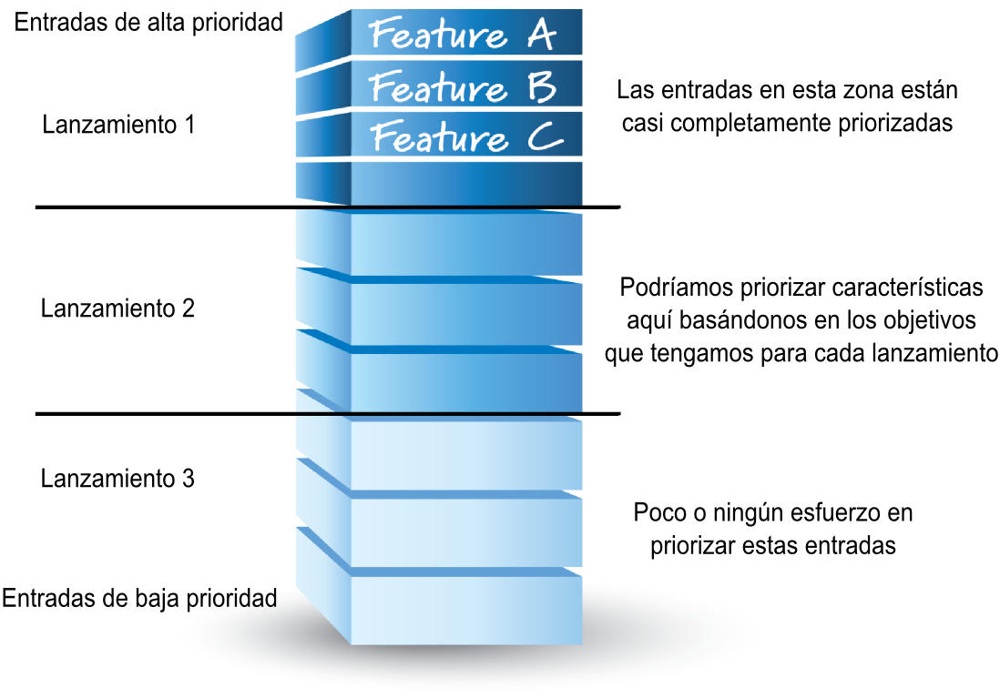
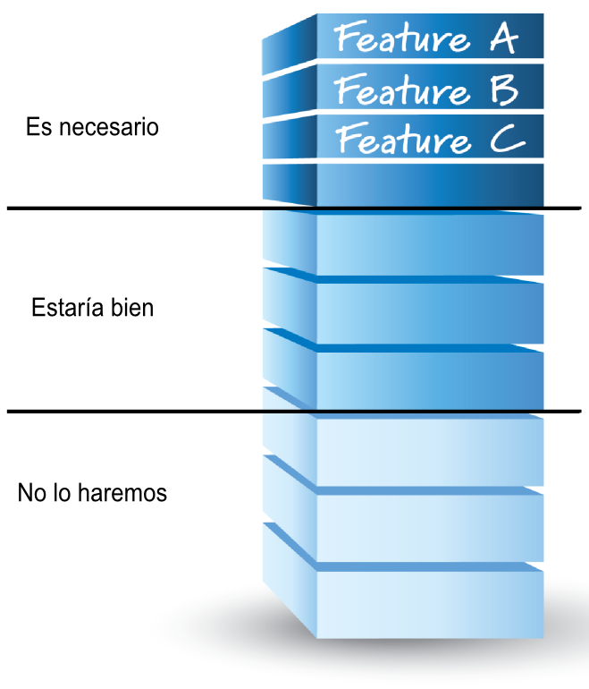
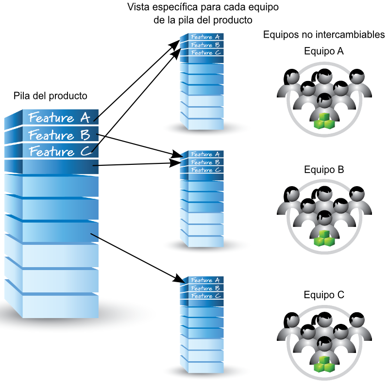
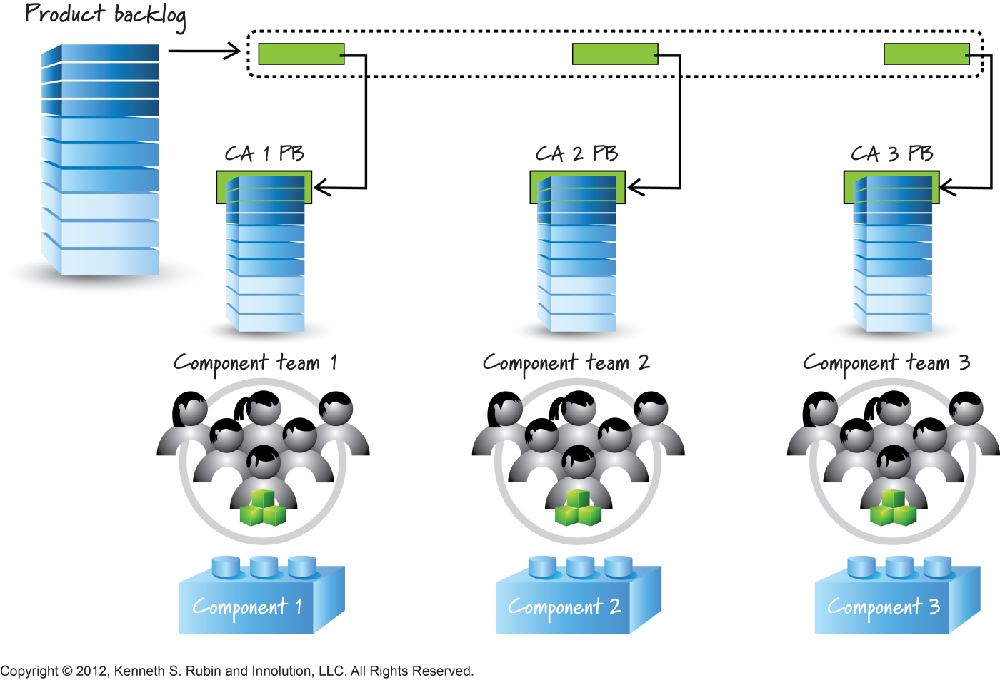
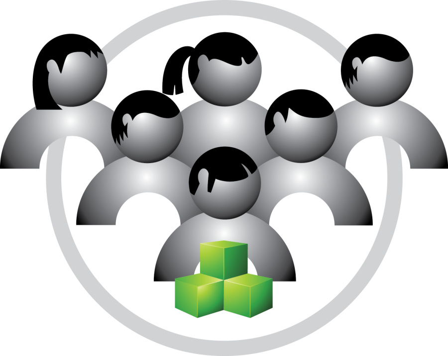

# 7i_GPS-S05-Scrum-PilaDelProducto

##  *Scrum – La pila del producto (* **Product backlog** *)* <u>Gestión de Proyectos Software</u>

*Scrum – La pila del producto (* **Product backlog** *)* <u>Gestión de Proyectos Software</u>

## Contenidos

-  La pila del producto
-  Criterios DEEP
-  Preparación ( grooming )
-  Gestión de flujos de trabajo ( flow management )
-  ¿Cuántas pilas?

## Pila del producto

-  Lista priorizada de las características que se desean para el producto
    -  Conocimiento centralizado sobre qué se quiere construir, y en qué orden
-  Central en Scrum, debe ser bien visible para todos los participantes

## Entradas de la pila del producto

-  Product backlog items  (PBI)
-  La mayoría son características ( features )
    -  Funcionalidad con valor tangible para el usuario/cliente
    -  Nuevas funcionalidades, pero también mejoras o cambios sobre las ya implementadas
    -  Otras    
        -  Defectos que hay que solucionar
        -  Mejoras técnicas
        -  Trabajo para adquirir conocimiento
        -  Documentación valiosa para los clientes
        -  Etc.

## Entradas de la pila del producto

-  Las buenas entradas siguen los criterios DEEP
    -  Detailed appropriately
    -  Emergent
    -  Estimated
    -  Prioritized

##  DEEP

DEEP

## Detalladas apropiadamente

-  No todas las entradas tienen el mismo nivel de detalle al mismo tiempo
-  Las entradas que se van a abordar pronto estarán cerca de la cima de la pila, y serán pequeñas y detalladas
    -  Las que no se abordan de momento, justo al revés
-  ¿Cuándo refinamos las entradas? Cuando las necesitemos, no antes
    -  Una pila con todas las entradas detalladas es casi lo mismo que un documento de requisitos tradicional    
        -  Y señal de que seguramente no se 

## Emergentes

-  Mientras se construye o mantiene un producto la pila del producto nunca está completa ni congelada
    -  Se actualiza continuamente en base a la información que llega
    -  Esta flexibilidad es una de las principales ventajas de las metodologías ágiles    
        -  Nos permite crear un producto lo más adecuado en cada momento a las necesidades cambiantes de tus clientes/usuarios 
-  La estructura de la pila es, por tanto, emergente

## Estimadas

-  Cada entrada tiene una estimación de tamaño (esfuerzo de desarrollo)
    -  El dueño del producto usa estas estimaciones como ayuda para decidir las prioridades
-  Una entrada de alta prioridad y mucho esfuerzo estimado necesita ser refinada antes de pasar a un sprint
-  Se suele estimar en puntos de historia o en días ideales
-  La estimación debe ser lo suficientemente precisa (pero no más)
    -  Las entradas más pequeñas estarán mejor estimadas
    -  Las entradas muy grandes pueden no estar estimadas, o solo muy por encima

## Priorizadas

-  La pila es una lista priorizada, pero es improbable que todas las entradas estén priorizadas
-  Se priorizan (ordenan) las que planificamos para los próximos sprints
-  También podemos priorizar lo que planeamos para la próxima versión
-  Intentar priorizar entradas que vayan más allá de eso no tiene mucho sentido

## 

##  Preparación  Grooming

Preparación  Grooming

## Grooming

-  La pila del producto debe ser activamente mantenida, organizada y administrada
-  El  grooming  incluye
    -  Crear, refinar y eliminar PBI
    -  Estimar PBI
    -  Priorizar PBI

## ¿Quién hace el grooming?

-  Esfuerzo colaborativo liderado por el dueño del producto
    -  Participa  el equipo Scrum  y, adicionalmente, clientes, inversores etc. según estén disponibles    
        -  No hace falta que siempre esté todo el equipo, pero es recomendable que sea así normalmente
    -  Las decisiones finales son del dueño del producto
-  Es una tarea importante, y el equipo debe dedicar una parte sustancial del tiempo de un sprint a ello
    -  El 10% del tiempo suele aparecer como referencia

## ¿Cuándo se hace el grooming?

-  Grooming  inicial en la planificación de  releases  (lanzamientos) del producto
-  Durante un sprint al menos hacerla una vez, o quizás una vez a la semana si son sprints más largos
    -  Como alternativa, podemos dedicar todos los días unos minutos tras el Scrum diario    
        -  En este caso es más normal que no participen todos los miembros del equipo de desarrollo
-  Durante, o después de, la revisión del sprint también es un buen momento
-  Es un proceso continuo y debe estar integrado en el proceso de cada organización, pero Scrum no dicta exactamente cuándo

## ¿Cuándo podemos llevar una PBI a un sprint?

-  El grooming debería asegurar que las entradas cercanas a la cima de la pila están  listas  para llevarse a un sprint
-  Este “listo” puede definirse como una lista de chequeo (igual que “hecho”). Por ejemplo, una entrada está lista si:
    -  Su valor de negocio está claro
    -  Hay detalles suficientes para que el equipo de desarrollo tenga toda la información necesaria para poder llevarla a cabo
    -  No tiene dependencias incumplidas que impidan completarla
    -  Está estimada y cabe bien en un sprint
    -  Tiene criterios de aceptación claros y testeables, y el equipo Scrum entiende cómo demostrar que está hecha cuando llegue la revisión del sprint

##  Gestión de flujos de trabajo ( flow management )

Gestión de flujos de trabajo ( flow management )

## Gestión de flujos de trabajo

-  Un flujo de trabajo es un patrón repetible formado por procesos (operaciones, fases) que transforman materiales, proporcionan servicios o procesan información
    -  Muchas veces se representa como una secuencia de estos procesos    
        -  P.ej. Análisis - Diseño - Implementación - Pruebas
-  En el desarrollo de software con Scrum, podemos ver las entradas de la pila como los elementos siendo procesados
    -  El flujo de trabajo principal en un proyecto Scrum consiste en transformar entradas de la pila en software disponible para los usuarios
-  Lo ideal es que todas los fases creen valor para el cliente, y que el trabajo pase de una fase a otra sin detenerse ni causar esperas innecesarias, completándose lo antes posible
-  Trabajar para conseguir ese ideal es a lo que denominamos gestión de flujos de trabajo
-  La pila del producto es crucial para alcanzar entrega de valor fluida en presencia de incertidumbre
    -  Va a llegar información importante de forma continua. Hay que organizarla, y organizar el trabajo, para que se procese con rapidez y con poco coste

## 

## Gestión del flujo hacia los lanzamientos (release flow)

-  La pila del producto debe estar cuidada ( groomed ) de manera que soporte una planificación de lanzamientos continuados
-  Un lanzamiento se puede ver como una línea en la pila del producto
    -  Por encima de la línea, las entradas van para el próximo lanzamiento
-  Otra alternativa es usar dos líneas para cada lanzamiento, dividiendo así la pila en tres
    -  Lo que debemos tener, lo que nos gustaría tener, y lo que no tendremos en ese lanzamiento en concreto    
        -  También se puede dividir en cuatro: must have / should have / could have / won’t have (MoSCoW para recordarlo)
-  Mantener así la pila nos ayudará cuando estemos haciendo la planificación de los futuros lanzamientos

## 

## 

Lanzamiento 1 Lanzamientos 2, 3...

## Gestión del flujo hacia el sprint

-  El  grooming  en la pila de producto es esencial para una planificación efectiva de cada sprint
-  Podemos ver la pila del producto como una “tubería de requisitos” que fluyen hacia los sprints
    -  Donde serán diseñados, implementados y probados por el equipo
-  Conforme los requisitos avanzan por esta tubería, se revisan progresivamente mediante el  grooming
    -  Para cuando llegan al final deben ser  sprintables
-  Ese punto de vista destaca que la entrada y salida de requisitos deben ser fluidas
    -  Si va lento, en algún momento nos quedamos sin requisitos sprintables
    -  Si hay demasiados en la tubería, tenemos un inventario grande que posiblemente tendrá partes que habrá que rehacer o tirar en el futuro
    -  Muchos equipos tratan de tener siempre suficientes entradas sprintables en la pila de producto como para dos o tres sprints

##  ¿Cuántas pilas?

¿Cuántas pilas?

## ¿Cuántas pilas del producto?

-  La regla básica es “un producto, una pila”
-  Pero definir producto no es obvio
    -  ¿Es Writer un producto, o lo es LibreOffice en conjunto?
-  Podemos considerar como producto algo de valor, por lo que algún cliente pagaría y que nosotros estamos dispuestos a “empaquetar y vender”
-  Vamos a ver algunos casos que se pueden dar

## Un producto, varios equipos y una sola pila

-  Si hay varios equipos trabajando en un producto, y este no es muy grande, una pila única nos permite optimizar dentro del producto
    -  Cada entrada se prioriza frente a todas las demás del producto
    -  Si cualquier equipo puede abordar cualquier entrada, esta estrategia es la mejor
-  Si los equipos están especializados, nos haría falta una pila por equipo
    -  En la pila de un equipo solo pueden ir cosas que ese equipo sabe hacer
    -  En la práctica no creamos una pila por equipo. Hay una única pila compartida, y una “vista” de la misma para cada equipo

## 

## Un producto grande, muchos equipos y pilas jerárquicas

-  Si un producto es grande, podemos tener muchos equipos trabajando
    -  Igual no es práctico, ni hace falta, que todos compartan la misma pila
-  Una solución es dividir los equipos por áreas
    -  En cada área hay varios equipos que trabajan en algo razonablemente independiente de las otras y que aporta valor identificable al cliente    
        -  P.ej., área de front-end Android, área de front-end iOS, área de API Web, área de back-end, área de análisis de datos, área de  machine learning ...
-  Basándonos en esta idea, podemos crear pilas jerárquicas
    -  Una pila que describe y prioriza las características a gran escala (p. ej. épicas) del producto    
        -  Con un dueño de producto “global”
    -  Y luego cada área tiene su propia pila con entradas más detalladas    
        -  Estas pilas de área serán compartidas por los equipos del área

## 

PBI más refinadas PBI épicas Cliente Android Cliente iOS Back-End

## Varios productos y un único equipo

-  Lo ideal es 1 pila por producto, y 1..N equipos por pila
-  Pero si un equipo tiene que trabajar en distintos productos, tendrá distintas pilas
    -  Esto es en general poco eficiente y trataremos de que no ocurra; pero a veces es inevitable
-  Una opción es que en cada sprint el equipo trabaje solamente en entradas de una de las pilas
    -  Es decir que trabaje solo en cosas de un producto
-  Si no es posible, podemos intentar mezclar las M pilas en una
    -  Los dueños de los M productos tendrán que coordinarse para decidir las prioridades

## Bibliografía

-  Kenneth S. Rubin.  Essential Scrum. A practical guide to the most popular agile process
    -  Chapter 6 (Product Backlog)

## 

