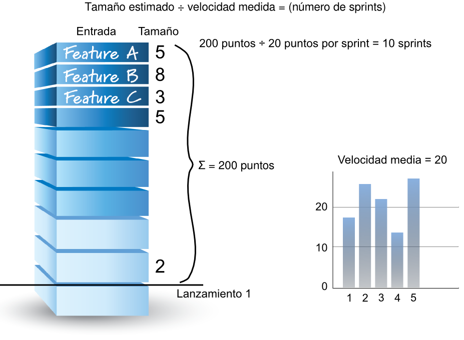

# 7i_GPS-S06-Scrum-EstimaciónVelocidad

##  *Scrum – Estimación y velocidad* **Gestión de Proyectos Software**

*Scrum – Estimación y velocidad* **Gestión de Proyectos Software**

## Contenidos

-  Planificación, velocidad y estimaciones
-  Estimar PBI
-  Velocidad

## Planificación

-  Para planificar el desarrollo de un producto, hay que estimar 
    -  ¿Cuántos requisitos implementaremos?
    -  ¿Cuándo estarán hechos?
    -  ¿Cuánto costará?
-  En Scrum estimamos el tamaño de lo que se construirá, y medimos la velocidad a la que trabajamos
    -  Con eso podemos derivar el probable tiempo de desarrollo (y por tanto el coste)    
        -  Dividiendo el tamaño estimado por la velocidad del equipo

## Velocidad

-  Velocidad de un equipo en un sprint :
    -  La suma de las  estimaciones  de tamaño de las entradas de la pila que el equipo  completó  (definición de hecho + aceptación) en el sprint
-  Podemos calcular la media, pero normalmente daremos un rango de velocidades
    -  Dependiendo de las unidades en que midamos, la media puede no tener mucho sentido

## 

## Qué y cuándo estimar

-  Típicamente en tres niveles
    -  Pila del portafolio
    -  Pila del producto
    -  Pila del sprint

## Estimaciones de la pila del portafolio

-  No es parte de Scrum, pero es común tener una
-  Un portafolio (o cartera) de productos/proyectos, contiene los productos/proyectos que tenemos que hacer
    -  La pila del portafolio serán esos productos/proyectos pero en formato lista priorizada
-  Todavía no tendremos requisitos detallados como para estimar cada uno y luego sumar
    -  Así que generalmente se usan estimaciones de grano grueso    
        -  P.ej. tallas de ropa: S, M, L, XL

## Estimaciones de la pila del producto

-  Las entradas a partir de cierto nivel de detalle (y de prioridad) suelen estimarse numéricamente
    -  En puntos de historia o días ideales
-  Estimar PBI es parte del  grooming  de la pila
-  Algunos practicantes de Scrum no estiman las PBI
    -  En su experiencia, cuando los equipos funcionan bien crean PBI de tamaños similares, y basta con contarlas para calcular la velocidad
-  Pero en general no todas las PBI son del mismo tamaño al mismo tiempo y es difícil partirlas en tamaños iguales
    -  Además las conversaciones de estimación son una buena forma de sacar a la luz ideas, problemas y asunciones ocultos

## Estimaciones de tareas

-  En el nivel más detallado están las tareas en la pila del sprint
    -  Normalmente se estiman durante la planificación del sprint
-  Se estiman en horas ideales (horas-persona)
    -  Es una estimación de cuánto de la capacidad que el equipo tiene disponible en el sprint hará falta para la tarea    
        -  Una tarea que creemos que va a necesitar a 3 personas durante 1 hora la tendremos que estimar en 3 horas-persona        
            -  Porque resta 3 horas de la capacidad del equipo en el sprint

##  Estimar PBI

Estimar PBI

## Estimar como equipo

-  En Scrum la regla es que la gente que hará el trabajo estima colectivamente
    -  Estima el equipo de desarrollo completo
    -  El dueño del producto y el ScrumMaster están presentes, pero  no estiman    
        -  El dueño del producto describe y clarifica las PBI
        -  El ScrumMaster facilita el trabajo

## Las estimaciones no son compromisos

-  Si le pides a alguien que estime, sin comprometerse, te dará su mejor estimación
-  Si le pides que se comprometa, te dará una estimación por exceso para ir tranquilo
    -  Tendrás que pelear para que reduzcan tiempos o no te saldrán los resultados económicos    
        -  Al final de este tira y afloja las estimaciones serán de todo menos fiables
-  Lo que queremos son buenas estimaciones

## 

## Exactitud o precisión (accuracy vs precision)

-  Es mucho más importante ser exactos (correctos) que ser precisos
    -  10276,5 horas-persona, o 45234,25 € son valores precisos    
        -  Pero no sabemos si son exactos
    -  La exactitud se refiere a la diferencia entre el valor que medimos y el valor auténtico
    -  La precisión se refiere a la dispersión que obtenemos al tomar diferentes mediciones    
        -  Si nuestro proceso de medida añade un error sistemático pequeño, todas nuestras medidas serán parecidas entre sí        
            -  Poca dispersión, alta precisión
        -  Pero sin comparar las medidas con el valor real, no sabemos si son exactas o no        
            -  Aunque el proceso de medida añada poco error sistemático, es posible que lo que estemos midiendo tenga un error no sistemático (ruido) muy grande y por tanto nuestras medidas no serán muy exactas
-  Estimar hasta un nivel de precisión muy alto es un desperdicio
    -  A partir de cierto punto, meter esfuerzo en una estimación para tratar de hacerla más precisa no la hace más exacta

##  Hay un señor que está hablando con el guía del museo del cosmos.  —¿Cuál es la edad del universo? —pregunta. —13.800.000.012,5 años —afirma el guía con rotundidad. —¿Y cómo lo sabe con tanta precisión? —contesta el señor sorprendido. —Cuando empecé a trabajar aquí me dijeron que era de 13.800.000.000 años. Y eso fue hace 12 años y medio.

Hay un señor que está hablando con el guía del museo del cosmos.  —¿Cuál es la edad del universo? —pregunta. —13.800.000.012,5 años —afirma el guía con rotundidad. —¿Y cómo lo sabe con tanta precisión? —contesta el señor sorprendido. —Cuando empecé a trabajar aquí me dijeron que era de 13.800.000.000 años. Y eso fue hace 12 años y medio.

## 

## Estimación de tamaños relativos

-  Normalmente estimaremos las entradas de la pila en relación con las otras entradas de la pila, no en valores absolutos
    -  En general es más fácil dar estimaciones exactas de esa forma, aunque no sean muy precisas    
        -  P.ej., es más fácil comparar dos árboles y determinar correctamente cuál es el más alto, que acertar la altura de cada uno en metros

## Unidades de estimación de PBI: puntos de historia

-  La elección más habitual para estimar las PBI
-  Miden la magnitud de una PBI en esfuerzo de desarrollo (que depende de complejidad, tamaño...)
    -  Un algoritmo de 50 líneas puede ser muy complejo, aunque sea pequeño
    -  Sumar 1 a todos los elementos de una hoja de cálculo de 60K líneas es muy simple, aunque pudiera parecer grande
-  Sirven para realizar afirmaciones del tipo, “si realizar esta PBI me cuesta 2 puntos de historia, esta otra me va a costar 4”
    -  Estimamos que la segunda PBI requerirá  aproximadamente  el doble de esfuerzo
-  Reflejan el esfuerzo asociado con las entradas de la pila del producto desde el punto de vista del equipo de desarrollo

## Unidades de estimación de PBI: días ideales

-  La segunda elección más habitual para estimar PBI
-  Número de días-persona necesarios para completar una historia
-  Son días ideales
    -  El equipo decidirá cual es su definición de “día ideal”. P.ej. “6 horas de trabajo continuado”.
-  Hay más riesgo de malentendidos con los días ideales que con los puntos de historia
    -  Además, es difícil usarlo como medida relativa al estar definida en unidades de tiempo    
        -  Son ideales, pero siguen siendo días, y la tendencia es pensar en los días como días de calendario

## ¿Para cuándo estará?

-  Hoy es lunes y son las 8 de la madrugada. Te señalo una PBI y te pregunto que en cuánto está estimado que cueste hacerla. Me dices que 2 días ideales. ¿Estará para el miércoles?

## De tallas de ropa a puntos de historia

-  Tomad la pila del producto (de vuestro proyecto) en su estado actual (entradas estimadas en tallas de ropa) y la pila del sprint actual (entradas de la pila divididas en tareas de X horas-persona)
-  A partir de ahí estimad puntos de historia para algunas de las entradas de la pila del producto. Usad solo estos valores: 1, 2, 3, 5, 8, 13, 20, 40 y 100
    -  Coged las entradas de menos esfuerzo, asignadles 1 o 2 puntos de historia y seguid desde ahí

## Escala de estimación

-  Buscamos favorecer la exactitud sobre la precisión
    -  Para ello usamos escalas en las que no están todos los números    
        -  Las unidades serán las que se usen: puntos de historia o días ideales
-  La escala más común es una secuencia de Fibonacci modificada
    -  1, 2, 3, 5, 8, 13, 20, 40 y 100
-  Una alternativa es usar potencias de dos
    -  1, 2, 4, 8, 16, 32, ...
-  Agrupamos PBI similares en esfuerzo y les damos el mismo número
    -  Las PBI con el mismo número serán de esfuerzos parecidos, aunque no iguales

##  Velocidad

Velocidad

## Velocidad

-  Cantidad de trabajo completada en cada sprint
    -  Mide tamaño/esfuerzo de las tares completadas, no su valor para clientes o usuarios    
        -  Todas las PBI tienen algún valor (o no deberían estar en la pila)
        -  Pero tamaño y valor no necesariamente están relacionados        
            -  Hay cosas que cuesta poco hacer y pueden tener un impacto importante en, por ejemplo, el éxito comercial del producto
-  Se mide sumando el tamaño  estimado  de las PBI completadas en el sprint
    -  Recordatorio: una PBI se ha completado si está “hecha” y “aceptada”
-  Esencial para la planificación
    -  Para planificar un lanzamiento, dividimos el tamaño del mismo por la velocidad media del equipo para estimar los sprints necesarios
-  Herramienta de diagnóstico para evaluar y mejorar al equipo
    -  Observando su propia velocidad en el tiempo, el equipo puede aprender cómo los cambios en sus procesos afectan a la entrega de valor al cliente (mejora continua)

## Calcular un rango de velocidades

-  Para la planificación lo más útil es expresar la velocidad como un rango
    -  Por ejemplo: el equipo suele completar entre 25 y 30 puntos de historia cada sprint
    -  Preferimos exactitud que excesiva precisión
-  El rango permite comunicar incertidumbre, algo que un valor concreto oculta

## Inciso: rangos y estimación en proyectos de software

## Calcular un rango de velocidades

-  Si para un lanzamiento hemos estimado 200 puntos de esfuerzo, y la velocidad media del equipo es entre 17 y 20 puntos por sprint, necesitaremos entre 10 y 12 sprints para completar el lanzamiento

## Calcular un rango de velocidades

-  Para calcular la velocidad baja y la alta no hay una forma exigida
-  Una fácil es coger las velocidades históricas y tomar un intervalo de p.ej. el 90% asumiendo que es una distribución normal (1,645 sigmas):
    -  Rango = (Media +/- 1,645 * Desviación estándar)
    -  Ejemplo: valores históricos 17, 21, 20, 15, 25, 16, 20 Rango = (19,1 +/- 1,645 * 3,4) (y luego redondeando, que los puntos de historia no tienen decimales): (14, 25)
-  También podemos dividir los valores históricos en dos grupos, por encima de la mediana y por debajo, y calcular luego la media de cada uno como valores para el rango

## Predecir la velocidad

-  Si no tenemos datos históricos (p.ej. equipo nuevo) tendremos que predecir la velocidad del equipo
-  Opción común: que el equipo planifique un sprint y, si nos parece razonable, tomar la suma de tamaños de las PBI para el sprint como su velocidad predicha
    -  Para tener un rango podemos añadir/restar valores a esa predicción a partir de datos de otros equipos, o podemos pedirles que estimen dos sprints y usar esos resultados
-  En cuanto tengamos un valor real, descartaremos la predicción y usaremos ese

## Usos incorrectos de la velocidad

-  Es una herramienta de planificación y de diagnóstico del equipo
    -  Sí: hacer estimaciones aproximadas de tiempos de desarrollo a medio plazo
    -  Sí: comprobar si los cambios en el proceso ayudan al equipo a funcionar mejor
-  No es una medida de prestaciones ni de productividad
    -  No: comprobar si un equipo funciona mejor que otro
    -  No: comprobar si un equipo cumple con unos objetivos de productividad establecidos

## Bibliografía

-  Kenneth S. Rubin.  Essential Scrum. A practical guide to the most popular agile process
    -  Chapter 7 (Estimation and Velocity)

## 

