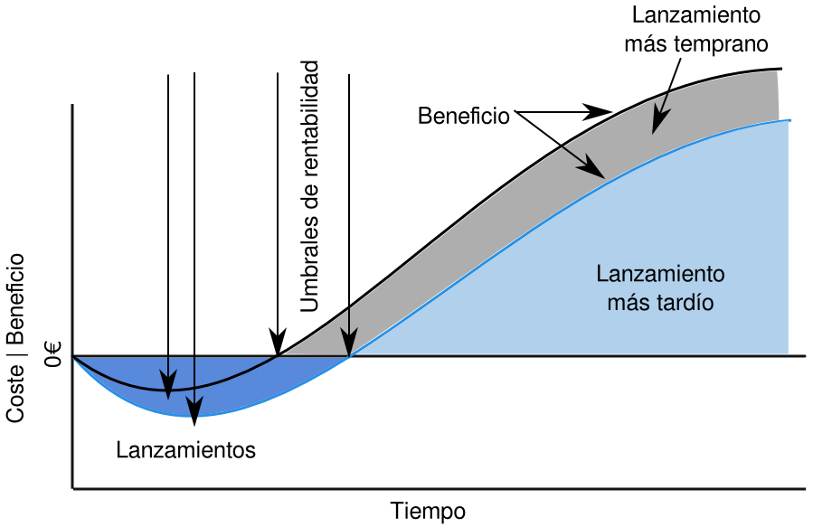
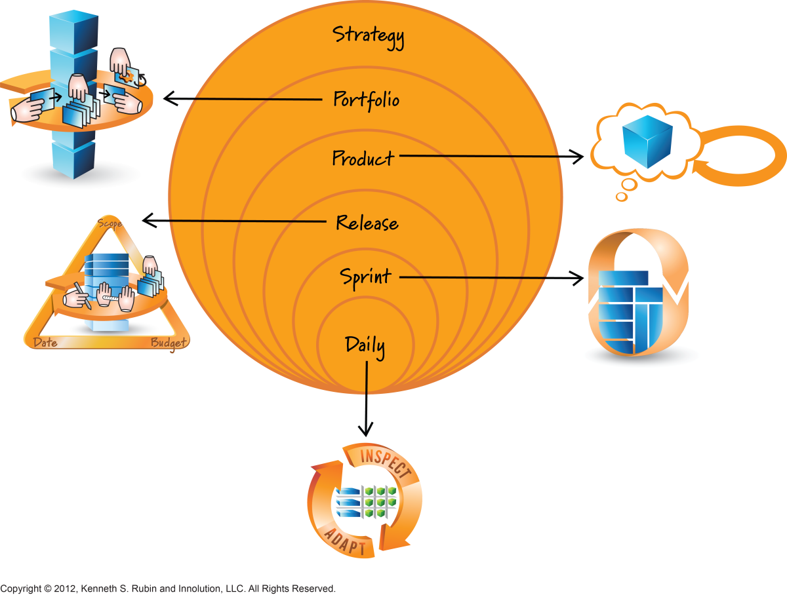
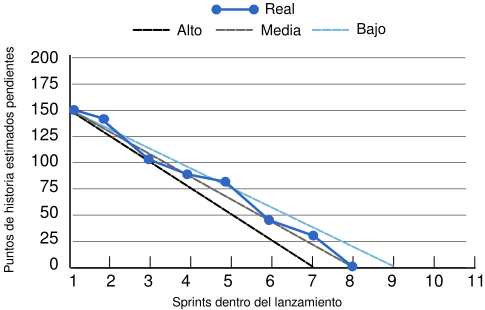

# 7i_GPS-S07-Scrum-Planificación


##  *Scrum – Planificación* **Gestión de Proyectos Software**

*Scrum – Planificación* **Gestión de Proyectos Software**

## Contenidos


-  Principios de la planificación
-  Planificación multinivel
-  Planificación de producto
-  Planificación de lanzamientos
    -  Planificación con alcance prefijado
    -  Planificación con fecha prefijada
    -  Estimación de costes
-  Planificación de sprint y diaria
-  Póquer de planificación

## Planificación en Scrum


-  Error : en Scrum se empieza sin hacer planificación, se lanza el primer sprint y los detalles se completan sobre la marcha
-  Realidad : en Scrum se planifica en varios niveles de detalle y en diversos momentos
    -  Puede que incluso se haga más planificación que con metodologías tradicionales

## Principios de la planificación


-  Desde la perspectiva tradicional hacemos un plan detallado antes de comenzar el trabajo
    -  Sin este plan no sabemos dónde vamos, ni podemos coordinar gente y actividades    
        -  Esto es, al menos, cierto en parte
-  En la aproximación Scrum no hacemos  toda  la planificación al principio
    -  Hacemos una parte y el resto  just-in-time
-  A partir de cierto punto en el tiempo, carecemos de la información necesaria para que el plan sea fiable, por eso queremos:
    -  Una planificación inicial que ayude sin ser excesiva
    -  Mantener opciones de planificación abiertas hasta el último momento responsable
-  La conformidad con un plan erróneo no aporta nada
    -  Si hemos dedicado mucho tiempo a crear un plan, cuesta mucho corregirlo
    -  Y además, asumiremos que es correcto hasta que no nos quede otro remedio que aceptar que no (demasiado tarde)

##  “Cuando estés perdido en un bosque, si el mapa no coincide con el terreno cree siempre en el terreno”
- 
    -     
        -          SAS Survival Handbook (supuestamente...)

 “Cuando estés perdido en un bosque, si el mapa no coincide con el terreno cree siempre en el terreno”
- 
    -     
        -          SAS Survival Handbook (supuestamente...)

## Principios de la planificación


-  Si no sabemos si un plan es correcto, el progreso no se puede medir por la conformidad, o no conformidad, con respecto al mismo
-  Scrum recomienda replanificar frecuentemente conforme validamos suposiciones
    -  Es mucho menos grave tener un plan erróneo porque se reemplaza en cuanto sabemos más
-  Un plan detallado y no validado al principio es esfuerzo desperdiciado
    -  Crear un plan tan detallado    
        -  Que lleva mucho tiempo, que además podría haberse dedicado a tareas más valiosas (coste de oportunidad)
    -  Tener que actualizarlo    
        -  El coste de actualizar algo complejo es mayor

## Principios de la planificación 


-  Es mejor planificar lanzamientos menores, con menos nuevas características implementada, pero más frecuentes
    -  Porque nos dan  feedback  antes
    -  Porque en general mejoran el retorno de la inversión    
        -  Pueden generar beneficio económico antes
    -  Para empezar, habrá un producto mínimo viable    
        -  Menos que eso no se puede lanzar
        -  Depende mucho de tu mercado
-  Es mejor planificar para aprender rápido y pivotar
    -  Haz, aprende y cambia si hace falta
    -  Pivotar es cambiar de dirección pero manteniendo un apoyo en lo que ya sabes/tienes hecho

## 





## La falacia del coste irrecuperable (sunk cost)


-  En teoría, haber hecho una inversión (tiempo, dinero) en algo no debería afectarnos a la hora de tomar decisiones racionales sobre ese algo
    -  Por ejemplo, si tenemos unas acciones cuyo valor ha bajado mucho, y un análisis económico indica que la cosa probablemente irá a peor, lo racional sería venderlas cuanto antes e invertir en algo con mejores perspectivas
-  En la práctica, la aversión a la pérdida y otros sesgos cognitivos hacen que no nos comportemos racionalmente en este tipo de situaciones
    -  En el ejemplo, podemos preferir “aguantar” las acciones confiando en que aún pueden recuperar su valor
-  Esta falacia tiene dos características principales
    -  Una vez hecha una inversión (tiempo/dinero) somos muy optimistas sobre sus beneficios
    -  Si nos vemos personalmente responsables de haber hecho una inversión (tiempo/dinero), somos más propensos a caer en esta falacia
-  Por lo tanto, si dedicamos mucho esfuerzo (inversión de tiempo) a crear un plan
    -  Seremos demasiado optimistas sobre sus beneficios
    -  No lo descartaremos incluso cuando sea evidente que no lo vamos a poder cumplir

##  Planificación multinivel

Planificación multinivel

## 




## Niveles de planificación


-  Estratégica
    -  Necesaria para el éxito de una organización
    -  No la vamos a ver porque no está en el ámbito de la gestión de proyectos
-  De portafolio (o cartera)
    -  Al menos a un año vista, gestiona una cartera de productos    
        -  Decidir en qué productos trabajar, en qué orden y durante cuánto tiempo
    -  No la vamos a ver porque no está en el ámbito de la gestión de proyectos
-  De producto
    -  Captura la esencia de un producto potencial y diseña un plan aproximado para su creación
-  De lanzamiento
    -  Típicamente entre tres y nueve meses
    -  Busca un equilibrio entre el valor que se entrega al cliente (características funcionales y no funcionales, calidad) y las restricciones de alcance, calendario y presupuesto
-  Y las dos únicas que Scrum requiere
    -  De sprint    
        -  Qué entregar en el próximo sprint
    -  Diaria    
        -  Cómo completar lo que se ha comprometido

##  Planificación de producto

Planificación de producto

## Planificación de producto


-  Capturar lo esencial de un producto potencial y crear un plan (aproximado) para su creación
-  Resultados
    -  Una visión
    -  Una pila de producto de alto nivel
    -  Y, opcionalmente, una hoja de ruta del producto
-  No contemplada por Scrum
-  Aún así se puede hacer de forma que se integre bien con sus principios y valores
    -  No intentar planificar todo por adelantado, pero sí tener suficiente detalle para entender a qué clientes va dirigido, las características que queremos y una idea de cuánto podría costar

## Fases


-  Empieza con una idea
-  Se pasa por el “filtro estratégico”
    -  ¿Encaja en los objetivos de la empresa?
-  Se hace una planificación inicial
    -  Lo mínimo suficiente para definir cuál sería el mínimo producto viable
-  Ese mínimo producto viable, en manos de los usuarios y clientes, nos proporcionará  feedback  para poder avanzar

## Participantes en la planificación del producto


-  Al principio el dueño del producto, con el apoyo (interno) que necesite
    -  Cualquiera que pueda aportar ideas + expertos en marketing/ventas, en diseño de interfaz de usuario, en arquitectura de sistemas…
    -  El dueño o la dueña de producto suelen ser la persona que propuso la idea
-  Cuando el producto ya esté en marcha los equipos Scrum también deberían participar en las reuniones de replanificación del mismo

## Entradas del proceso de planificación del producto


-  Para hacer la planificación de producto necesitamos:
    -  Una idea que ha superado el filtro estratégico o, en fases sucesivas, una idea que ha ido evolucionando según  feedback  adquirido
    -  Horizonte de planificación    
        -  ¿Hasta qué fecha tiene que llegar nuestro plan?
    -  Fecha límite para completar la planificación    
        -  ¿Cuánto tiempo nos da la jefa (o el jefe) para tener hecho el plan?
    -  Presupuesto y recursos para la planificación    
        -  ¿Cuánto dinero nos da la jefa (o el jefe) para tener hecho el plan?
    -  Umbral de confianza    
        -  Cuánta información necesitamos para decidir si vamos adelante o no con el producto        
            -  Es decir, ¿cuánta seguridad tenemos que tener en la viabilidad de nuestro plan para que nos den luz verde para ponerlo en marcha?

## Resultados del proceso de planificación del producto


-  Como resultados de la planificación del producto tendremos:
    -  Una  visión  clara, concreta    
        -  Frecuentemente se expresa en términos de cómo los clientes, usuarios o inversores obtendrán valor
    -  Una pila del producto de alto nivel 
    -  Una hoja de ruta del producto

## La visión: posibles áreas de valor para clientes e inversores


-  El producto que vamos a crear
    -  Cumple ciertos requisitos mínimos, o normas y regulaciones obligatorias
    -  Va a facilitar o permitir la venta de otros productos o servicios
    -  Nos diferenciará de la competencia, o dificultará que esta se ponga a la par con nosotros
    -  Eliminará la diferenciación/ventaja que ahora tiene un competidor
    -  Cambiará el juego (p.ej., revolucionará un mercado existente) 
    -  Reducirá costes acortando el tiempo de llegada al mercado de otro producto, reduciendo el número de personas necesarias para un trabajo o el tiempo que tienen que emplear o mejorando márgenes de beneficio

## La visión: posibles formatos


## Pila del producto de alto nivel


-  Si usamos historias de usuario, querremos historias épicas
-  Las crean los mismos que la visión
    -  Dueño del producto, clientes, inversores, equipo Scrum (si ya está creado), y cualquiera que pueda aportar experiencia, conocimiento e ideas

## Hoja de ruta del producto (product roadmap)


-  Un resumen del plan que tenemos para los lanzamientos de producto incrementales que vamos a hacer
    -  Tan largo como necesitemos     
        -  P.ej., si pedimos financiación para un año, el plan tiene que abarcar al menos un año
-  Los lanzamientos frecuentes requieren que cada uno tenga pocas características nuevas
    -  Conceptos de “producto mínimo viable” y de “incremento mínimo viable de producto”
-  Tener una estrategia de lanzamientos prefijada simplifica la hoja de ruta
    -  Un ejemplo es Ubuntu, que cada año lanza dos nuevas versiones, en Abril y en Octubre
    -  Esto puede ser complementario a una estrategia de lanzamientos menores más frecuentes    
        -  Ubuntu tiene frecuentes actualizaciones de mantenimiento entre versiones
-  Tiene que considerar a los clientes
    -  Si hay varios segmentos de clientes, la hoja de ruta indica cuándo y cómo se aborda cada segmento
-  Tiene que considerar aspectos tecnológicos y arquitecturales de alto nivel
    -  Para cada lanzamiento se pueden decidir abordar ciertas tecnologías o arquitecturas o no
-  Tiene que considerar aspectos de marketing
    -  Por ejemplo las fechas de ciertas ferias o congresos donde queramos exponer nuestro producto

## 


```
Copyright © 2012 , Kenneth S. Rubin and Innolution, LLC. All Rights Reserved.
```


## Otras actividades


-  Lo que necesitemos para tener confianza en el plan
    -  Algo de investigación de mercados, análisis de otros productos parecidos ya existentes, un modelo de negocio viable...
-  En general son actividades “de negocios” y no de gestión de proyectos software

##  Planificación de lanzamientos (para un producto dado)

Planificación de lanzamientos (para un producto dado)

## Planificación de lanzamientos


-  Cada organización determina la cadencia de entrega de características a los clientes
    -  Las nuevas versiones que se van publicando
    -  Cada sprint, cada N sprints, o incluso cada característica implementada (despliegue continuo)
-  Independientemente de esto, una cierta planificación de largo plazo y alto nivel suele ser útil
    -  Planificación de lanzamientos    
        -  Dar una idea la funcionalidad que entrará en cada uno de los próximos lanzamientos

## Planificación de lanzamiento (release planning)


-  Consiste en buscar un equilibrio entre el alcance (funcionalidad+calidad), las fechas de entrega, y el presupuesto, en un contexto de entregas incrementales
    -  Recordad el triángulo de hierro de la gestión de proyectos    
        -  Coste, Plazos y Resultados (Alcance y Calidad) se enfrentan entre sí
-  Se hace una inicial después de la planificación de producto y antes del primer sprint asociado con el lanzamiento
    -  Como mínimo hay que decidir cuánto se hará en el primer lanzamiento frente a cuándo estará disponible    
        -  Podemos planear hacer muchas cosas pero el lanzamiento tardará más, o al revés
-  Para tener idea de cuánto se puede hacer para una fecha dada, o cuándo se podrá entregar una funcionalidad concreta, hay que estimar suficientes entradas de la pila del producto
-  Se puede visualizar poniendo líneas en la pila
    -  Por encima de cada línea están las PBI planificadas para ese lanzamiento

## 


## Planificación de lanzamientos


-  No es una actividad que se haga una sola vez, es continua
    -  Por ejemplo, la planificación de lanzamientos se puede examinar, y quizás modificar, en las revisiones de cada sprint
-  La inicial se hace tras la planificación de producto
    -  La planificación de producto que hemos hecho antes ha establecido qué debería ser el producto y, a grandes rasgos, cuándo estarán disponibles sus primeras versiones y qué características tendrán
    -  La planificación de lanzamientos establece los pasos para alcanzar ese objetivo
-  Pueden participar todos los interesados (clientes, usuarios, inversores...) y el equipo Scrum
-  Para planificar los próximos lanzamientos necesitamos:
    -  Los resultados de la planificación del producto    
        -  Visión, pila de alto nivel, hoja de ruta
    -  Las velocidades de los equipos Scrum involucrados

## Actividades de planificación de lanzamientos


-  Comprobar, y actualizar si es necesario, las restricciones de alcance, fecha y presupuesto del producto
-  Grooming  de la pila del producto
-  Chequear que el mínimo conjunto de características para cada lanzamiento es adecuado desde la perspectiva del cliente
    -  Que cada lanzamiento es un producto mínimo viable, o un incremento de producto mínimo viable, adecuado
-  Mantener un plan de lanzamientos
    -  Con la precisión mínima suficiente
    -  Cuándo terminaremos, y qué características tendremos en, cada lanzamiento

## Restricciones para los lanzamientos


-  Podemos tener un proyecto en el que alcance (funcionalidad+calidad), la fecha y/o el presupuesto estén prefijados y no se puedan cambiar
    -  Serán restricciones
-  Para ver cómo podemos hacer la planificación de lanzamientos hay que saber primero qué restricciones tenemos. Vemos cuatro casos
    -  Todo prefijado
    -  Alcance y fecha prefijados
    -  Alcance prefijado
    -  Fecha prefijada

## Restricción: todo prefijado


-  Alcance, fecha y presupuesto están fijados de antemano
    -  Esto son los típicos contratos “llave en mano”
-  Choca frontalmente con una base de Scrum
    -  La de que no podemos saberlo todo por adelantado
-  Además nos impide aprovechar la variabilidad útil
    -  P.ej., alterar el alcance del producto conforme aprendemos más sobre el tipo de usuarios que tendremos
-  A efectos prácticos  es incompatible con Scrum
    -  Podemos usar cosas de Scrum, pero choca con algunos de sus principios fundamentales

## Restricción: alcance y fecha prefijados


-  Esta circunstancia no es común
    -  Es poco habitual que alcance y fecha estén prefijados, pero que el presupuesto sí que sea flexible
-  Tanto alcance como fecha son difíciles de prefijar
    -  Así que no es buena señal que ambos lo estén
-  Alcance y fecha se oponen frontalmente
    -  Normalmente alguno acaba por ceder
-  Aunque realmente podamos estirar el presupuesto, es posible que no podamos acelerar el proyecto
    -  “ Nueve mujeres no hacen un bebé en un mes” (Brooks, 1995)
-  La aproximación iterativa e incremental de Scrum nos puede servir para darnos cuenta antes si tenemos problemas
    -  Pero tampoco esta forma de trabajar es recomendable

## Restricción: alcance prefijado


-  Hay unas características fundamentales que tienen que estar sí o sí
    -  P.ej., el mínimo producto viable
-  No tenemos una fecha límite estricta
    -  Notad que si estiramos la fecha límite, estamos estirando también el presupuesto, así que tampoco podremos eternizarnos
-  Scrum es adecuado, aunque no sea la situación ideal
-  La vemos en detalle enseguida

## Restricción: fecha prefijada


-  Acordamos una fecha límite clara y un presupuesto final con el cliente
    -  Pero, a cambio, pactamos flexibilidad con la funcionalidad
-  Es la aproximación más compatible con los principios de Scrum
-  Como desarrollamos primero lo más prioritario para el cliente, generalmente no tendremos que dejar de lado nada importante
    -  Esto solo funciona si tenemos una definición de “hecho” fuerte    
        -  Así, hasta lo hecho durante los primeros sprints será lo bastante bueno como para producción
-  Si tenemos pocas características “obligatorias” en nuestro alcance, probablemente podremos crear más (de las menos importantes) antes de la fecha debida
-  La veremos en detalle después

## Resultados de planificación de lanzamientos


-  Tras una planificación de lanzamientos tendremos:
    -  Conjunto mínimo de características deseadas para cada lanzamiento
    -  Si el presupuesto está prefijado (restricción de coste)    
        -  Características que podemos hacer por ese presupuesto        
            -  Con un margen de confianza
        -  Deberían ser suficientes para varios lanzamientos, como mínimo para uno, o el proyecto no es viable
    -  Si las características del producto están prefijadas (restricción de alcance)    
        -  Número de sprints y coste para cada lanzamiento        
            -  De nuevo con márgenes de confianza
    -  Opcionalmente un mapa de sprints    
        -  Idea general de qué PBI se implementarán en los próximos N sprints        
            -  Recordad que cada lanzamiento planificado requerirá varios sprints
        -  De corto plazo y teniendo claro que eso no puede sustituir a la planificación de cada sprint conforme avancemos

##  Planificación de lanzamientos con alcance prefijado

Planificación de lanzamientos con alcance prefijado

## Planificación con alcance prefijado

1. Haz  grooming  de la pila del producto hasta abarcar al menos las PBI que tienes que implementar (ese alcance prefijado) 2. Suma el tamaño total de esas PBI 3. Calcula la velocidad del equipo como un rango 4. Divide el tamaño total por la velocidad más rápida y redondea hacia arriba Ese es el número de sprints mínimo necesario 5. Lo mismo con la velocidad más lenta Ese es el número de sprints máximo que se tardará

## Planificación con alcance prefijado


-  Tenemos estimadas las entradas que tenemos que implementar en 150 puntos de historia
-  La velocidad de nuestro equipo es de entre 18 y 22 puntos por sprint
-  Calcula los sprints que necesitaremos

## Comunicar progreso con alcance prefijado


-  ¿Cómo expresamos lo que hemos progresado hacia el objetivo prefijado?
    -  En un diagrama de trabajo  pendiente  ( burndown chart ) para el lanzamiento
    -  O en un diagrama de trabajo  completado  ( burnup chart ) para el lanzamiento

## 




## 


##  Planificación de lanzamientos con fecha prefijada

Planificación de lanzamientos con fecha prefijada

## Fecha prefijada


-  Esta es la planificación de lanzamientos más compatible con los principios de Scrum

## Planificación con fecha prefijada

1. Determina cuántos sprints se harán para esa fecha 2. Haz  grooming  de la pila del producto que cubra bastantes entradas como para llegar con trabajo a esa fecha 3. Calcula la velocidad del equipo como un rango 4. Multiplica la mínima por el número de sprints Ese número de puntos de historia de la pila del producto serán las características que “se tendrán” 5. Lo mismo con la máxima Serán las que “podrían estar”

## Planificación con fecha prefijada


-  Tenemos fecha prefijada para dentro de 3 meses y sprints de 2 semanas
-  La velocidad de nuestro equipo es de entre 18 y 22 puntos de historia por sprint
-  Calcula los puntos de historia que se podrán implementar

## Comunicar progreso con fecha prefijada


-  Una vez sabemos exactamente cuántos sprints vamos a emplear, hay que comunicar cuántas características vamos a poder completar, y las que llevamos completadas, tras cada sprint
    -  Los diagramas de trabajo pendiente y completado ( burndown  y  burnup)  normales no son adecuados para esto
    -  Pero podemos crear un diagrama de trabajo completado especial para esto

## 


##  Estimación de costes tras una planificacion de lanzamientos

Estimación de costes tras una planificacion de lanzamientos

## Estimar coste (fecha o alcance prefijados)

1. Determina quién forma el equipo 2. Determina la longitud de sprint 3. Calcula coste del sprint P.ej. el sueldo de cada miembro del equipo y la longitud del mismo (más otros costes más o menos fijos, pero esto debería dar una idea) 4a. Si es la fecha la prefijada Número de sprints * coste por sprint 4b. Si es el alcance el prefijado Entre número de sprints mínimo * coste por sprint 

## Estima el coste


-  Entre 6 y 8 sprints de 1 mes
-  El equipo son cinco personas
    -  Arturo y Beatriz, que cuestan(*) 3500 euros al mes
    -  Carlos, Daniel y Esther, que cuestan 2500 euros al mes
-  Arturo y Carlos van a estar solo el 50% de su tiempo los dos primeros meses en este proyecto
    -  El resto lo dedicarán a otros proyectos
-  Esther va a coger una baja por una cirugía planificada del mes 6 en adelante y no planificamos meter a nadie en el equipo para sustituirla antes de haber terminado el lanzamiento actual (*) El coste para la empresa, que será bastante mayor que su sueldo

## Calcula el coste: respuesta


-  A y B: 3500. C, D y E: 2500
-  Costes por sprint:
    -  Sprint 1,2: 3500/2 + 3500 + 2500/2 + 2500 * 2 = 11500 
    -  Sprints 3,4,5: 3500*2 + 2500*3 = 
    -  Sprint 6,7 y 8: 3500*2 + 2500*2 = 12000
-  En 6 sprints: 78500
-  En 8 sprints: 102500

## Atención: “calidad variable”


-  Si restringimos demasiado el alcance, la fecha y el presupuesto, la calidad se vuelve “flexible”
    -  Por cumplir las exigencias de alcance, fecha y presupuesto, entregaremos un producto de baja calidad que puede no satisfacer al cliente    
        -  Generalmente esto no será obvio para el cliente hasta que el producto se haya puesto en producción y ya lleve un tiempo en marcha
-  Esto sucede frecuentemente en los proyectos “llave en mano” y en los proyectos que se otorgan en subastas a la baja
    -  P.ej., los contratos típicos con la administración pública o empresas grandes
    -  Seguramente es la tipología de contratación más frecuente    
        -  Eso dice algo sobre el interés existente por la calidad... :-(

##  Planificación de sprint y diaria

Planificación de sprint y diaria

## Planificación de sprint


-  Al principio de cada sprint
-  El equipo crea la pila del sprint
    -  Entradas de la pila del producto para el sprint y las tareas que hay que completar para asegurarse de que estén hechas
-  La veremos en detalle en el próximo tema

## Mapa de sprints


-  Además de planificar cada sprint al principio del mismo, que es  imprescindible , también podemos tener una mínima planificación de los próximos N sprints
    -  Asociar entradas de la pila con algún sprint próximo
-  Necesitamos un conjunto de entradas de la pila del producto adecuadamente detalladas, estimadas y priorizadas
-  Usando la velocidad del equipo, podremos agrupar entradas que quepan en un sprint
-  Esto no sustituye a la planificación de cada sprint, solo nos da una idea gruesa de cómo serán los próximos sprints

## Planificación diaria


-  El nivel más detallado de planificación se realiza durante el scrum diario
-  Cada persona del equipo describe, de manera claramente visible pero a alto nivel, el plan para el día
    -  “ Hoy voy a terminar el proceso de importación de los datos. A mediodía debería estar. Luego por la tarde planeo empezar a diseñar el acceso a los mismo”
-  Así se pueden detectar posibles problemas y restricciones, y mejorar la fluidez del trabajo
    -  “ Pues yo me iba a poner ya con el acceso a los datos, pero dado que la importación aún tardará, empezaré a diseñar los tests de prestaciones de acceso”

##  Póquer de planificación ( Planning poker )

Póquer de planificación ( Planning poker )

## Póquer de planificación


-  Técnica para estimar tamaño (esfuerzo) de entradas de la pila (PBI). Basada en
    -  Consenso
    -  Experiencia y pericia
    -  Discusión intensa
    -  Tamaños relativos
    -  Agrupar PBI de tamaños similares
    -  Aprovechar el historial de estimaciones del equipo

## Cómo jugar


-  Participa todo el equipo Scrum
-  El dueño de producto presenta, describe y clarifica PBI (no estima)
-  La ScrumMaster ayuda con el juego y está atenta a que todos los miembros se involucren (no estima)
-  El equipo de desarrollo genera las estimaciones de manera colaborativa

## Cada miembro del equipo tiene las siguientes cartas


-  0, ½, 1, 2, 3, 5, 8, 13, 20, 40, 100,  ∞ , ?,  
    -  0: entrada ya terminada o minúscula
    -  ½: entrada muy pequeña
    -  1, 2, 3: entradas pequeñas
    -  5, 8, 13: entradas medianas (típicamente el 13 es para lo más grande que se metería en un sprint)
    -  20, 40: entradas grandes (características, temas)
    -  100: entradas muy grandes (características grandes, épicas)
    -  ∞ : tan grande que no merece la pena estimarlo
    -  ?: no se entiende la entrada
    -   : necesito un descanso

## Reglas del póquer de planificación


-  1. El dueño del producto elige la PBI que se estimará y la lee
-  2. El equipo de desarrollo discute y pide clarificaciones al dueño
-  3. Cada estimador elige la carta con su estimación
    -  Sin que le vean los demás
-  4. Se muestran a la vez todas las cartas
-  5. Si son todas iguales hay consenso y ya tenemos la estimación
-  6. Si no, se discute para exponer asunciones y malentendidos
    -  Se puede empezar pidiendo a los que han estimado más y menos que justifiquen sus estimaciones
-  7. Tras la discusión, se vuelve al punto 3 y se repite hasta el consenso

## Inciso: ¿por qué mostrar todas las cartas a la vez?


-  Evitar un sesgo cognitivo conocido como “Anclaje” o “Efecto foco”: las personas hacemos cálculos o estimaciones a partir de una primera aproximación (ancla o foco) y luego la vamos ajustando con información adicional
    -  Un truco que manejan muy bien en cualquier zoco o en cualquier respetable casa de subastas
-  Un problema es que el peso del ancla inicial suele ser  desproporcionadamente grande  en la estimación final
-  Otro problema es que ese ancla inicial puede ser cualquier cosa,  hasta un dato al azar

## Resultados del póquer de planificación


-  No se hacen promedios y no se usan números fuera de la escala (solo se usan los de las cartas)
    -  No se busca un compromiso, se busca alcanzar un  consenso  desde la perspectiva del equipo    
        -  Que suele ser mejor que la estimación de cualquier miembro por separado
-  La discusión que se produce es valiosa porque saca a la luz asunciones y detalles importantes de las PBI y ayuda al equipo a entenderlas mejor

## Bibliografía


-  Kenneth S. Rubin.  Essential Scrum. A practical guide to the most popular agile process
    -  Capítulos 7 ( Estimation and Velocity ), 14 ( Scrum Planning Principles ), 15 ( Multilevel Planning ), 17 ( Product Planning ), 18 ( Longer-Term Planning )

## 


