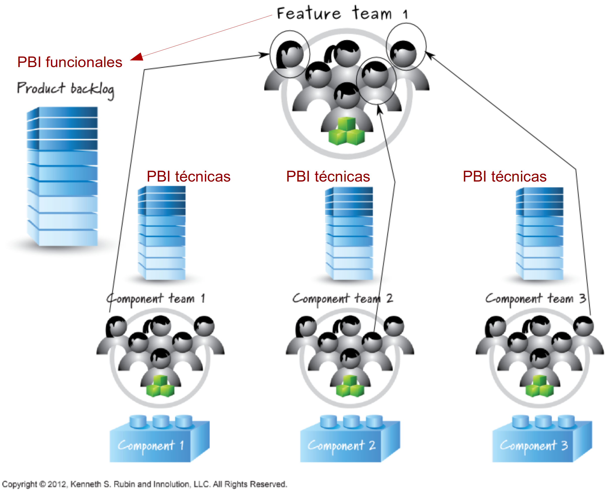
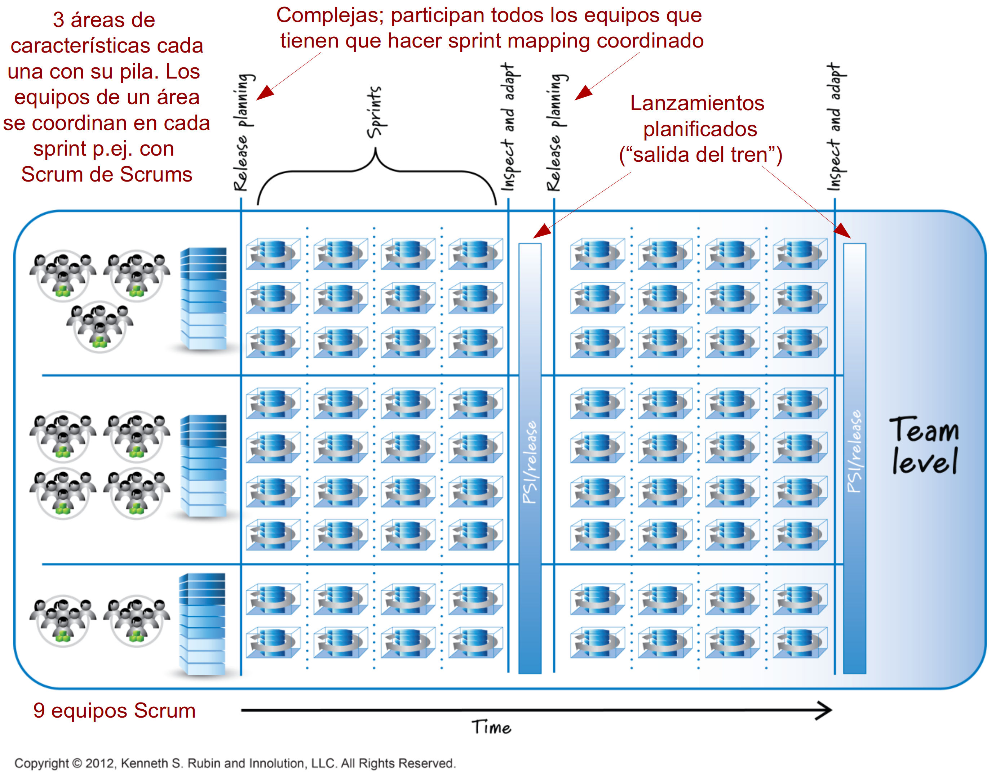

# 7i_GPS-S08-Scrum-Roles y Estructuración de Equipos

##  *Scrum – Roles y estructuración de equipos* **Gestión de Proyectos Software**

*Scrum – Roles y estructuración de equipos* **Gestión de Proyectos Software**

## <u>Contenidos</u>

-  El dueño del producto
-  El ScrumMaster
-  El equipo de desarrollo
-  Managers
-  Staff Engineers
-  Directores de proyecto
-  Resolución de problemas en equipo
-  Estructuración de equipos Scrum

##  El dueño del producto

El dueño del producto

## <u>El dueño del producto</u>

-  Entiende las necesidades y prioridades tanto de la organización cliente, que quiere que se desarrolle el software, como de usuarios/as
    -  Se asegura de que se desarrolle la solución adecuada
-  Comunica al equipo de desarrollo qué construir, y en qué orden
    -  Y se asegura de que hay criterios de aceptación de cada característica, y de que estos se verifican

## <u>Responsabilidades</u>

-  Cierta gestión económica
    -  Tiene que considerar la rentabilidad del producto que se está construyendo y de cada una de sus características, por ejemplo para priorizar las más rentables
-  Participa en la planificación
-  Grooming  de la pila del producto
-  Define criterios de aceptación y verifica que se cumplen
-  Colabora con el equipo de desarrollo
-  Colabora con los interesados ( stakeholders )
    -  Patrocinadores, clientes, usuarios...

## <u>Habilidades / Requisitos</u>

-  Conoce el dominio del problema y tiene la visión del producto que se quiere construir
    -  Pero se da cuenta de que no todo se puede anticipar
-  Es buen negociador y comunicador
    -  Tiene que tratar con todas las partes involucradas
-  Es capaz de tomar decisiones, y tiene la autoridad para hacerlo
    -  Además tiene suficiente visión económica y técnica como para equilibrar ambos aspectos en sus decisiones
-  Acepta la responsabilidad del éxito/fracaso del producto
-  Está disponible cuando se le necesita y acepta su papel como miembro del equipo Scrum

## 

## <u>¿Quién debería ser dueño del producto?</u>

-  Para un desarrollo interno (p.ej., dentro de una misma empresa)
    -  Un/a representante del área de nuestra empresa que se beneficiará
-  Para un desarrollo comercial (algo que luego se venderá)
    -  Alguien que pueda hablar por los potenciales clientes/usuarios     
        -  Normalmente un responsable/director de producto o alguien de marketing
-  Para un desarrollo externalizado
    -  Alguien de la compañía que nos contrata
-  Para el desarrollo de un componente reusable (pero no directamente un producto que se vende a clientes)
    -  Alguien con buenos conocimientos técnicos (la pila va a tener entradas muy técnicas)
-  El dueño del producto puede ser miembro del equipo de desarrollo
-  El dueño del producto no debería ser a la vez el ScrumMaster
    -  Son dos papeles ligeramente enfrentados

## <u>¿Quién debería ser dueño del producto?</u>

-  Una misma persona puede ser dueña de varios productos
    -  Pero no de muchos
-  El dueño del producto puede nombrar a alguien como representante ( proxy ) para que actúe en su lugar en ciertas situaciones
    -  Siempre que le confiera plenos poderes en esas situaciones, puede ser útil
-  Un producto muy grande (muchos equipos simultáneos) puede tener un dueño del producto “jefe” pero necesitará una jerarquía de dueños de producto que le apoyen
    -  Organizados por líneas de producto, por características funcionales o como sea

##  El ScrumMaster

El ScrumMaster

## <u>El ScrumMaster</u>

-  Se encarga de ayudar a que todo el mundo entienda los valores, principios y prácticas de Scrum
-  Actúa como entrenador para el equipo de desarrollo y para el dueño del producto
-  Ayuda al equipo, y a su organización o empresa, a desarrollar su propia aproximación a Scrum

## <u>Responsabilidades</u>

-  Entrenar al equipo Scrum
    -  Observa como el equipo usa Scrum y les ayuda a resolver los problemas que surgen
-  Actuar como “líder sirviente”
    -  ¿Qué puedo hacer para ayudaros a ser más efectivos?
-  Autoridad (pero solo respecto al proceso)
    -  Conoce Scrum y se asegura de que se siguen sus principios y valores
-  Escudo frente a interferencias externas
    -  P. ej., de los directivos de la empresa o de temas que surgen desde otros equipos
-  Eliminador de obstáculos
    -  De todo lo que reduzca la productividad del equipo y que los miembros del equipo no puedan solucionar    
        -  P. ej., la carencia de ciertos recursos
-  Agente del cambio
    -  Hace lo posible para que el equipo, y su organización/empresa, entiendan la necesidad de los cambios y las ventajas de corto y largo plazo por usar Scrum

## <u>Habilidades / Requisitos</u>

-  Conoce bien Scrum
    -  Mejor si también tiene algunos conocimientos técnicos y del dominio de problema
-  Hace las preguntas correctas
    -  Su objetivo no es dar respuestas fáciles, es conseguir que el equipo encuentre respuestas propias    
        -  La forma de que los equipos mejoren es dejarles resolver sus propios problemas sin dárselo todo hecho
    -  Esto requiere que sea paciente
-  Colaborativo
    -  Tiene que relacionarse con el dueño del producto, el equipo de desarrollo y con otras partes (resto de la empresa, clientes...)
    -  Es importante que además sea transparente respecto a la comunicación que tiene con miembros del equipo y externos
-  Protector
    -  Mantiene al equipo protegido de injerencias que afecten a su trabajo y a su aplicación de Scrum    
        -  P.ej. presiones de la empresa para recortar en calidad (definición de hecho) o para acelerar el trabajo (en lugar de buscar el ritmo sostenible) 

## <u>¿Quién debería ser ScrumMaster?</u>

-  Cualquiera que reúna las habilidades indicadas antes
-  Típicamente no es un papel de tiempo completo y se compagina con otras actividades en la empresa/organización
    -  Puede ser conflictivo ser ScrumMaster y miembro del equipo de desarrollo, especialmente en cuanto a la priorización de actividades
    -  No es recomendable ser ScrumMaster y dueño del producto    
        -  El ScrumMaster muchas veces debe actuar de contrapeso frente al dueño del producto
    -  Se puede ser ScrumMaster de más de un equipo

## <u>Actividades de un ScrumMaster</u>

-  Como apoyo al dueño de producto, asegurarse de que:
    -  La pila del producto refleja las últimas ideas del dueño de producto
    -  La pila del producto captura las necesidades de todos los involucrados    
        -  P.ej., incluye cosas que se comentaron durante las revisiones
    -  La pila del producto tiene suficientes entradas y suficientemente detalladas, todo el tiempo
    -  El dueño de producto entiende el problema de la deuda técnica y lo considera importante
    -  La pila del producto es bien visible siempre y para todos los participantes    
        -  Especialmente importante si se usa alguna herramienta electrónica
    -  Los diagramas de progreso (burndown y burnup) se crean, se actualizan y son visibles para todo el mundo
    -  El plan de lanzamientos actual sigue siendo viable

## <u>Actividades de un ScrumMaster</u>

-  Como apoyo al equipo, asegurarse de que:
    -  Todo el mundo está concentrado, tiene objetivos claros, recibe feedback pronto, tiene tareas que puede realizar pero que no son demasiado simples y siente que tiene suficiente control sobre su trabajo
    -  Los miembros del equipo se apoyan mutuamente
    -  No se pierden oportunidades por falta de oportunidades para dialogar
    -  Las retrospectivas son productivas
    -  El tablero de tareas del sprint refleja realmente lo que todo el mundo está haciendo
    -  El equipo tiene la combinación de habilidades necesarias para llevar a cabo el trabajo
    -  No hay tareas que nadie quiere hacer y que por tanto se posponen hasta que no queda otro remedio
    -  La deuda técnica no se acumula hasta el punto de hacer complicados cambios que deberían ser sencillos
    -  El equipo se responsabiliza de todos los aspecto del trabajo y nadie se considera a si mismo demasiado importante para hacer algunas de esas cosas
    -  Se llevan a cabo buenas prácticas de ingeniería

##  El equipo de desarrollo

El equipo de desarrollo

## <u>El equipo de desarrollo</u>

-  Debe ser multidisciplinar
    -  El equipo en su conjunto debe tener todas las habilidades necesarias para el desarrollo del producto    
        -  Arquitectura, programación, tests, gestión de base de datos, diseño de GUI...
-  Tener equipos especializados suele ser un obstáculo para llevar a cabo Scrum de la mejor manera

## <u>Responsabilidades</u>

-  Ejecución de los sprints
    -  El equipo se auto-organiza para hacer el trabajo
-  Inspección y adaptación diaria (Scrum diario)
-  Mantenimiento de la pila del producto
    -  Parte del trabajo de un sprint incluye ir preparando los próximos
-  Planificar los sprints
-  Inspección y adaptación de producto y proceso (revisiones y retrospectivas)

## <u>Habilidades / Requisitos</u>

-  Capaz de auto-organizarse
    -  El equipo no necesita que alguien externo señale a un líder que le diga a cada uno qué hacer
-  Lo bastante multidisciplinar
    -  Colectivamente el equipo debe tener todas las habilidades necesarias
    -  Distintas habilidades, niveles de experiencia etc., aportan más ideas y facilitan la colaboración 
    -  Lo ideal es que todos los miembros sepan hacer varias cosas, aunque algunos estén más especializados en unas que en otras
    -  Algunas veces habrá personas muy especializadas y decidiremos que repartan su tiempo entre distintos productos en desarrollo    
        -  Hay que evitar que se conviertan en cuellos de botella

## <u>Habilidades / Requisitos</u>

-  Actitud de mosqueteros
    -  La responsabilidad de hacer el trabajo es colectiva    
        -  El equipo tiene éxito o no lo tiene
    -  Nadie dice “ese no es mi trabajo” si hay un trabajo que hacer y tiene las habilidades necesarias para hacerlo
    -  Si alguien ve un problema con algo, aunque sea en algo que no es su especialidad, lo mencionará para que se pueda discutir

## <u>Habilidades / Requisitos</u>

-  Comunicación de banda ancha
    -  La información pierde valor con el tiempo, por eso acelerar el ritmo al que se comparte es importante
    -  La comunicación cara a cara es lo más eficiente, pero la tecnología puede ayudar
    -  La ceremonia es un obstáculo    
        -  Tres niveles de indirección para hablar con el cliente, tener que crear documentos sin valor para comunicar algo o tener que conseguir una firma son obstáculos
    -  Un equipo de N miembros tiene N(N-1)/2 canales de comunicación entre individuos    
        -  Cuanto más grande, la comunicación es más complicada

## <u>Habilidades / Requisitos</u>

-  Comunicación transparente
    -  Comunicar con claridad ayuda a la comprensión y fomenta la confianza dentro del equipo
-  Tamaño correcto
    -  Regla general: de 5 a 9 personas
    -  En equipos pequeños, es más fácil que haya interacciones constructivas, se pierde menos tiempo en coordinación, nadie puede “escaquearse” sin que se note y la gente normalmente se encuentra más cómoda
    -  Para productos grandes es preferible tener varios equipos más pequeños que uno muy grande

## <u>Habilidades / Requisitos</u>

-  Concentrado y comprometido
    -  Más fácil si se trabaja solo en un producto
    -  Hay datos que apoyan la idea intuitiva de que trabajar en más de dos proyectos al mismo tiempo disminuye notablemente la productividad
-  Trabaja a un ritmo sostenible
    -  No se trabaja con más intensidad a final del proyecto que al principio
-  Vida larga
    -  Esta es la principal diferencia entre un equipo y un grupo
    -  Mantener al equipo junto tanto tiempo como sea económicamente sensato    
        -  De nuevo hay datos que confirman la idea intuitiva de que los equipos que llevan más tiempo juntos son más eficientes y productivos
    -  Crear un equipo que funciona tiene un coste, pero hay que verlo como una inversión

##  Managers

Managers

## Managers

-  Scrum no menciona explícitamente a los/as  managers  ( gerentes, directores/as, supervisores/es, encargados/as...)
    -  De área, de proyecto, de cuenta, ejecutivas...
-  Una organización típica puede tener tres niveles
    -  Un primer nivel (el más bajo) en el que los managers supervisan el trabajo de los individuos que producen
    -  Un segundo nivel (intermedio), que incluye todos los managers entre el primer nivel y el nivel más alto y que supervisa a los del primer nivel    
        -  Jefe de departamento, líder de proyecto, encargado de planta, gerente de división...
    -  Un tercer nivel (el más alto), donde están los/as responsables de las decisiones, planes y objetivos que afectan a toda la organización    
        -  Vicepresidente ejecutivo, presidente, CEO (chief executive officer)...

## Managers

-  En estas transparencias, cuando hablemos de manager nos referiremos esencialmente al primer nivel, o como mucho a alguno de los primeros escalones del segundo
    -  Que son los más cercanos a la gestión de los proyectos
-  Cada empresas y organización que use Scrum tendrá que encontrar como compatibilizarlo con su estructura organizativa y qué papeles pueden jugar sus managers

## Managers

-  La primera experiencia profesional que se tiene con un/a manager suele ser en “el otro lado”
    -  Y salvo que se ascienda a la cima de una organización (o que seas fundador/a), lo normal es que en el resto de tu carrera profesional siempre vayas a tener que rendir cuentas a uno o más managers
-  Conocer cuál es el trabajo de un manager te puede ayudar a determinar si el/la tuyo/a es bueno o no en su trabajo
    -  Un mal jefe es uno de los motivos más comunes para cambiar de empleo
-  Pasar a ser manager es una de las posibilidades para ascender en una organización
    -  En muchas organizaciones, es la única opción real de ascender una vez llevas 6-8 años en ella

## Managers

-  El trabajo de un/a manager consiste en obtener los mejores resultados posibles de un grupo de gente que trabaja junta
-  Creando un equipo que trabaje bien
    -  Esto incluye tomar decisiones sobre a quién contratar, despedir o promocionar
-  Creando procesos que faciliten que el trabajo se haga eficientemente y sin obstáculos

## Managers

-  Apoyando a cada persona de ese equipo a alcanzar sus objetivos profesionales
    -  Realizando reuniones uno a uno    
        -  Permiten crear una conexión humana entre manager y managed
        -  Son un contexto privado en el que poder tratar cualquier tema profesional que sea necesario
    -  Dando feedback sobre el desempeño individual    
        -  El feedback es más útil cuanto más pronto se recibe
        -  Los halagos deberían ser públicos (al menos un poco públicos), y las críticas deberían ser privadas

## Responsabilidades de los/as managers en Scrum

-  Los equipos Scrum se auto-organizan en un entorno dado, pero hay que establecer este entorno
    -  Qué productos o proyectos se abordarán
    -  Si el despliegue de una aplicación es trabajo de cada equipo Scrum, o si se tienen equipos de operaciones para esto
    -  Formación y cambios en la composición de equipos    
        -  Lógicamente deberían consultar a los miembros de un equipo antes de incluir o retirar a alguien, pero la decisión es de la gerencia
-  Delegación de ciertas tareas de gestión a equipos Scrum
    -  Entre comunicar una decisión ya tomada y delegar toda la responsabilidad hay muchos grados intermedios    
        -  Convencer, consultar previamente, acordar...
    -  Esto aumenta su autonomía y su confianza

## Responsabilidades de los/as managers en Scrum

-  Apoyar a los equipos
    -  No dirigir, sino apoyar
    -  Motivar y poner objetivos globales elevados
    -  Facilitar el aprendizaje continuo de los integrantes de los equipos    
        -  P.ej., dando tiempo para ir a cursos y conferencias
        -  Ese  feedback  sobre el desempeño individual del que hablábamos antes
-  Proporcionar liderazgo en su área
    -  P.ej., la directora del área de recursos gráficos apoyará y coordinará a los diseñadores gráficos en los distintos equipos Scrum
    -  Establecer estándares e iniciativas para mejorar el trabajo en sus áreas    
        -  P.ej., la directora del área de QA puede establecer el uso de ciertas herramientas de automatización de tests en la organización

## Responsabilidades de los/as managers en Scrum

-  Entender y llevar los valores de Scrum y de las metodologías ágiles al resto de la empresa/organización
-  Eliminar obstáculos en la organización
    -  Esta es tarea de los ScrumMasters, pero las decisiones finales las tendrá la gerencia
-  Coordinar grupos internos
    -  Si unos equipos usan Scrum y otros no, es posible que los beneficios cruciales de Scrum (poner valor en manos de los clientes lo antes posible) se pierdan
-  Coordinar con socios externos
    -  Se pueden promover tipos de subcontratos y alianzas que faciliten el trabajo de modo ágil    
        -  Por ejemplo buscando alternativas a los contratos “llave en mano” con las subcontratas

## Responsabilidades de los/as managers en Scrum

-  Gestionar el flujo de creación de valor
    -  Cierta gestión económica    
        -  Un/a manager es responsable de cómo los recursos de que dispone generan beneficios
-  Monitorizar medidas/métricas e informes (de aquellos que aportan valor) y asegurarse de que esa información se usa para mejorar lo antes posible
    -  Medidas que informen sobre obstáculos para un buen flujo de trabajo    
        -  P.ej., analizar cómo evoluciona el tiempo medio desde que algo se empieza hasta que termina
    -  Medidas sobre el valor entregado    
        -  Qué se ha entregado, lo que ha costado en tiempo y dinero, o problemas de calidad (p.ej., errores que han surgido en producción)

##  Staff engineers

Staff engineers

## Staff engineers

-  Cada vez más organizaciones proporcionan una vía de carrera profesional paralela a la de la gestión
    -  Staff engineer track ,  track  tećnico o  individual contributor track
-  Los nombres y número de los niveles del escalafón profesional que se pueden tener en una organización varían tanto que hay una web para compararlos
    - 
    -  Por ejemplo, la cima de la carrera como  Software Engineer  en Amazon es  Distinguished Engineer , mientras que en Red Hat es  Fellow , y en Microsoft es  Technical Fellow
    -  El título que tengas tiene su importancia    
        -  Ves como progresas en tu carrera, otros ven como progresas en tu carrera, y cualquiera que no te conozca puede evaluar rápidamente, aunque sin mucho detalle, tu nivel de conocimientos y experiencia
-  En general podemos decir que  Senior Engineer , o algo así, suele ser la cima de la carrera técnica de responsabilidad individual
    -  A partir de ahí, si se quiere ascender en la organización, o se pasa a la vía de  Manager  o se pasa a la vía de  Staff Engineer  (si existe esta última)

## Staff engineers

-  De un staff engineer, se espera que pueda tomar:
    -  Decisiones técnicas que afectan a varios grupos, o incluso a toda la empresa
    -  Decisiones a medio y largo plazo    
        -  P.ej., en qué tecnologías invertir, qué plataformas estandarizar dentro de la empresa etc.
-  En una empresa pequeña, puede haber un CTO ( chief technology officer ), que es un manager/ejecutivo, y que asume el papel de staff engineer
    -  Al ser pequeña, un CTO puede estar pendiente de todo lo que se hace en esa empresa
    -  Hay un cierto riesgo de que tome decisiones de gestión contrarias al juicio técnico de los ingenieros

## Staff engineers

-  En una empresa grande la necesidad de separar la gestión de la “gran ingeniería” es más importante
    -  Cada decisión técnica controvertida que involucre a varios equipos no puede acabar en la mesa del CTO
    -  Otra forma de ver esto, es que es necesario separar el liderazgo sobre personas (manager) del liderazgo técnico (staff engineer)
    -  Ambos tracks (gestión e ingeniería) deben coordinarse y alinearse

## El trabajo de staff engineer

-  Liderazgo
    -  Tu nivel de antigüedad ( seniority ) es equivalente a la de algún/a manager    
        -  Y conforme avanzas, será equivalente a la de un/a manager de nivel superior
    -  Como staff engineer se espera que tu trabajo tenga más impacto en la organización
-  No es el mismo liderazgo que ejercen los managers
    -  No tienes a gente directamente a tu cargo
    -  No evalúas su desempeño
    -  No apruebas peticiones de gasto o de vacaciones
    -  No despides ni promocionas a nadie

## El trabajo de staff engineer

-  Es un liderazgo técnico
    -  Requiere conocimientos técnicos y experiencia
    -  Revisas artefactos técnicos (diseños, código…), considerando    
        -  Si son buenos
        -  Si se alinean con los objetivos de la organización
        -  Si encajan con lo que hacen otros equipos
    -  Puedes dar formación y mentorizaje
    -  Puedes establecer dirección técnica    
        -  P.ej., seleccionar nuevas tecnologías de interés para la organización
    -  Puedes inspirar a otros ejerciendo tus habilidades de ingeniería

## El trabajo de staff engineer

-  Requiere tener altos estándares sobre qué es buena ingeniería y la capacidad de aplicarlos
    -  Tus revisiones de código y de diseños deben ser instructivas y ayudar a que haya un mejor código o arquitectura
-  Tienes que entender los compromisos que hay que evaluar al tomar una decisión técnica
-  Normalmente no programas mucho
    -  Pero sí que es común que trabajes en un problema ambiguo o complicado solo hasta que este problema se vuelva tratable y ya puede ser abordado por ingenieros menos experimentados
    -  Sí puede ser que mirar el código sea la forma más eficiente de resolver algún problema    
        -  También es posible que lo sea mantener una documentación buena y actualizada o hacer un análisis cuantitativo de datos existentes que ayuden a tomar las mejores decisiones

## El trabajo de staff engineer

-  Tu objetivo es ser autónomo
    -  Seguirás teniendo un/a manager    
        -  Pero no puedes esperar que te diga qué hacer, cómo abordar un problema o qué problemas son los más importantes
        -  Tu manager te tiene que dar información y contexto, pero tú deberías decir qué es importante y qué no
    -  Parte de trabajo es crear tu propia lista de tareas con trabajo de alto impacto y valioso

## El trabajo de staff engineer

-  Tienes que asegurarte de que en tu organización hay buenas direcciones técnicas
    -  Que las decisiones técnicas se toma bien    
        -  Dentro de los equipos, entre varios equipos y a nivel organización
    -  Y que las decisiones se escriben para que todo el mundo tenga una referencia y esté claro lo que se ha decidido
-  Tienes que comunicar bien
    -  Casi todo lo que haces como staff engineer requiere transmitir información a otras personas    
        -  Cuanto mejor hagas eso, más eficaz serás

##  Directores de proyecto

Directores de proyecto

## Directores de proyecto

-  Ni el ScrumMaster ni el dueño de producto son el “director de proyectos versión Scrum”
    -  El ScrumMaster no “manda”, y el dueño de producto tiene autoridad solo con respecto al producto
-  Los directores de proyecto tradicionales tienen unas responsabilidades que en Scrum están repartidas

## 

## Directores de proyecto

-  Como norma, la responsabilidad de coordinarse con otros equipos Scrum es de cada equipo
-  Si hay muchos (decenas, cientos) de equipos esto es complicado
    -  Se puede tener un director de proyecto cuya principal responsabilidad sea facilitar esta coordinación
    -  Pero primero hay que ver si esta coordinación es tan complicada    
        -  Si la mayor parte de estos equipos forman clusters de comunicación más intensa, es posible que puedan organizarse sin ayuda externa
    -  Tener un responsable externo a los equipos Scrum no es ideal    
        -  Los equipos adquieren la sensación de que la coordinación no es su problema
-  También se puede tener un director de proyecto para coordinar un proyecto grande en el que no todos los equipos son Scrum
    -  Porque habrá que gestionar subcontratas, proveedores etc.

##  Resolución de problemas en equipo

Resolución de problemas en equipo

## Resolución de problemas en equipo

-  El tipo de problema a resolver afecta a la capacidad de un equipo para resolverlo
-  Si el problema es de tipo Eureka (hay que dar con una “idea feliz”)
    -  Si un grupo contiene k personas y Pi es la probabilidad de que una persona encuentre la solución, la probabilidad de que el grupo encuentre la solución es      1 - (1 - Pi) k
    -  La probabilidad de un grupo de resolver el problema es pues mayor que la de una persona y aumenta con el número de personas
-  Sin embargo, para problemas de tipo  brainstorm  (producir el mayor número de ideas creativas que se pueda), los individuos superan consistentemente a los grupos
    -  Si medimos la cantidad y calidad de ideas generadas por persona
    -  A pesar de que la  , la creencia de que el  brainstorming  funciona mejor si se hace en grupo sigue estando muy extendida

## Resolución de problemas en equipo

-  Cuantas menos personas en un grupo poseen cierta información, menos probable es que esa información se use durante las discusiones, porque es menos probable que alguien la ponga sobre lo mesa
    -  Si hay información necesaria para resolver una tarea y esta está muy distribuida (cada participante tiene solo alguna parte de la misma) es más difícil que esta información llegue a utilizarse
    -  Esto justifica el énfasis que pone Scrum en que toda la información posible esté disponible para todo el mundo todo el tiempo

## Resolución de problemas en equipo

-  Conforme el tamaño de los grupos crece, el esfuerzo individual de sus integrantes disminuye
    -  A veces a esto se le llama  Efecto Ringelmann
    -  Esto se ha observado incluso en tareas que no exigen ninguna interacción entre integrantes del grupo    
        -  Pensad en cuando se aplaude al final de un evento; si hay poca gente, tendemos a esforzarnos más en hacer ruido que si hay mucha
    -  También se ha observado en trabajos realizados por estudiantes    
        -  Comparando el rendimiento individual con el rendimiento trabajando en grupo, en general se obtienen mejoras notas trabajando solo        
            -  Y mejores notas en grupos más pequeños que en grupos más grandes
    -  Esto justifica que en Scrum prefiramos no tener equipos grandes

##  Estructuración de equipos Scrum

Estructuración de equipos Scrum

## <u>Estructuración de equipos Scrum</u>

-  Para un producto pequeño, un equipo Scrum es suficiente
-  Para productos más grandes, va a ser necesario coordinar varios equipos

## <u>¿Equipos de características o de componentes?</u>

-  Equipo de características
    -  Toma características (historia de usuario / requisitos funcionales) de la pila y las completa
-  Equipo de componentes
    -  Se focaliza en desarrollar un componente o subsistema que se usa para implementar partes de características

## <u>Equipos de componentes</u>

-  Scrum favorece los equipos de características, pero muchas organizaciones prefieren los de componentes
    -  Que haya equipos responsables de algunas partes del código y que si otros necesitan cambios se los pidan

## <u>Equipos de componentes</u>

-  Los equipos de componentes pueden funcionar si hay un solo producto en desarrollo
    -  Sería una forma de distribuir el trabajo, aunque quizás no la óptima
-  Cogemos entradas de la pila del producto, las dividimos en sus piezas de nivel de componente, y cada pieza va a la pila del equipo del componente correspondiente
    -  La división la hacen entre los equipos involucrados, o alguien con un rol de  chief architect
-  Después de que cada equipo hace su pieza, se integran para completar las características de la pila del producto

## 

## <u>Equipos de componentes</u>

-  Si hay varios productos que usan los mismos componentes, alguno de los equipos de componentes posiblemente acabará siendo un cuello de botella para el desarrollo de algunos de estos productos
    -  ¿Por qué no hemos terminado el producto X? 
    -  Porque falta algo del componente 3, y el equipo de ese componente está implementando peticiones para el producto Y y el producto Z
-  Incrementamos las posibilidades de no terminar de implementar cada característica en su sprint
    -  Porque con que falle uno de los equipos de los componentes que necesita esta característica, esta no se terminará

## <u>Equipos de características</u>

-  La alternativa es tener equipos de características, que pueden modificar los componentes que necesiten
-  Compartir la responsabilidad del mantenimiento de componentes reusables entre los equipos de características es más complejo, pero es factible y debería ser el objetivo a largo plazo
-  Aunque normalmente se acaba por llegar a alguna organización que combina equipos de características y de componentes
    -  Por ejemplo, haciendo que algunas personas formen parte de un equipo de características y de un equipo de componentes (ver siguiente transparencia)
    -  El objetivo final debería ser tener equipos de características “puros”

## 

## <u>Coordinación de múltiples equipos: Scrum de Scrums</u>

-  Miembros de varios equipos se juntan para hacer algo parecido al Scrum diario
-  Normalmente no todos los días, aunque típicamente más de una vez a la semana
-  15 minutos es referencia, pero puede decidirse hacerlo más largo
-  ¿Qué ha hecho mi equipo desde el último Scrum de Scrums que pueda afectar a otros equipos? ¿Qué planeamos hacer? ¿Qué problemas tenemos que otros equipos podrían ayudar a resolver?

## Coordinación de múltiples equipos: Tren de lanzamientos

-  Sincronización entre equipos basada en una cadencia común
-  La metáfora del tren es porque hay un horario público de “salida de la estación” de cada lanzamiento/incremento de producto entregable
    -  Todos los equipos tienen que subir su carga al tren antes de la hora de salida
    -  El tren sale aunque no esté toda la carga
    -  La carga que no va en un tren, puede ir en el siguiente

## 

## Coordinación de múltiples equipos: Tren de lanzamientos

-  Hay fechas fijas para los frecuentes lanzamientos
    -  Fechas fijas (y calidad fija) => alcance variable
-  Los equipos tienen sprints de igual duración que empiezan y terminan en las mismas fechas
    -  Esto facilita sincronizar a todos los equipos del producto
-  Los equipos se suelen agrupar en áreas de características
    -  Para un reproductor de música en local y en streaming podríamos tener tres áreas:    
        -  Gestión de las colecciones de música
        -  Reproducción de música
        -  Analítica de datos y recomendaciones
    -  Cada área tiene su pila
    -  Si hay varios equipos trabajando en un área de características, cada uno trabajará normalmente con una vista de esta pila
-  Además de estas pilas de las áreas de características (con historias implementables) suele haber una pila de portafolio (con épicas) y una de producto (con características más grandes)

## Coordinación de múltiples equipos: Tren de lanzamientos

-  Se hace integración continua tanto a nivel global como al de característica y/o componente
-  Los incrementos potencialmente entregables están disponibles con regularidad (p.ej., cada 30 días) para su revisión
-  Se pueden hacer sprints de “endurecimiento” a nivel global para reducir la deuda técnica y para validación y pruebas de nivel de lanzamiento
    -  Por ejemplo, el último sprint antes de cada lanzamiento
-  Cierta infraestructura común (entornos de desarrollo, entornos de CI/CD, datos de prueba...) debe haberse establecido por adelantado

## Bibliografía

-  Kenneth S. Rubin.  Essential Scrum. A practical guide to the most popular agile process
    -  Capítulo 9 ( Product owner ), 10 ( ScrumMaster ), 11 ( Development team ), 12 ( Scrum team structures ), 13 ( Managers )
-  Derek M. Jones.  Evidence-based Software Engineering based on the publicly available data
    -  Sección 3.4.9 ( Group problem solving )
-  Camille Fournier.  The Manager’s Path. A guide for tech leaders navigating growth & change
    -  Capítulo 1 (Management 101)
-  Julie Zhuo.  The Making of a Manager. What to do when everyone looks to you
    -  Capítulo 1 (What is Management?)
-  Tanya Reilly.  The Staff Engineer’s Path. A guide for individual contributors navigating growth and change
    -  Capítulo 1 (What would you say you do here?)
-  Y un par de cositas de este libro (que en general me gusta poco): Andrew Pham and Phuong-Van Pham.  Scrum in Action. Agile Software Project Management and Development
    -  Capítulo 12 ( How to adapt Scrum (without destroying its agile foundations or doing negative ScrumButs) )

## 

