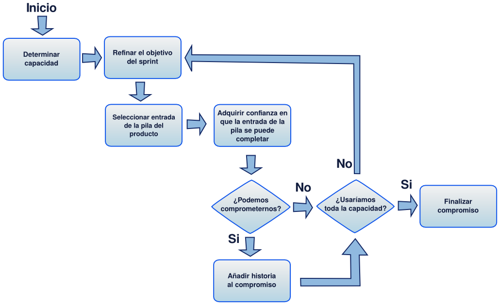
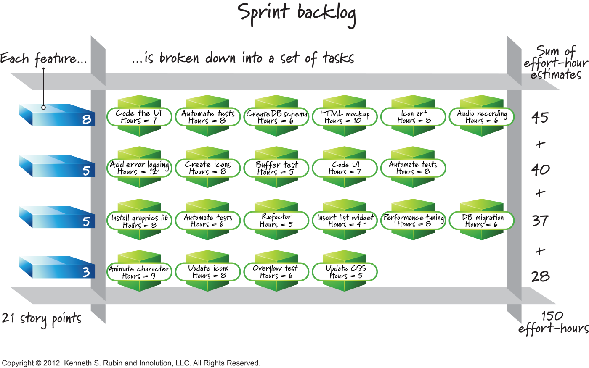
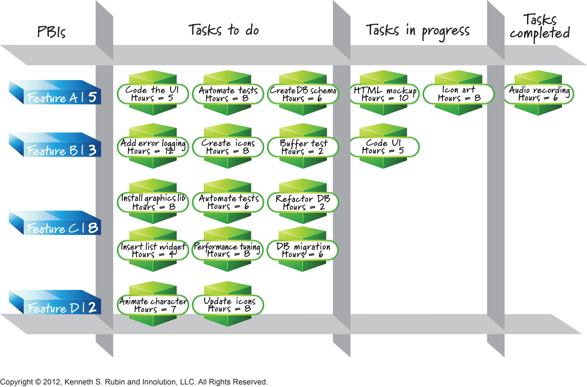
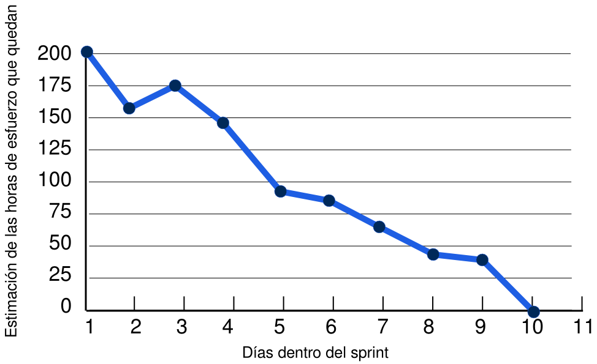
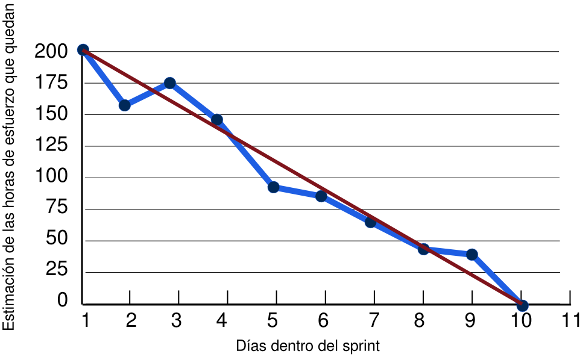
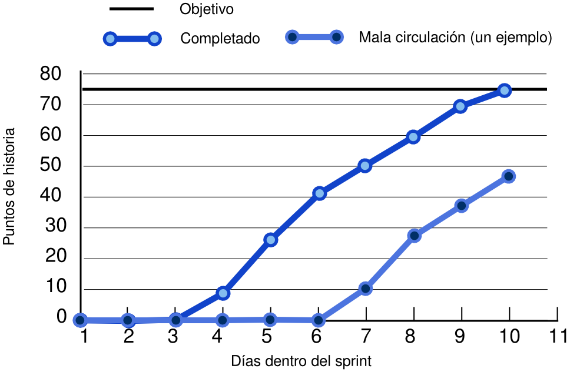

# 7i_GPS-S08-Scrum-SprintsEnDetalle

##  *Scrum – Sprints en detalle* **Gestión de Proyectos Software**

*Scrum – Sprints en detalle* **Gestión de Proyectos Software**

## Contenidos

-  Planificación de un sprint
-  Ejecución de un sprint
-  Revisión de un sprint
-  Retrospectiva de un sprint

##  Planificación de un sprint

Planificación de un sprint

## Planificación de un sprint

-  Se decide un objetivo para el sprint, y se eligen las entradas de la pila que encajan con este objetivo
-  Se planifica el sprint para que el equipo adquiera confianza en que podrá completarlo
    -  Justo al principio de cada sprint
    -  Se suelen dedicar unas 2 horas por cada semana del sprint
    -  “ Adquirir confianza” significa que una vez concluida la planificación, el equipo confía en que podrán terminar todo lo que han planificado dentro del sprint
-  Las entradas de la pila elegidas y el plan del sprint forman la pila del sprint

## Entradas del proceso de planificación de un sprint

-  Una pila del producto adecuadamente mantenida ( grooming )
    -  Las entradas de la parte superior están listas    
        -  Criterios de aceptación claros, tamaño adecuado, estimadas, priorizadas
-  Un objetivo claro para el sprint (por parte del dueño del producto)
    -  Que se debe refinar durante la planificación
-  La velocidad del equipo
-  Otras consideraciones 
    -  Disponibilidad de los miembros del equipo, sus conocimientos y habilidades, y restricciones de negocios o tecnológicas que puedan afectar

## Planificación de sprint

## Determinar la capacidad

-  Para la planificación tenemos que calcular  la capacidad que tiene el equipo para trabajar en entradas de la pila  durante el sprint
-  El tiempo disponible (p.ej. “jornadas laborables en el sprint”) no se usa solo para trabajar en entradas de la pila
    -  Otras actividades del sprint    
        -  Planificación, revisión, retrospectiva,  grooming  de la pila del producto
    -  Actividades relacionadas con la mejora del proceso Scrum, posiblemente decididas en alguna retrospectiva anterior
-  Y también habrá tiempo laboral no disponible para el sprint
    -     
        -  Vacaciones, médico...
        -  Compromisos profesionales fuera del sprint        
            -  Trabajo en otros proyectos, tareas administrativas, otras reuniones...

## Capacidad en puntos de historia

-  Si expresamos la velocidad del equipo en puntos de historia, determinar la capacidad disponible para un sprint es predecir la velocidad para ese sprint
-  Se coge la velocidad media del equipo, y si si el sprint no va a ser un sprint “promedio”, entonces se ajusta (normalmente a la baja)
    -  Por ejemplo si va a haber mucha gente de vacaciones u otros proyectos robando mucho tiempo habrá que bajarla

## Capacidad en horas-persona

-  Si queremos afinar más que con los puntos de historia, podemos determinar la capacidad en horas-persona
-  Cada miembro del equipo de desarrollo estima cuántas horas tendrá disponibles para trabajar en las entradas de la pila del sprint
    -  Como casi toda estimación, es buena idea darla como un rango [mínimo – máximo] de nº de horas disponibles previstas
    -  Recordad que en esas horas no entran las que hagan falta para otras actividades Scrum del proyecto, ni para otros proyectos, vacaciones etc.

## Seleccionar entradas de la pila del producto

-  Si hemos definido un objetivo claro para el sprint, elegimos las entradas que encajen con él
-  Si no, elegiremos entradas de las de la cima de la pila en orden de más a menos prioridad
    -  Si p.ej. tras elegir las dos primeras, y con capacidad disponible, vemos que no queda capacidad para la tercera, probaremos con la cuarta que puede ser más corta
    -  O trataremos de partir la tercera en dos o más
-  Se empieza solo lo que se puede terminar en el sprint

## Adquirir confianza

-  Usar la velocidad media del equipo para determinar si el compromiso es realista
    -  Si haces entre 25 y 30 puntos de historia por sprint, comprometerte a hacer 25 es razonable a priori
-  Pero es más fiable dividir las entradas elegidas en tareas, porque hasta que no haces esta división, hay cosas que no sabes
    -  Interdependencias, demasiadas tareas que solo un miembro del equipo sabe hacer etc.
-  ¿Cuántas tareas? ¿Cuáles?
    -  Las que hagan falta para cumplir la definición de hecho y ser aceptadas por el dueño de producto
    -  Estimadas en horas-persona y restadas de la capacidad del equipo para comprobar si son un compromiso razonable

## La pila del sprint

-  El resultado de la planificación del sprint es la pila del sprint

## La pila del sprint

-  En la pila del sprint no está toda la información para saber si hemos adquirido un compromiso razonable
    -  P.ej., ¿qué pasa si el especialista en interfaz de usuario va a estar de vacaciones más de medio sprint?
-  En Scrum generalmente no se asignan miembros del equipo a tareas durante la planificación del sprint
    -  Pero al menos hay que considerar esto lo suficiente como para determinar si el compromiso para el sprint es o no es razonable

## Finalizar el compromiso

-  El objetivo del sprint y las entradas de la pila del producto que se han seleccionado representan el compromiso del equipo
    -  El objetivo del sprint se ha podido refinar durante la planificación si, p.ej., se ha visto que era demasiado ambicioso
    -  A veces en lugar de compromiso se dice predicción, para minimizar una actitud defensiva a la hora de hacer las estimaciones

## Pila del sprint

-  Teniendo en cuenta que durante un sprint no se debe cambiar el trabajo que nos hemos comprometido a hacer
-  ¿Permitiremos añadir nuevas tareas al sprint en medio del mismo?

##  Ejecución de un sprint

Ejecución de un sprint

## Ejecución de un sprint

-  Empieza tras la planificación del sprint y termina antes de la revisión
-  Suele ocupar aproximadamente el 80% del tiempo del sprint
    -  El resto del tiempo se empleará en hacer grooming de la pila y, sobre todo, en las reuniones de planificación, revisión y retrospectiva
-  Los miembros del equipo se auto-organizan para determinar la mejor forma de alcanzar el objetivo establecido en la planificación
    -  El ScrumMaster facilita el trabajo al equipo    
        -  No se encarga de repartir trabajo ni de decir cómo se hace
    -  El dueño del producto debe estar disponible para clarificar cosas, revisar trabajo intermedio, proporcionar  feedback  y verificar que los criterios de aceptación se cumplen

## Planificación de la ejecución de un sprint

-  El equipo ha creado una pila del sprint durante su planificación
-  No es un plan de trabajo detallado en forma p.ej. de diagrama de Gantt
    -  El coste de crear algo así de detallado para cada sprint sería difícil de justificar
-  Sí que es importante hacer la planificación suficiente para exponer dependencias fuertes entre tareas y así poder ordenarlas en el tiempo
    -  El resto se puede abordar de forma oportunista, durante la ejecución del sprint

## Organizar el trabajo

-  Primero se elige por dónde empezar
    -  Por las PBI más prioritarias es lo más obvio
    -  Dependencias técnicas o restricciones por el personal disponible pueden hacer esto imposible
-  También hay que evitar pensar que cada PBI se aborde con metodología en cascada
    -  Diseño un poco de la PBI, lo implemento, lo pruebo, diseño un poco más…    
        -  Esto facilita aún más el repartir y paralelizar el trabajo
-  El equipo decide qué tareas hay que hacer y quién hará cada una

## Organizar el trabajo

-  Paralelizar el trabajo ayuda a poder terminar más cosas
    -  Pero trabajar en demasiadas cosas al mismo tiempo requiere demasiados cambios de contexto, lo que es ineficiente
-  En general, los miembros del equipo con capacidad disponible deberían trabajar en cosas que están empezadas en lugar de en cosas nuevas
    -  P.ej., ponerse con los tests de una PBI que está medio desarrollada en lugar de empezar a desarrollar una nueva
    -  Esto requiere que todo el mundo sepa hacer distintas cosas
-  No es que haya que evitar siempre el estar trabajando en varias PBI al mismo tiempo
    -  Hay que evaluar el trabajo pendiente, las habilidades de cada cual etc.
-  Lo que hay que evitar es abordar el sprint como si fuera un miniproyecto en sí mismo, con una aproximación en cascada
    -  Por ejemplo, no queremos analizar todo antes de empezar a diseñar, ni diseñar/implementar todo antes de empezar a hacer pruebas
    -  El riesgo de no completar ninguna entrada de la pila es grande si lo hacemos así

## Scrum diario

-  Es parte de la inspección y adaptación diaria
    -  Se ve lo que está haciendo todo el mundo
    -  Salen a la luz posibles problemas sin esperar más de 24 horas
    -  Facilita la planificación oportunista
-  15 minutos, siempre a la misma hora
-  Es una actividad crítica para que Scrum funcione bien
    -  La auto-organización del equipo es casi imposible si el equipo no habla con frecuencia

## Comunicación

-  Generalmente se usa un tablero de tareas ( task board ) y diagramas de trabajo pendiente ( burndown )  y/o de trabajo completado ( burnup )
    -  El tablero de tareas se crea inicialmente a partir de la pila del sprint
-  El tablero va reflejando los cambios durante el transcurso del sprint
    -  Se suele recoger el estado en el que se encuentran las tareas necesarias para completar cada entrada de la pila    
        -  Por ejemplo pueden aparecer en tres estados posibles: por hacer, en progreso y completada

## 

## Diagrama de burndown del sprint

-  El eje vertical son horas-persona
-  El eje horizontal son los días dentro del sprint
-  El diagrama representa las horas de esfuerzo que nos quedan para completar todas las tareas de la pila del sprint
    -  Horas  estimadas . Este diagrama no representa horas reales invertidas    
        -  P.ej. no se puede usar para el control de esfuerzos del equipo Scrum

## 

## Diagrama de burndown

-  ¿Qué significa que del día 2 al día 3 hayan aumentado las horas de esfuerzo de las tareas pendientes de hacer?

## 

## Diagrama de burnup del sprint

-  El eje vertical son horas-persona o puntos de historia
    -  Los puntos de historia pueden ser más adecuados porque son una medida de progreso real (características terminadas y entregables)
-  El eje horizontal son los días dentro del sprint
-  El diagrama representa el progreso llevado a cabo en el sprint

## 

## Diagrama de burnup

-  ¿Cuántas entradas de la pila del producto se habían planificado para el sprint anterior según el diagrama de  burnup  que muestra buena circulación?

## Inciso. ¿Por qué tableros y diagramas bien visibles?

-  Tenerlos actualizados y bien visibles los convierte en “radiadores” de información
    -  Metáfora del radiador (da calor solo con pasar cerca) frente a la nevera (tienes que ir de propio a buscar algo y abrirla para ver lo que hay dentro)
    -  Cualquiera que pase delante los ve, y esto puede traducirse en oportunidades    
        -  Detección temprana de problemas, surgen ideas nuevas etc.
-  Por otra parte, un meta-análisis realizado por la Universidad de Sheffield concluyó que
    -  Monitorizar tus progresos hacia un objetivo, y más si es frecuentemente, ayuda a alcanzarlos
    -  Esto tiene un efecto mayor si esa monitorización se graba físicamente y es pública
    - 

##  Revisión de un sprint

Revisión de un sprint

## Revisión de un sprint

-  Tras la ejecución del sprint, inspeccionamos sus resultados
    -  El estado actual del producto
-  Además del equipo Scrum completo, debe incluir gente (interesada) que no está disponible durante el sprint
    -  Internos    
        -  Ejecutivos, usuarios internos, personal de ventas, personal de soporte a usuarios...
    -  Externos    
        -  Clientes, usuarios, socios

## Preparación de la revisión

-  Determinar los asistentes, roles de cada uno y acordar horarios
-  Asegurarse de que está claro el trabajo  completado  durante el sprint
    -  Lo único que se puede presentar
    -  El dueño del producto ya ha tenido que dar el visto bueno a ese trabajo durante la ejecución 
-  Preparar la demostración
    -  El software real
    -  Generalmente solo aquello que se ha hecho para alcanzar el objetivo del sprint

## Ejecución de la revisión

-  Alguien (p.ej. el dueño del producto) cuenta el objetivo del sprint, las entradas de la pila asociadas y un resumen de lo que se ha completado
-  Se hace una demo de las características relevantes implementadas
    -  A veces es buena idea que sean los propios clientes/usuarios los que “toquen” el producto con sus manos
-  Se discute y se opina sobre lo que se ha visto (ideas, problemas, mejoras...)
    -  No se solucionan problemas graves, pero se sacan a la luz
-  Muchas veces se aprovecha para hacer algo de  grooming  de la pila del producto

## Ejecución de la revisión – Preguntas y respuestas

-  ¿A los clientes/usuarios les gusta lo que ven? ¿Querrían cambios?
-  ¿Es todavía relevante lo que estamos haciendo, dados posibles cambios en nuestro entorno/mercado/contexto legal...?
-  ¿Se nos ha pasado alguna característica importante?
-  ¿Estamos trabajando demasiado en algo que no es tan importante?

## ¿Qué hacer si...

-  Durante la revisión, un ejecutivo de alto nivel de la empresa del cliente indica que una de las entradas de la pila que ha visto demostradas no le parece que esté realmente terminada

## ¿Qué hacer si...

-  Hay varios equipos Scrum trabajando en el mismo proyecto

##  Retrospectiva de un sprint

Retrospectiva de un sprint

## Retrospectiva de un sprint

-  Oportunidad para que el equipo Scrum examine su forma de trabajar, identifique formas de mejorar y haga planes para llevar a cabo esas mejoras
    -  ¿Qué ha funcionado y debemos continuar haciendo?, ¿qué no ha funcionado y hay que dejar de hacer?, ¿qué debemos empezar a hacer o mejorar?
    -  Mejora continua (Kaizen -  改善 )
-  Se examinan procesos, prácticas, comunicación, entorno, herramientas etc.
-  Participa todo el equipo Scrum
    -  Se puede invitar a alguien más, pero no será común

## Preparación de la retrospectiva

-  Decidir el foco
    -  Por defecto todos los aspectos del proceso Scrum 
    -  Se puede elegir algo más concreto que sea importante para el equipo y que vaya a requerir esfuerzo    
        -  P.ej. “Mejorar nuestro proceso de tests”
    -  Con el foco determinado, se puede decidir si se invita a alguien externo al equipo Scrum
-  Decidir los ejercicios a realizar
-  Recopilar datos objetivos
    -  P.ej. entradas de la pila que no se terminaron, los diagramas de  burndown / burnup  del sprint, bugs detectados etc. 
    -  Depende del foco
-  Establecer duración
    -  Como pauta, entre 30 y 45 minutos por cada semana de sprint

## Ejecución de la retrospectiva

-  Dejar claro que todo el mundo puede expresar sus opiniones, también las negativas, sin temor
    -  Pero la retrospectiva no es el sitio para sacar a la luz problemas con individuos concretos    
        -  Es para hablar del proceso y de la organización del trabajo
-  Usar los datos objetivos como forma de que todo el mundo comparta una visión común de lo ocurrido durante el sprint
    -  Y luego compartir las posibles visiones subjetiva de cada uno para terminar de asegurarnos de que no hay visiones dispares que no se han compartido
-  Realizar los ejercicios decididos en la preparación

## Actividad: línea temporal de eventos

-  Representación visual de eventos del sprint 
    -  “ Se colapsó el servidor”, “hubo que parar para atender un problema en producción”, “Ángel faltó dos días por enfermedad”
-  Se pinta una línea horizontal dividida en los días del sprint
    -  Cada miembro del equipo va añadiendo lo que considera significativo (según el foco de la retrospectiva) que ha ocurrido durante el sprint
    -  Puede ser útil anotar también si algunos días alguien se sintió especialmente estresado o pesimista, o quizás todo lo contrario    
        -  Podría ayudar a identificar malas y buenas prácticas

## Ejercicio: identificar cosas que se pueden mejorar

-  Examinar la línea temporal de eventos para responder a 
    -  ¿Qué funcionó bien?
    -  ¿Qué funcionó mal?
    -  ¿Dónde hay oportunidades para hacer las cosas de otra forma?
-  Los participantes recopilan las ideas que se les ocurran
    -  También se pueden coger ideas que surgieron durante retrospectivas anteriores y aún no se han abordado
-  Se agrupan las ideas en grupos por similitud
    -  También se pueden agrupar en “cosas a seguir haciendo”, “cosas a dejar de hacer” y “cosas para probar”
-  Se discuten las ideas y se identifican áreas de mejora

## Dinamizar la reunión

-  Para que salgan a la luz las cosas se pueden preguntar distintas cosas a todos los miembros
    -  ¿Qué crees que hay que empezar a hacer, dejar de hacer y seguir haciendo?
    -  O usar las cuatro L: Liked, Learned, Lacked y Longed For    
        -  ¿Que te gustó, aprendiste, careciste, deseaste?
-  También se puede examinar la definición de hecho, quizás para ampliarla

## Determinar acciones

-  Decidir qué hacer para solucionar los problemas identificados
    -  Y comprobar si acciones decididas con anterioridad funcionan
-  Lo primero es decidir qué problemas son más urgentes
    -  Se puede hacer como una votación ponderada de los miembros del equipo    
        -  P.ej. cada uno tiene 5 votos y los puede repartir como quiera entre los problemas identificados
-  Luego se determina cuánto tiempo se dedicará a solucionarlos
    -  El dueño del producto, presente en la reunión, tiene mucho que decir aquí
-  Finalmente se deciden las acciones que se llevarán a cabo

## Determinar acciones

-  Muchas acciones tomarán la forma de tareas específicas que algún miembro del equipo Scrum realizará en el próximo sprint
    -  P.ej., si “el proceso de pasar los tests lleva mucho tiempo” una acción puede ser “implementar un sistema que los llame automáticamente como parte del proceso de compilación”
    -  El equipo decide quién y calcula cuánto tiempo llevará (de cara a la planificación del próximo sprint)
-  Hay acciones que no restarán capacidad al equipo
    -  “Hay que ser puntual en el Scrum diario”
-  Hay problemas que dependen de otros
    -  La acción la hará un miembro del equipo, pero dependerá de otros    
        -  “Conseguir que los de administración nos permitan comprar un nuevo servidor de pruebas”
-  Habrá problemas que no entendemos lo suficiente como para pensar una acción para solucionarlos
    -  Podemos establecer como acción una exploración para comprender mejor el problema

## Determinar acciones

-  Hay cosas que pueden parecer acciones de mejora, pero que no son muy “accionables”
    -  Habría que trabajar en lotes más pequeños, hacer requisitos más fáciles de entender, escribir más tests unitarios, mejorar las estimaciones…    
        -  Son vagas y más buenos deseos que acciones concretas de mejora
-  Se deberían expresar cosas más concretas que contribuyan a mejorar esos problemas
    -  Hay que hacer check-in del código al Git al menos dos veces al día, cada PBI debe llevar criterios de aceptación definidos estilo BDD/A-TDD, hay que crear un test automático para cada bug que se detecte antes de arreglarlo, usaremos siempre póquer de planificación durante el grooming de la pila...

## Realizar las acciones

-  Las acciones decididas no deben quedarse en la retrospectiva, hay que abordarlas
-  No es buena idea tener un plan de mejora separado del trabajo habitual del sprint
    -  Lo normal es que este plan de mejora acabe como algo secundario frente al resto del trabajo
-  Para que las acciones se hagan, lo mejor es considerarlas como tareas durante la planificación del siguiente sprint
    -  Así restan capacidad al equipo: estamos reservando específicamente el tiempo para realizarlas
-  Y dedicar algo de tiempo en cada retrospectiva a analizar si lo que se decidió hacer en la anterior se ha hecho, y si ha funcionado o no

## Posibles problemas

-  La retrospectiva es importante para la mejora continua y hay que hacerlo entender a todo el mundo
    -  Incluso los equipos experimentados tienen margen para mejorar
-  El objetivo es determinar  acciones  de mejora
    -  No es una sesión de terapia de grupo para quejarse en voz alta
    -  Tampoco tiene que ser una reunión depresiva    
        -  Se habla de problemas, pero es para determinar cómo se van a resolver
    -  Los problemas no se resuelven durante la retrospectiva    
        -  Se detectan y se determinan acciones de mejora que se llevan a cabo  después
-  Si hay problemas graves que no salen a la luz en las retrospectivas, no se va a mejorar sustancialmente
    -  El ScrumMaster tiene que detectar esto y ayudar a resolverlo

## Bibliografía

-  Kenneth S. Rubin.  Essential Scrum. A practical guide to the most popular agile process
    -  Capítulo 19 ( Sprint Planning ), 20 ( Sprint Execution ), 21 ( Sprint review ), 22 ( Sprint retrospective )

## 

