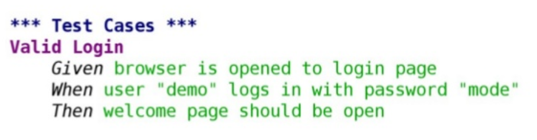

# 7i_GPS-T01-Técnicas-TestsEnProyectosÁgiles

##  *Las pruebas (tests) en proyectos ágiles* **Gestión de Proyectos Software**

*Las pruebas (tests) en proyectos ágiles* **Gestión de Proyectos Software**

## <u>Contenidos</u>

-  Tipos de tests
-  Desarrollo dirigido por tests
-  Desarrollo dirigido por tests de aceptación
-  Estrategias y situaciones en la vida real
-  Las pruebas en Scrum

## Los tests en proyectos ágiles

-  Los tests de software son esenciales en las metodologías ágiles
    -  Pero no todas las técnicas de prueba encajan bien
-  En la definición clásica, hacer tests consiste en ejecutar un programa para encontrar errores
-  Esto cambia en las metodologías ágiles donde se pueden cuestionar muchas de las asunciones tradicionales sobre los tests
    -  Esto no significa que todas estas asunciones sean incorrectas o inaplicables
    -  Significa que hay que pensar si todas tienen sentido en una metodología más ágil

## Asunciones habituales sobre los tests que se pueden cuestionar

-  El testeo debe ser independiente del desarrollo
-  El testeo no puede empezar antes de que se haya terminado la implementación
-  El testeo va en este orden: diseño de los casos de prueba, ejecución de los casos de prueba, informe de los casos de prueba
    -  Esta sería la visión del testeo “en cascada”
-  Debe haber un departamento de tests separado
-  Debe haber un encargado de tests ( test manager )

## Asunciones habituales sobre los tests que se pueden cuestionar

-  El testeo debe hacerse al final
-  El testeo debe estar planificado
-  Debe haber una estrategia de testeo y un plan maestro de tests
-  Cubrir el 100% de los casos es demasiado caro
-  Automatizar el 100% de los tests es demasiado caro
-  El testeo requiere herramientas sofisticadas
-  El testeo debe ser realizado por “testers”

##  Tipos de tests

Tipos de tests

## Tipos de tests

-  ¿Cuántos tipos de tests distintos que conozcáis podéis nombrar?

## Tipos de tests

-  La terminología elaborada muchas veces conduce a tener especialistas en equipos o departamentos especializados
    -  P.ej., especialistas en tests de integración que están en el equipo de integración
-  En Scrum queremos evitar que haya equipos especializados si es posible
-  Por tanto, intentaremos minimizar el uso de terminología elaborada sobre los tests y usaremos una clasificación lo más simple posible

## Una clasificación de tests

Negocio (dominio de problema) Tecnología Crítica al proyecto (pruebas) Soporte al desarrollo

## Una clasificación de tests

-  La clasificación anterior organiza los tests en dos dimensiones
-  Dimensión “negocio-tecnología”
    -  Negocio    
        -  Desde la perspectiva de clientes y usuarios finales
    -  Tecnología    
        -  Desde la perspectiva del equipo de desarrollo
-  Dimensión “soporte al desarrollo-crítica al proyecto”
    -  Soporte al desarrollo    
        -  Los que ayudan a diseñar el software, a extraer requisitos etc.
    -  Crítica al proyecto    
        -  Los que buscan “romper” el sistema y sacar defectos y problemas a la luz        
            -  Los primeros que nos vienen a la mente al pensar en pruebas de software
-  Estas dimensiones nos dan cuatro cuadrantes que nos ayudan a no olvidar nada importante cuando decidamos la estrategia de pruebas del sistema

## Tests de tecnología y soporte al desarrollo

-  Unitarios, de integración y de despliegue
-  Escritos y mantenidos exclusivamente por los desarrolladores
-  Los unitarios prueban piezas de código aisladas
    -  No deberían llamar a la BD, usar el sistema de ficheros o hablar con sistemas externos    
        -  A veces tienen que simular otras partes del sistema
    -  Deberían tener una muy amplia cobertura de código
-  Los de integración prueban grupos de funcionalidad mayores
    -  Normalmente más lentos, pues hacen entrada/salida, conectan con la BD, el sistema de ficheros u otros sistemas
    -  A veces se les llama  tests de componentes
-  Los de despliegue (o de sistema) se ejecutan al desplegar la aplicación
    -  Comprueban que el despliegue ha tenido éxito    
        -  La aplicación está correctamente instalada, configurada, es capaz de contactar con todos los servicios que necesita y responde

## Tests de negocio y soporte al desarrollo

-  Normalmente conocidos como  tests funcionales o tests de aceptación
-  Sirven para asegurar que los criterios de aceptación de las historias de usuario funcionales se cumplen
    -  Los tests para los criterios de aceptación que corresponden con características no funcionales van en el cuadrante de tecnología y crítica al proyecto
-  Deberían escribirse, e idealmente automatizarse, antes de que comience el desarrollo de las historias

## Tests de negocio y soporte al desarrollo

-  Los tests de aceptación deben ejecutarse cuando el sistema está en modo de producción
    -  Los manuales suelen hacerse poniendo una aplicación en un entorno similar al de producción    
        -  Quizás con algunas versiones simuladas ( mock versions ) de servicios externos
    -  Los automáticos también deben ejecutarse en entornos similares al de producción, con el motor de tests interactuando con la aplicación de manera similar a lo que haría una persona    
        -  Haciendo clics en botones, pulsando teclas, rellenando cajas de texto etc.
-  Crear y mantener tests de aceptación automáticos puede ser bastante costoso
    -  Es mejor automatizar solo cuando ya hayamos tenido que repetir algo manualmente varias veces

## Tests de negocio y soporte al desarrollo

-  En cualquier historia de usuario hay un camino canónico a través de la aplicación en términos de las acciones que realizan los/as usuarios/as
    -  A veces se le llama el  happy path
    -  Si se modeliza la historia de usuario con casos de uso, esto correspondería al flujo de eventos principal
-  Aparte de este camino canónico, típicamente habrá variaciones del estado inicial, de las acciones realizadas y del estado final de la aplicación
    -  Algunas serán variaciones válidas (si fueran casos de uso, serían los flujos de eventos alternativos) y otras causarán errores
-  Los tests de aceptación automáticos deben cubrir primero el camino canónico
    -  Una vez tenemos esto, nos podemos plantear automatizar también la preuba de otros caminos

## Tests de negocio y crítica al proyecto

-  Tests manuales que verifican que la aplicación hace lo que se espera de ella
-  No solo comprueban que la aplicación cumple sus especificaciones,  también comprueban que las especificaciones son correctas
-  Las  demostraciones  que se hacen en las revisiones en Scrum (al final de cada sprint) son un ejemplo de estos tests
-  Los  tests exploratorios  son tests manuales donde quien hace los tests decide sus pasos conforme los realiza
    -  Se hacen sin un guion ni un plan preestablecido, usando la aplicación y probando cosas
-  Los  tests de usabilidad  buscan determinar cómo de sencillo es para los/as usuarios/as alcanzar sus objetivos con el software
    -  Se analiza cómo se usa la aplicación (tiempo para realizar tareas, si se tocan los botones equivocados a veces etc.) y se pregunta el nivel de satisfacción con la misma al final
    -  Se pueden montar programas de  beta testing , o hacer pruebas A/B

## Tests de tecnología y crítica al proyecto

-  Tests de aceptación no funcionales: capacidad, disponibilidad, seguridad etc.
    -  No funcional se refiere a aspectos del producto final que deben ser tenidos en cuenta en todas o casi todas las partes del sistema, y que podemos definir sin hacer referencia, o casi sin hacer referencia, al dominio de problema de nuestra aplicación    
        -  Prestaciones, seguridad, usabilidad, disponibilidad, el software y hardware mínimo en el que hay que funcionar...
-  Estos tests suelen requerir más recursos, son más complicados de diseñar (hay que conocer bien la arquitectura del sistema) y suelen ser más lentos de ejecutar
    -  Un ejemplo de la necesidad de más recursos es que es difícil medir la capacidad del sistema en producción en el  cluster  de balance de carga si haces las pruebas en un pequeño servidor compartido
-  Es buena idea tener al menos algunos muy básicos al principio del proyecto
-  Si tenemos un proyecto complejo o que vaya a ser esencial para algo ( mission-critical ), hay que considerar asignar recursos y personal desde el principio a diseñar e implementar estos tests

## Tests de tecnología y crítica al proyecto

-  Los tests de requisitos no funcionales pueden durar más tiempo que un sprint
    -  Un test de estabilidad (de estrés) requiere probar que el sistema funciona sin problemas durante un tiempo largo
-  Aún así, se deben ejecutar continuamente y tratarlos como otros tests
    -  Cuando fallan, se informa a los desarrolladores involucrados
    -  Cuando se han completado con éxito, se coge la última compilación completa del sistema y se vuelven a poner en marcha
-  Algunos tests solo se pueden pasar en el entorno de producción, o requieren hardware caro
    -  Lo ideal es evitarlos cuando sea posible, buscando alternativas    
        -  Hardware virtualizado, simuladores
    -  En algún momento habrá que pasarlos, no hay sustituto completo para el entorno real

## Otros usos de los tests: aprendizaje

-  Un test de aprendizaje se escribe únicamente para aprender sobre el sistema
    -  Para entender el código de otro
    -  Para aprender a usar una API mal documentada
    -  Para averiguar como se comporta un hardware mal documentado
    -  Etc.
-  Una vez escritos, pueden servir para verificar rápidamente que en la siguiente versión de ese código/API/hardware no ha cambiado lo que aprendimos

## Tipos de tests

-  Si una función ya se prueba dentro de un test de aceptación funcional (automático), ¿es necesario que se pruebe también en un test unitario?

##  Desarrollo dirigido por tests

Desarrollo dirigido por tests

## Desarrollo y tests

-  Tradicionalmente los tests se habían considerado algo independiente del desarrollo. Esto se justificaba con argumentos así:
    -  “ La programación es constructiva y el testeo es destructivo”
    -  “ Si los programadores testean su propio código, adaptarán los tests para que concuerden con la implementación”
    -  “ Cuando el testeo lo hacen los implementadores, podrán cumplir sus fechas límite saltándose los tests”
-  Los dos primeros argumentos asumen equipos especializados y no equipos multidisciplinares 
-  El último es parte de un problema mucho mayor, que es el de tomar atajos bajo presión que disminuyen la calidad final

## Desarrollo y tests

-  Bajo la perspectiva tradicional se asume que para que los tests y el código sean independientes, testeo y desarrollo deben estar separados
-  Sin embargo la independencia entre tests y código no requiere que los hagan personas distintas
    -  Si los hacen personas o equipos distintos hacen falta reuniones adicionales, y aparecen problemas por la falta de objetivos comunes y problemas de comunicación
-  La forma de que los tests sean independientes del código aunque los haga la misma persona es  escribirlos antes que el código
    -  De esa forma la implementación no puede influir en el test porque aún no existe

## TDD: Test-Driven Development

-  El TDD ( test-driven development ) es una  técnica de diseño de software , con la ventaja extra de que al final tendremos un montón de tests automáticos de ese software
    -  “ Test-first coding is not a testing technique”  Kent Beck (el que lo inventó)    
        -  “ Escribir los tests antes que el código no es una técnica de pruebas ”
-  En el TDD el diseño del sistema se produce mediante microciclos
    -  while (True) {Escribe test – Implementa – Refactoriza}
-  Si se adopta el TDD asumiendo que es una técnica de prueba se pierde su objetivo principal

##  Desarrollo dirigido por tests de aceptación

Desarrollo dirigido por tests de aceptación

## A-TDD: Acceptance Test Driven Development

-  El desarrollo dirigido por tests de aceptación ( Acceptance  TDD) es una  técnica de ingeniería de requisitos
    -  Estos tests especifican el comportamiento del sistema y luego permiten verificar que el comportamiento es el correcto
    -  A esto también se le llama  Behavior Driven Development  (BDD)

## Un problema: la entrega de requisitos de mano en mano

-  Una analista clarifica los requisitos por su cuenta (y con el cliente), documenta una especificación y se la pasa a desarrolladores y testers
-  Los desarrolladores implementan el software según entienden la especificación
-  Los testers prueban el código según entienden la especificación
-  En este punto tenemos tres interpretaciones, probablemente conflictivas, de lo que quería realmente el cliente
-  Esta aproximación genera mucho desperdicio
    -  Grandes documentos
    -  Tener que esperar a que otros terminen su parte
    -  Aumenta el WIP    
        -  Cada característica no está implementada hasta que pasa al menos por tres manos
    -  Y además, se dispersa mucho el conocimiento que se va adquiriendo sobre el sistema

## Desarrollo dirigido por tests de aceptación (A-TDD)

-  Es una aproximación colaborativa al descubrimiento de requisitos, donde desarrolladores, dueño de producto y otros, cogen ejemplos y tests automatizables y a partir de ellos crean especificaciones ejecutables
    -  Estos tests son especificaciones de requisitos
    -  Se hacen talleres para clarificar requisitos
    -  Énfasis en la prevención en lugar de la detección
-  El A-TDD no es TDD
    -  En ambos casos se hacen tests primero, pero el TDD es una técnica de diseño de software, mientras que el A-TDD es una técnica de ingeniería de requisitos
    -  Ninguna es una técnica de prueba aunque, como efecto secundario aunque importante, ambas producen muchos tests que se usarán durante las pruebas

## Desarrollo dirigido por tests de aceptación (A-TDD)

-  El A-TDD coge unos requisitos informales y los reformula de manera precisa en forma de tests automáticos
    -  Esto facilita mucho tener criterios de aceptación claros para las historias de usuario
    -  Si alguien formula algo de manera vaga, suele ser útil pedirle ejemplos concretos y elaborar a partir de ellos    
        -  Además esos ejemplos concretos pueden convertirse en buenos tests
-  Los talleres de requisitos permiten que haya una conversación cara a cara entre interesados y desarrolladores
    -  Lo más valioso del A-TDD es la comprensión y clarificación de requisitos que se obtiene al aplicarlo
    -  Los interesados deben tratar de expresar sus requisitos de manera que se pueda verificar su cumplimiento de forma automática    
        -  La automatización de eso será parte del trabajo de los desarrolladores

## Un ejemplo de test de aceptación

-  Como requisito: “el sistema permitirá acceder a usuarios con nombre y password válidos”
-  Como test de aceptación, ejemplo con Robot Framework usando el formato tipo “palabras clave”

## Un ejemplo de test de aceptación

-  Como test de aceptación, ejemplo con Robot Framework usando el formato tipo BDD (también llamada sintaxis Gherkin)

## Un ejemplo de test de aceptación

-  Robot Framework se combina con bibliotecas de testing como Selenium para ejecutar estos tests sobre aplicaciones web o móviles Library  *** Variables *** ${SERVER}  ${BROWSER}  ${DELAY}  ${LOGIN URL}  *** Keywords *** Open Browser To Login Page Open Browser  Maximize Browser Window Set Selenium Speed  Login Page Should Be Open ...

## Desarrollo dirigido por tests de aceptación (A-TDD)

-  Si un requisito ya está expresado en forma de test de aceptación, hay que evitar mantener otras versiones del mismo 
    -  P.ej., tenerlo también redactado en lenguaje natural es en el mejor caso redundante y en el peor caso una fuente de contradicciones    
        -  Y un desperdicio de esfuerzo por mantener dos veces lo mismo
    -  Sí que puede ser útil mantener algo de documentación que ayude a entenderlo (explicaciones/aclaraciones en lenguaje natural, imágenes, bocetos etc.)
-  Los tests de A-TDD deben ser entendibles por el dueño del producto y por cualquier usuario
    -  Lo ideal sería que el dueño de producto pudiera modificarlos o escribirlos por si mismo

##  Las pruebas en Scrum

Las pruebas en Scrum

## ¿Creamos “pilas de bugs”?

-  Lo primero que podemos pensar es que es mejor no tenerlas
    -  En ese caso, cada vez que se encuentra un defecto, la prioridad es solucionarlo
    -  En algunos casos esto no encaja bien con Scrum, donde las prioridades las decide el dueño del producto y puede que algunos defectos no sean su prioridad
-  El mayor riesgo de tener una pila de defectos separada consiste en que se vayan acumulando cada vez más defectos en ella
    -  El equipo puede acabar abrumado
-  La mejor opción suele ser que en la pila del producto tengamos tanto características (requisitos) como defectos
    -  Trabajar en un defecto requiere tiempo, y se lo estamos quitando a otro defecto, o a alguna característica funcional u otra mejora
    -  El dueño del producto tiene la oportunidad de decidir qué defectos/características son prioritarios

## Actividades de pruebas en un sprint

-  En las sesiones de grooming de la pila del producto
    -  El equipo Scrum clarifica los requisitos escribiendo tests de ejemplo    
        -  Incluso se pueden ir creando en estilo A-TDD/BDD si se va a usar esta técnica
-  Planificación del sprint
    -  Puede haber clarificación de requisitos adicional, resultando en nuevos ejemplos y tests
    -  Se definen y planifican tareas relacionadas con los tests durante el sprint    
        -  Creación y mantenimiento de tests automáticos
        -  Llevar a cabo tests manuales 

## Actividades de pruebas en un sprint

-  Durante el sprint
    -  Los tests automáticos se ejecutan todo el tiempo    
        -  Idealmente habrá un pipeline de despliegue automático que se encargará de esto
        -  Como mínimo el equipo de desarrollo los ejecutará frecuentemente mientras trabaja
    -  Los tests manuales se hacen justo después de implementar la PBI correspondiente    
        -  En general no queremos dejarlos para el final del sprint
    -  El dueño del producto confirma si el resultado de los tests de aceptación es el que se esperaba
-  En la revisión
    -  Los ejemplos y tests de aceptación que se crearon antes del sprint se incorporan a la demostración del producto    
        -  Son de aceptación y por tanto tendrán sentido para los clientes/usuarios que están viendo la demostración
-  Antes del despliegue en producción de una nueva versión
    -  Ejecutar tests costosos que no se pueden hacer más frecuentemente    
        -  No debería haber sorpresas de última hora si todo se ha hecho bien

## Seguimiento de errores durante un sprint

-  Si se encuentra un error durante un sprint, hay que intentar arreglarlo inmediatamente
    -  Si no puede ser inmediato pero no se puede dejar para otro sprint, entonces se añadirá una tarea en el tablero del sprint    
        -  No debemos dejar para otro sprint las cosas que nos impedirían cumplir nuestro compromiso para el actual
    -  Si no puede ser inmediato pero sí se puede dejar para otro sprint, irán a nuestro sistema de seguimiento de errores/incidencias
-  Los defectos que se encuentran fuera del sprint (por ejemplo, un fallo encontrado en producción, o algo que surge en una reunión de revisión) también deben ir al sistema de seguimiento de errores ( issue tracker )
    -  Si tenemos por ejemplo pruebas de sistema continuas en paralelo a los sprints de desarrollo, los errores que se encuentren ahí también irían al sistema de seguimiento de errores
-  En algún momento, periódicamente, revisaremos el issue tracker y crearemos entradas de pila para las cosas que hayamos anotado ahí

##  Estrategias y situaciones en la vida real

Estrategias y situaciones en la vida real

## Pistas de que algo no va bien con los tests

-  Los propios tests tienen bugs
    -  Se detectan defectos en el código que tendrían que haber detectado los tests automáticos, pero no lo han hecho porque tienen sus propios defectos
-  Los desarrolladores no escriben tests a la vez que crean nueva funcionalidad
-  Los tests requieren mucho mantenimiento
    -  Cuando se implementa nueva funcionalidad, actualizar los tests automáticos para incluirla cuesta mucho trabajo
    -  Llegan bugs a producción
-  Estas cosas tendrán una causa raíz que habrá que analizar
    -  Por ejemplo, pueden deberse a que los desarrolladores no tienen tiempo suficiente para escribir y mantener los tests

## Automatización de tests

-  Invertir en automatización de tests es importante y es valioso
    -  Crear tests automáticos requiere entender bien el producto, y esa comprensión siempre será de ayuda
-  El mantenimiento de los tests automáticos puede ser más costoso que la creación inicial de los mismos
    -  Hay que tener especial cuidado al automatizar tests de GUI, dado que las GUI cambian con frecuencia    
        -  Un buen diseño de software puede permitir testear casi toda la funcionalidad de la interfaz de usuario aunque la propia GUI cambie (p.ej., patrón Model-View-Presenter)
-  Quien crea los tests automáticos debe ejecutarlos regularmente, o se acaba por crear tests difíciles de usar
    -  Porque son muy lentos, o es difícil entender sus resultados, o no se mantienen actualizados y fallan por esa falta de mantenimiento y no porque el software tenga errrores
    -  “ Eat your own dog food”
-  Automatizar tests debe ser responsabilidad de los equipos multidisciplinares , al igual que ejecutarlos con frecuencia

## Tests de integración

-  Si tu aplicación interactúa con sistemas externos con distintos protocolos (p.ej., API externas), o si consta de varios componentes con interacciones complejas entre ellos, los tests de integración son muy importantes
    -  Con tests de integración, aquí nos referimos a asegurar de que cada parte independiente de tu aplicación funciona correctamente con los servicios o componentes de los que depende
-  Es esencial asegurarse de que no conectas con un sistema externo a menos que estés en producción
    -  Salvo que tengas alguna forma de indicarle a este sistema que estás enviando peticiones de prueba y no peticiones reales
    -  Para evitar este problema:    
        -  Aísla el acceso al sistema externo desde tu entorno de pruebas con un firewall
        -  Crea un ajuste de configuración en tu aplicación que la haga hablar con una versión simulada del sistema externo cuando esté en pruebas

## Tests de integración

-  Lo ideal sería que la organización que te proporciona la API externa tuviera una réplica del servicio que se comportara casi igual que el de producción
    -  Es sencillo hacer pruebas en ese caso
-  Pero normalmente tienes que crear un doble ( mockup ) por tu cuenta
    -  Porque el sistema todavía no existe (aunque ya se ha definido su interfaz)
    -  Porque no ofrecen una versión para hacer pruebas
    -  Porque sus respuestas no son deterministas (p.ej., cotizaciones en bolsa)
    -  Etc.
-  Los dobles de los servicios externos pueden tener que ser bastante sofisticados, especialmente si las interacciones con ellos son protocolos con memoria ( stateful )
    -  Es importante replicar no solo las respuestas esperadas, sino también las inesperadas    
        -  P.ej., incluir algún test que simule que hay problemas de red o que se ha caído el servidor remoto

## Bibliografía

-  Craig Larman & Bas Vodde.  Practices for Scaling Lean & Agile Development. Large, Multisite and Offshore Product Development with Large-Scale Scrum
    -  Capítulo 3 ( Test )
-  Jez Humble & David Farley. Continuos Delivery. Reliable Software Releases Through Build, Test and Deployment Automation
    -  Capítulo 4 ( Implementing a Testing Strategy )

