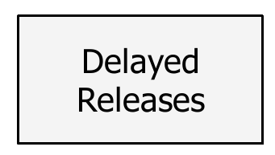
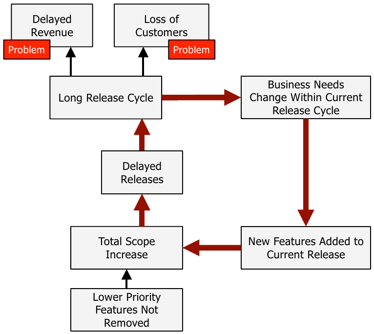
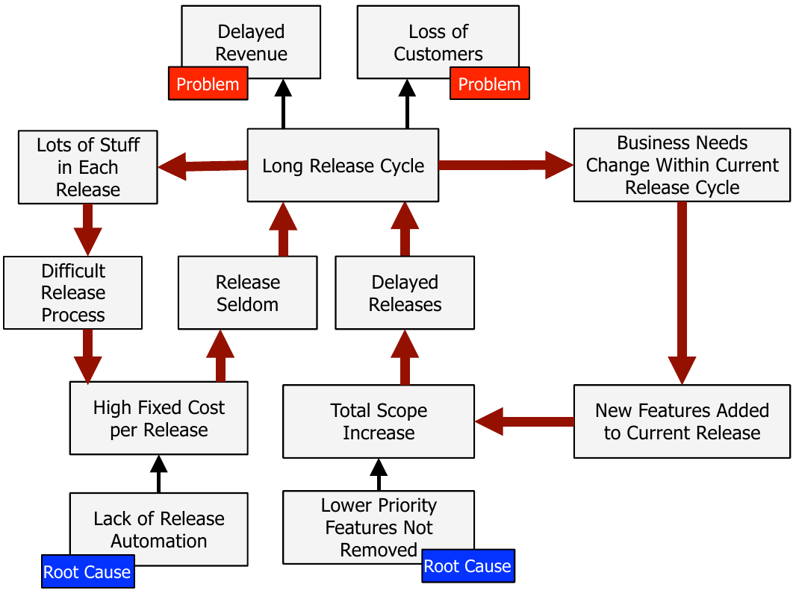
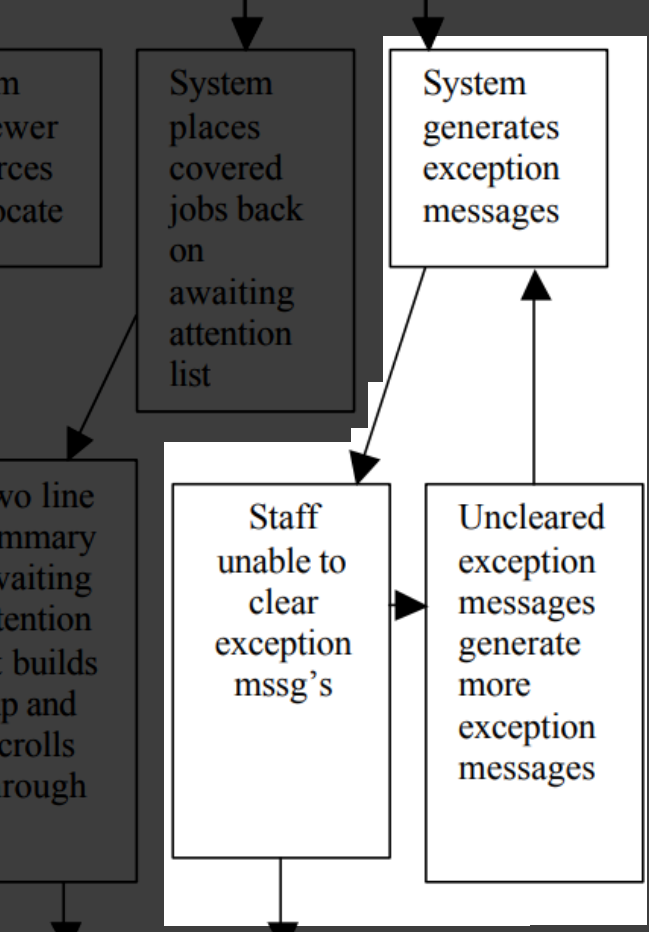
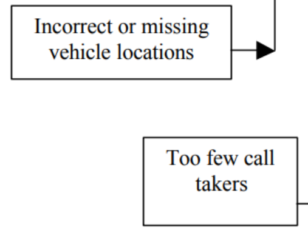

# 7i_GPS-T02-Técnicas-ProyectosFallidosYRootCauseAnalysis

##  *Proyectos de software fallidos: problemas, soluciones y el análisis de la causa raíz* **Gestión de Proyectos Software**

*Proyectos de software fallidos: problemas, soluciones y el análisis de la causa raíz* **Gestión de Proyectos Software**

## Contenidos

-  Proyectos de software fallidos
    -  El servicio de ambulancias de Londres (1992)
    -  HealthCare.gov (2013)
    -  El fallido lanzamiento de Target en Canadá (2015)
    -  ELWIS: control de Inventario de LIDL (2018)
    -  La actualización de la web de Hertz (2018)
    -  Problemas comunes y soluciones
-  Análisis de la causa raíz y los diagramas causa-efecto

## Proyectos de software fallidos

-  Los proyectos de software pueden fallar por muchas razones
-  Razones técnicas
    -  Requisitos mal definidos
    -  Errores en el código
    -  Acumulación de deuda técnica
    -  Pruebas insuficientes
    -  Etc.

## Proyectos de software fallidos

-  Razones debidas a la gestión
    -  Restricciones presupuestarias
    -  Liderazgo o dirección pobres
    -  Dificultad en las comunicaciones
    -  Procedimientos mal documentados
    -  Insuficiente involucración de potenciales usuarios/as
    -  Métricas de seguimiento del proyecto inadecuadas o insuficientes
    -  Etc.
-  En general un proyecto que ha fracasado lo ha hecho por múltiples causas
-  A continuación vamos a analizar varios proyectos fallidos, y vamos a tratar de entender los problemas que tuvieron y cómo una adecuada gestión podría haberlos evitado (o al menos reducido)

##  El servicio de ambulancias de Londres (1992)

El servicio de ambulancias de Londres (1992)

## El fallo del servicio de ambulancias de Londres (1992)

-  En los años 80 del siglo XX, el servicio de ambulancias de Londres funciona así:
    -  El CAC ( Central Ambulance Control ) recibe llamadas de teléfono
    -  Un/a CA ( Control Assistant )    
        -  Contesta la llamada
        -  Escribe los detalles en un formulario, incluyendo las coordenadas del lugar del incidente
        -  Los envía (mediante una cinta transportadora) a un punto central 
    -  Allí una persona los recoge y decide qué asignador/a de recursos debía ser llamado    
        -  Noreste, norte, oeste o sur
    -  El/la asignador/a de recursos decide entonces qué recursos hay que movilizar    
        -  Usando la información que tiene, enviada periódicamente por radio por las ambulancias
    -  Una vez decidido, se anota en el formulario y se pasa a un/a operario/a que contacta directamente con la ambulancia
-  El proceso completo debía tardar menos de 3 minutos

## El fallo del servicio de ambulancias de Londres (1992)

-  El denominado informe Finkelstein identifica problemas con este sistema manual. Algunos ejemplos:
    -  Identificar la localización precisa lleva tiempo y a menudo se hace de manera parcial
    -  Mover papel físicamente de un sitio a otro de la sala de control es ineficiente
    -  El estado de los vehículos y su localización, que llega a través de los operadores de radio, tiene que tenerlo en la cabeza todo el tiempo el/la asignador/a de recursos de esa zona
    -  Comunicarse por voz (radio) con las ambulancias lleva tiempo
    -  Identificar llamadas duplicadas depende la memoria y juicio de los/as CA ( control assistant )    
        -  Muchos incidentes los reportan varias personas
    -  Identificar cuando un incidente necesita una unidad de respuesta rápida o un helicóptero depende totalmente del juicio de una persona

## El fallo del servicio de ambulancias de Londres (1992)

-  Se propone desarrollar un sistema de envío de ambulancias asistido por computador (LASCAD,  London Ambulance Service Computer Aided Dispatch system )
    -  Un intento anterior había sido abandonado tras una prueba de carga que mostró que no podría soportar las necesidades de un entorno tan grande como es Londres
-  La especificación de requisitos era ambiciosa
    -  Pedía un sistema en el que la mayor parte de las llamadas recibieran una propuesta de asignación de la ambulancia más adecuada de manera automática
    -  En casos complejos una persona especializada sería llamada para elegir y asignar los mejores recursos    
        -  Pero en el caso habitual la misma persona que recibe la llamada debería poder atenderla hasta que se completase el servicio

## El fallo del servicio de ambulancias de Londres (1992)

-  Se puso como límite que el sistema estuvieran en marcha el 8 de enero de 1992
    -  El paso de análisis de requisitos a diseño había empezado a finales de 1990
    -  El proyecto se planificó con lo que esencialmente era una metodología en cascada
-  El proyecto se asignó a un consorcio de tres empresas (Apricot, Systems Option y Datatrak) por 1.1 millones de libras
    -  Algunas ofertas de empresas competidoras pedían hasta 8 millones para hacer lo mismo

## El fallo del servicio de ambulancias de Londres (1992)

-  Durante los primeros 9 meses de 1992 el sistema se prueba, mostrando ser inestable en cada prueba que se hacía
    -  Esta “fase de pruebas” no se había planificado inicialmente
-  Aún así, se decidió ponerlo en marcha el 26 de octubre de 1992
    -  ~9 meses de retraso sobre la fecha prevista inicialmente
-  El sistema empezó el día con una carga baja, pero conforme iban llegando más llamadas, el sistema alcanzó varios cuellos de botella
    -  Los cuellos de botella provocaron a su vez otros
-  El 28 de octubre a las 11 de la noche, tras dos días consecutivos de fallos y frustración del personal, el Servicio de Ambulancias de Londres (LAS) pone en marcha un procedimiento para volver al sistema anterior
    -  Este procedimiento no estaba planificado, tuvieron que improvisarlo
-  En esos dos días habían muerto más de 20 personas
    -  En ningún caso se culpó oficialmente al LAS, pero un sindicato insistió en que el sistema era responsable de, al menos, varias de esas muertes

## Las causas del fallo del servicio de ambulancias de Londres (1992) 

-  Había fallos en la transmisión de datos con las ambulancias
-  No está claro cómo de preciso era el sistema automático de localización de vehículos
-  Se usó Visual Basic (no estaba planificado al principio) para algunos formularios
    -  Bien para prototipos rápidos, pero mal para sistemas en los que el tiempo es un factor crítico    
        -  Sobre todo con los computadores de 1992
-  Como los formularios de VB eran lentos, los usuarios precargaban todas las pantallas que preveían necesitar
    -  Esto ponía una gran carga en el procesador y la memoria, enlentenciendo los procesos y llegando a causar caídas del sistema
-  El servidor de ficheros de respaldo no se había probado en absoluto

## Las causas del fallo del servicio de ambulancias de Londres (1992) 

-  No se había hecho ningún intento por anticipar qué pasaba si los datos que se introducían al sistema eran incompletos o imprecisos
    -  Los datos imprecisos provocaban que se generasen muchos mensajes de excepción
    -  Si había muchas excepciones, estas se salían de la página y no había un  scroll  o similar, con lo que no se podían ni leer    
        -  Esto a su vez provocaba más excepciones
    -  Si había muchas excepciones, estas también ocultaban otros mensajes anteriores    
        -  No se podía ir atrás a ver si se había enviado el vehículo adecuado a la emergencia 
    -  El manejo de excepciones acabó siendo el principal cuello de botella del sistema

## Las causas del fallo del servicio de ambulancias de Londres (1992) 

-  El personal no había sido formado adecuadamente
    -  Habían recibido algo de formación, pero mucho antes de la fecha original de implantación    
        -  Al final pasó más de un año entre su formación y cuando tuvieron que usar realmente el sistema
    -  La formación no era siempre completa y a menudo era inconsistente    
        -  En parte por la cantidad de cambios al sistema que se iban haciendo mientras se desarrollaba

## Las causas del fallo del servicio de ambulancias de Londres (1992) 

-  Algunas de estas causas son técnicas y otras de gestión, pero en general nos vamos a encontrar que están muy relacionadas. Ejemplos:
    -  La elección de Visual Basic    
        -  ¿El equipo de desarrollo eligió una mala herramienta o la usó mal?
        -  ¿Se permitió que esta decisión se tomara sin un análisis completo de pros y contras?
    -  Las pruebas fueron totalmente insuficientes    
        -  ¿Falta de herramientas de prueba adecuadas?
        -  ¿Se debió a una mala planificación temporal del proyecto?
        -  ¿Recortes debidos a que las empresas contratantes habían subestimado mucho el presupuesto necesario?
    -  Las pocas pruebas que sí se hicieron mostraban un sistema inestable y con fallos    
        -  ¿Por qué aún así se dio la orden de desplegar y poner en marcha?
    -  La formación del personal fue insuficiente y mal planificada    
        -  De nuevo podría ser falta de recursos, mala planificación...

##  HealthCare.gov (2013)

HealthCare.gov (2013)

## HealthCare.gov (2013)

-  HealthCare.gov es la web que el gobierno federal de EE.UU. pone en marcha para facilitar la adquisición de seguros privados de salud para sus ciudadanos
-  Se crea durante la administración Obama, bajo la ACA ( Affordable Care Act , Ley de Cuidados Sanitarios Asequibles)
    -  Ofrece subsidios dependiendo del nivel de ingresos aunque deja fuera a la personas más vulnerable    
        -  Las que están por debajo del umbral de pobreza

## HealthCare.gov (2013)

-  El sitio web se pone en marcha el 1 de octubre de 2013, cubriendo a residentes de 36 de los 50 estados de EE.UU.
-  La demanda inicial (5 veces mayor que la esperada) causó que el sitio web se cayera a las 2 horas de su puesta en marcha
-  El diseño del sitio web no estaba completo
    -  Había problemas de front-end    
        -  Menús desplegables incompletos
        -  Errores de ortografía
        -  Incluso textos de prueba que nadie había borrado (los famosos  Lorem Ipsum )
    -  Aunque los problemas graves estaban en el back-end    
        -  P.ej., las compañías de seguros reportaron que los datos de los usuarios no estaban completos o correctos cuando les llegaban
-  El acceso ( log in ) aún podía aguantar menos tráfico que el sitio principal, lo que creó un enorme cuello de botella
    -  Ese mismo mecanismo de acceso era usado por el personal técnico    
        -  Lo que hacía muy difícil que pudieran acceder para diagnósticos o mantenimiento

## HealthCare.gov (2013)

-  Durante  el primer día, 4 millones de visitantes  únicos accedieron a la web
    -  Solo  6 personas  pudieron completar y enviar sus solicitudes
-  En los días siguientes, de los 8 millones de visitantes que accedieron, se estima que el 1% pudieron apuntarse a un plan de salud
    -  De los que lo consiguieron, muchos tuvieron errores como envíos duplicados etc.
-  Tras mucho esfuerzo, nuevos contratistas y nueva gestión, el sitio web pudo manejar hasta 35.000 usuarios concurrentes para el 1 de diciembre
    -  2 meses después de su lanzamiento
-  En julio de 2014 el sitio web fue “hackeado”
    -  Aunque parece que no fue muy grave, se comprobó después que la seguridad del sistema tenía muchos fallos
-  El presupuesto inicial de 93.7 millones de dólares se convirtió en un coste total reportado en 1700 millones de dólares
    -  Incluso más según otras fuentes

## Las causas de los fallos de HealthCare.gov (2013)

-  El CMS ( Centers for Medicare and Medicaid Services ), la agencia responsable, tenía experiencia con gestión de seguros de salud y grandes proyectos gubernamentales, pero no con productos tecnológicos
    -  Hubo roles técnicos clave que no pudieron cubrirse y los/as managers del proyecto no tenían experiencia para poder estimar la cantidad de esfuerzo requerida    
        -  Las pruebas para coordinar e integrar todo el software desarrollado por terceras partes se dejaron para solo 2 semanas antes del lanzamiento
        -  Se hicieron pruebas de carga para solo 2000 usuarios concurrentes
    -  El CMS podría haber asignado algunos papeles clave de gestión a una firma externa con experiencia    
        -  O haber buscado asesoramiento en el DoD, la NASA...

## Las causas de los fallos de HealthCare.gov (2013)

-  Hubo problemas de liderazgo
    -  No estaban claras las responsabilidades los distintos departamentos gubernamentales involucrados    
        -  La toma de decisiones era lenta
    -  Cada subproyecto tenía su propia estructura organizacional    
        -  Cada uno se organizaba como podía
    -  Tampoco se comunicaban adecuadamente las decisiones tomadas

## Las causas de los fallos de HealthCare.gov (2013)

-  Problemas de calendario
    -  La fecha de entrega estaba prefijada de antemano, porque era un mandato legal de la ACA    
        -  El CMS pudo haber sido transparente con los problemas que había, lo que habría podido conseguir algo más de tiempo
        -  O podrían haber planificado una entrega por fases        
            -  Haciendo una beta a un grupo pequeño de solicitantes primero
            -  Proporcionando incentivos para que la gente decidiera apuntarse en distintos momentos del año y no el primer día
    -  Como ejemplo del tipo de problemas que esto generó, la empresa responsable del  log in  trabajaba sobre la base de que el sitio web iba a tener algunas partes que no requiriesen estar registrado/a para ser usados    
        -  Esta funcionalidad se quitó porque se acumulaban retrasos, y por tanto todo el mundo pasó a tener que registrarse para hacerlo todo        
            -  Con lo que esa parte del sistema no se pudo dimensionar bien
-  El proyecto se gestionó con una metodología que esencialmente era en cascada

##  El fallido lanzamiento de Target en Canadá (2015)

El fallido lanzamiento de Target en Canadá (2015)

## Target Canadá (2015)

-  La corporación Target es una cadena de grandes almacenes de EE.UU.
-  En 2011 anunciaron que abrirían tiendas en Canadá, y planificaron abrir 3 en marzo de 2013, y otras 21 poco después
    -  Llegaron a tener hasta 133
-  En 2012, en los pedidos destinados a las primeras tiendas que se abrirían ya había problemas
    -  Los productos que tenían que ir por barco no parecían llegar nunca
    -  Lo que llegaba a los centros de distribución no llegaba a procesarse para enviarlo a las tiendas
    -  A las tiendas llegaban cosas que no cabían en las estanterías a las que iban destinadas
-  A un mes de abrir la primera, ya sabían que tenían serios problemas con la cadena de distribución
    -  Y que probablemente eso implicaría tiendas desabastecidas

## Target Canadá (2015)

-  Tras la apertura de las primeras tiendas, enseguida llovieron críticas en las redes sociales sobre la falta de productos
    -  Aunque los centros de distribución de Target en Canadá estaban literalmente saturados de cosas    
        -  Camiones haciendo cola por no haber sitio libre para su carga
-  Los sistemas de punto de venta (software de la empresa Retalix) tampoco funcionaban bien
    -  Las cajas de autoservicio daban el cambio equivocado
    -  Los escáneres de código de barras no funcionaban, o devolvían el precio que no era
    -  Incluso a veces era posible que un/a cliente/a se fuera de la tienda con una transacción aparentemente completa pero en la que el pago nunca se había realizado

## Target Canadá (2015)

-  En febrero de 2014 Target había perdido 941 millones de dólares en Canadá
-  Se pusieron medidas paliativas para algunos problemas desde el punto de vista del negocio
    -  Alquilar más almacenes
    -  Priorizar productos básicos
    -  Focalizarse en las tiendas con mejores localizaciones
-  Entre eso y otros problemas que se detectaron y corrigieron en el software, para la segunda mitad de 2014 el sistema funcionaba más o menos como debía
    -  Pero esto ya llegaba tarde
-  En enero de 2015 Target anunció un procedimiento concursal ( bankruptcy protection ) y que cerraría y liquidaría sus 133 tiendas de Canadá
    -  Proceso que culminó en abril de ese año

## Target Canadá (2015)

-  Este fracaso se debió a muchas cosas
    -  Pero algunas de las más importantes tenían que ver con la tecnología
-  El sistema de gestión de la cadena de suministro que tenían en los EE.UU. funcionaba muy bien y había sido ajustado durante muchos años a las necesidades de la empresa
    -  Y había mucha gente dentro de Target que entendía perfectamente su funcionamiento
-  Al pasar a Canadá se enfrentaban al menos con dos novedades
    -  Una nueva divisa, y un segundo idioma

## Target Canadá (2015)

-  En lugar de modificar el sistema que tenían, decidieron que implantar una solución existente sería más rápido y se decidieron por SAP (con el apoyo de la consultora Accenture)
    -  Implantarían SAP, y los datos que salieran de ahí serían enviados a otras piezas cruciales del sistema de Target    
        -  Un software que predice la demanda de productos y las necesidades de reponerlos, y otro que permite gestionar los centros de distribución
    -  Una vez en funcionamiento en Canadá, llevarían el nuevo sistema a EE.UU. para unificar ambos
    -  Y esto en 2 años

## Target Canadá (2015)

-  Target presume de una buena cultura empresarial
    -  En parte esto pasaba por reclutar a gente joven y con personalidades “compatibles” con esta cultura
-  Al empezar a reclutar personal en Canadá aplicaron las mismas ideas
    -  Contrataron a gente joven, con la personalidad que buscaban, pero a la que apenas tuvieron tiempo de formar mínimamente    
        -  En buena medida porque Target en Canadá no había tenido el mismo tiempo que en EE.UU. para establecer programas de formación y mentorizaje

## Target Canadá (2015)

-  Había que introducir 75000 productos distintos en el sistema SAP en muy poco tiempo, y obtener toda la información de los proveedores se dejaba muchas veces al personal recién contratado
    -  Con más experiencia habrían sabido que los vendedores a menudo proporcionan información poco fiable    
        -  Y habrían tenido más capacidad para enfrentarse a ello
    -  El sistema SAP no ayudaba mucho porque no validaba las entradas de los usuarios
    -  Se estima que el sistema tenía datos correctos aproximadamente el 30% del tiempo    
        -  El que tenían en EE.UU estaba entre el 98 y el 99%

## Target Canadá (2015)

-  Se propuso apagar todo el sistema y verificar cada entrada de datos en el mismo de forma manual, y así se hizo
    -  En otoño del 2012 se celebró la “semana de datos”    
        -  Había que confirmar cada dato para cada producto con el vendedor correspondiente
        -  75000 productos, cada uno con entre 50 y 80 campos
    -  Para complicar el proceso, los datos de prueba ( dummy ) que se habían introducido aún estaban ahí
    -  Los datos no podían ser insertados en SAP por los mismos que los verificaban, y se enviaron a la India para que desde allí se cargasen al sistema    
        -  Esto introdujo algunos errores adicionales, aunque no muchos

## Las causas de los problemas de Target Canadá (2015)

-  Había muchos problemas que podemos considerar técnicos, de requisitos mal expresados o de usabilidad del software
    -  Las dimensiones de los productos a veces estaban en pulgadas (EE.UU.)    
        -  Y no en centímetros (Canadá y resto del mundo)
    -  Las dimensiones de los productos que deberían aparecer como ancho/alto, aparecían como ancho/alto
    -  Otras veces se usaba la divisa equivocada en los precios
    -  Lo que Target entendía como la fecha en la que algo llegaba a un centro de distribución, algunos de los suministradores más grandes la interpretaban como el día en que tenían que hacer el envío    
        -  Esto no se detectó hasta 2014

## Las causas de los problemas de Target Canadá (2015)

-  El sistema de previsión de la demanda funcionaba muy bien en EE.UU., pero falló estrepitosamente en Canadá
    -  Esto es lo que llevo a tener almacenes saturados
    -  En EE.UU. habían tenido muchos años de datos para ajustarlo, y tenían una amplia y fiel clientela, pero ninguna de estas cosas era así en Canadá
-  Algunas cosas habrían mejorado con personal más experto y mejor formado
    -  Cuando se quiso enviar personal con experiencia desde los EE.UU. ya era tarde    
        -  El sistema era distinto, así que su experiencia no era muy útil
-  Muchas cosas no se detectaron a tiempo por falta de pruebas
    -  Por ejemplo, los errores en el sistema de punto de venta se habrían detectado rápidamente con solo unas horas de compras simuladas

## Las causas de los problemas de Target Canadá (2015)

-  En 2014 se detectó que aunque en el sistema de reposición había una característica que notificaba a los centros de distribución para que entregaran más productos cuando una tienda se quedaba sin existencias, esta no funcionaba
    -  Resultó que algunos analistas de negocios apagaban esto a propósito
    -  El problema es que se les evaluaba en base al porcentaje de sus productos que estuvieran disponibles en un momento dado    
        -  Si apagaban la opción de autorreponer, el sistema no indicaba que un producto no estaba disponible, con lo que ellos/as quedaban bien en sus informes        
            -  Un claro ejemplo de cómo las métricas mal entendidas y mal aplicadas son contraproducentes
    -  Una vez esto se activó completamente, se pudo comprobar la auténtica realidad del bajo nivel de stock que tenía la compañía

## Las causas de los problemas de Target Canadá (2015)

-  También para 2014 consiguieron añadir un sistema de verificación de datos para evitar que entraran datos incorrectos a SAP
    -  Cosas simples, como códigos a los que les faltaba algún dígito etc. ahora ya se detectaban automáticamente
    -  Esto llegó demasiado tarde
    -  Un antiguo empleado describía el desentrañar el funcionamiento de SAP, tuvieron que hacerlo para añadir esto, como pelar una cebolla    
        -  Tiene múltiples capas y te hace llorar

##  eLWIS: control de Inventario de LIDL (2018)

eLWIS: control de Inventario de LIDL (2018)

## eLWIS (2018)

-  En 2011, la cadena de supermercados Lidl decide poner en marcha un sistema de control de inventarios global utilizando el software de SAP (también alemana) denominado eLWIS ( electronic Lidl merchandise management and information system )
    -  Para sustituir al que tenían, un desarrollo interno denominado Wawi    
        -  Estaba alcanzando los límites de su capacidad y tenía carencias técnicas y funcionales
        -  Cada vez más caro de mantener en marcha
-  Se espera que el nuevo producto permita procesos más eficientes para más de 10000 tiendas y más de 140 centros logísticos

## eLWIS (2018)

-  En 2015 el sistema se puso en marcha, a modo de piloto, en las tiendas de Austria, Irlanda y EE.UU
    -  Aquí ya se vio que el sistema no funcionaba para países con grandes volúmenes de ventas
-  En 2017, SAP le entrega un premio a Lidl como uno de sus mejores clientes
-  Para julio de 2018 se cortó el desarrollo de eLWIS, y Lidl tuvo que volver a su anterior sistema de inventario
    -  Se señaló que los objetivos estratégicos iniciales no podían alcanzarse con un esfuerzo razonable    
        -  Y que no era una decisión “contra SAP” sino “a favor de su propio sistema”
    -  Después de haber gastado unos 500 millones de euros

## Las causas de los problemas con eLWIS (2018)

-  El sistema SAP basaba el inventario en los precios finales de venta de los productos, mientras que Lidl se basaba en los precios a los que los habían adquirido ellos
    -  Lidl decidió adaptar SAP a su filosofía de inventarios y ese fue el principio del fin
-  Un software complejo como un ERP (Enterprise Resouce Planning) es complejo de adaptar
    -  La implementación de un ERP debe reflejar un conjunto de buenas prácticas y un conocimiento profundo de ese dominio de problema
    -  Hay que elegir el producto cuya implementación esté más alineada con lo que quieres conseguir    
        -  No tratar de adaptar uno más alejado
    -  Lidl no evaluó adecuadamente SAP    
        -  Por bueno, conocido o popular que sea un producto de software, no se debe elegir sin evaluar en cada caso si es el adecuado

## Las causas de los problemas con eLWIS (2018)

-  Nadie en Lidl fue capaz de parar el proyecto cuando el presupuesto y los plazos empezaron a crecer
    -  Haber parado en 2015, tras las pruebas piloto que mostraron que había problemas, habría ahorrado mucho dinero y tiempo
    -  El liderazgo en general fue problemático    
        -  Hubo bastantes cambios de los ejecutivos responsables de este proyecto
-  Algunas voces de Lidl culparon a la consultora KPS, que debía guiar la adaptación de SAP a las necesidades de Lidl, de ser demasiado lenta
-  Desde KPS se señaló que los plazos eran demasiado cortos, y que aún así las fases piloto (Austria, Irlanda, EE.UU.) se desplegaron a tiempo

##  La actualización de la web de Hertz (2018)

La actualización de la web de Hertz (2018)

## La web de Hertz (2018)

-  En 2016, la compañía de alquiler de coches Hertz llevaba un tiempo luchando para mantener beneficios
    -  Por el crecimiento de Uber y Lift, la mayor competencia en el sector y la caída en el valor de los coches usados
-  Deciden modernizar toda su presencia online, y para ello contratan a la consultora Accenture en agosto de 2016
-  La idea es lanzar la nueva versión en diciembre de 2017, pero esto se retrasa primero hasta enero de 2018 y luego hasta abril de 2018
-  Cuando esta última fecha tampoco se cumple, y viendo que el producto no cumple ni la mitad de lo que estaba especificado el proyecto se cancela
    -  Y Hertz demanda a Accenture por los 32 millones de dólares que habían pagado señalando que no habían entregado ni un sitio web funcional ni una aplicación móvil funcional

## La web de Hertz (2018)

-  En 2015, la infraestructura informática de Hertz era bastante compleja
    -  Unos 1800 sistemas distintos, 6 proveedores de bases de datos y 30 sistemas distintos para el procesamiento de los alquileres de coches
-  En 2016 ponen en marcha un proceso de modernización de la web y la aplicación móvil
    -  En esta fase se apoyan en Accenture para validar la estrategia y planificación para el proyecto
    -  Este proceso aparentemente va a adoptar una metodología “ágil”, con dueños/as de producto y sprints
-  En la segunda mitad del año se buscan proveedores para implementar esta nueva solución
    -  Se concluye que Accenture, dada su experiencia en webs y aplicaciones móviles, es la adecuada
    -  Se pagan 7 millones de dólares a Accenture para que creen un plan detallado que describe la funcionalidad, los procesos de negocio, la tecnología y la seguridad de la solución    
        -  Recordatorio: crear un plan detallado por adelantado y “ágil” no son compatibles

## La web de Hertz (2018)

-  En la primera mitad de 2017, Accenture y Hertz planean llevar a cabo una fase 2, que incluya el diseño, construcción, prueba, validación y despliegue de la web y la aplicación móvil
    -  Hertz se compromete con sus inversores a tener esto listo para final de año
    -  Accenture por su parte quita al “product manager” y al “project architect” del proyecto
-  En la segunda mitad de 2017, Hertz y Accenture acuerdan llevar a cabo esa fase 2 por 26 millones de dólares
    -  La gestión del proyecto queda en manos de Accenture    
        -  Incluyendo la planificación, el control y el liderazgo 

## La web de Hertz (2018)

-  Pronto Accenture señala que no van a llegar a diciembre de 2017 y piden una extensión de plazos de un mes
    -  Y poco después, posponen esa fecha hasta abril de 2018
-  En mayo de 2018, tras lo que parece ser el despedido y sustitución del CIO de Hertz, se saca a Accenture del proyecto
-  En junio de 2018 Hertz contrata a otro proveedor para completar el proyecto
    -  Hertz señala que gastaron 10 millones de dólares adicionales en corregir o reemplazar lo que había hecho Accenture
-  En abril de 2019, Hertz demanda a Accenture

## Los problemas de la web de Hertz (2018)

-  Según Hertz, Accenture recomendó las siguientes soluciones tecnológicas
    -  Angular para el front-end
    -  Adobe Experience Manager para la gestión de los contenidos de la web
    -  Una arquitectura de microservicios
    -  MuleSoft como middleware/plataforma de integración entre front-end y back-end
    -  Y todo esto conectado a los sistemas de back-end de Hertz    
        -  Reservas de coches, programas de fidelización de clientes/as y otras cosas

## Los problemas de la web de Hertz (2018)

-  En la demanda de Hertz, se alega que Accenture:
    -  No había propuesto un diseño web responsive, algo que llevaba años siendo una práctica común y que estaba en el contrato    
        -  Parece que Accenture asumió que no era necesario adaptarse a una tablet
    -  No había considerado en absoluto la futura extensión del sistema, algo que estaba como requisito en el contrato    
        -  Parece que Accenture se focalizó en resolver el problema de Hertz en EE.UU        
            -  Sin pensar en la marca global o en otras marcas de la empresa
    -  Había escrito un código terrible plagado de vulnerabilidades de seguridad y problemas de prestaciones    
        -  Especialmente en el front-end (Angular)

## Los problemas de la web de Hertz (2018)

-  No tenía la experiencia necesaria con las tecnologías, a pesar de que Accenture sostenía que:
    -  Tenían “al mejor talento del mundo”
    -  Las “habilidades necesarias para ganar”
    -  Y que “pondrían al equipo adecuado sobre el terreno el día uno”
-  Falló en las pruebas y en la documentación
    -  Tests inadecuados, incluso engañosos
    -  Documentación que debía ser dinámica y actualizable se proporcionaba únicamente en PDF
-  Y que, en general, cada vez que se señalaba alguno de estos problemas a Accenture, estos se ofrecían a solucionarlo pero siempre pidiendo más dinero

## Los problemas de la web de Hertz (2018)

-  Las alegaciones de Accenture a algunos de estos puntos son significativas, pues reflejan bien como algunas grandes consultoras entienden su relación con sus clientes:
    -  Señalan que cosas como “el mejor talento” o “las habilidades necesarias para ganar” es solo marketing y que Hertz no puede basarse en eso para pedir nada    
        -  Y que, por contrato, Accenture tenía libertad para elegir a su personal
    -  Que las responsabilidades de entregar a tiempo se acaban en su parte, y que Hertz tenía que implementar las integraciones con su backend, la seguridad y los tests de aceptación de usuarios/as    
        -  Así como gestionar a todas las posibles subcontratas

## Los problemas de la web de Hertz (2018)

-  Que los contenidos de la web los tenía que proporcionar Hertz
    -  Y que sin eso no se podía lanzar
-  Que el contrato no establecía un precio prefijado sino que era de obra y servicio
    -  Por tanto, Accenture podía pedir más dinero para cubrir sus gastos
-  Que el acuerdo general de servicios entre Hertz y Accenture (que existía desde 2004, mucho antes que este desarrollo) indicaba que a Accenture no se le podía demandar por daños o perjuicios

##  Problemas comunes y soluciones

Problemas comunes y soluciones

## Problemas comunes

-  En estos ejemplos de fracasos hemos visto cosas que se repiten en muchos o todos los casos
-  Las presiones para entregar en una fecha prefijada
    -  Que provocan lanzamientos plagados de fallos y/o fechas incumplidas
-  Las planificaciones y capturas de requisitos muy detalladas por adelantado, que al final:
    -  O se incumplen    
        -  Recortes de funcionalidad, recortes de calidad...
    -  O llevan a importantes retrasos y sobrecostes
    -  O las dos cosas
-  Metodologías en cascada 
    -  Si alguna vez aparece la palabra “ágil” suele ser puro marketing

## Problemas comunes

-  Los intereses del licitador (empresas o administraciones públicas) y del contratista (a menudo una o más consultoras tecnológicas) son muy distintos
-  No se consideran adecuadamente algunos costes muy importantes:
    -  Integración
    -  Migración del sistema antiguo
    -  Creación de los contenidos para la nueva solución
-  Se dejan las pruebas para el final y se deja poco tiempo para hacerlas
-  No se pone a las personas adecuadas en puestos clave
    -  Gestión del proyecto y/o dirección técnica
    -  A veces se delega esto en los contratistas    
        -  Se puede delegar la autoridad, pero es necesario entender que  no se puede delegar la responsabilidad
    -  Otras veces se trata de poner en estos puestos a gente de la organización licitadora    
        -  A menudo sin suficientes conocimientos y experiencia

## Soluciones

-  Las metodologías ágiles, como Scrum, proponen soluciones a muchos de estos problemas
    -  Evitan tener fechas de entrega prefijadas y conjuntos de requisitos prefijados    
        -  O bien una cosa, o bien la otra, pero las dos a la vez se entiende que es un gran riesgo
    -  Se evitan los planes y requisitos muy detallados por adelantado    
        -  A cambio de una mayor flexibilidad después, lo que acaba siendo beneficioso para licitadores y contratistas
    -  Son la antítesis de las metodologías en cascada
    -  Tienen una aproximación más colaborativa entre licitador y contratista    
        -  Dueño/a de producto, reuniones de revisión frecuentes para que haya feedback...
    -  Las integraciones/migraciones/creaciones de contenidos se abordan en cuanto es posible    
        -  Aproximación iterativa e incremental al desarrollo de software
    -  Las pruebas se abordan desde el principio    
        -  Definición de “hecho” fuerte, aproximación iterativa e incremental al desarrollo de software

## Soluciones

-  Que los contratistas (consultoras) no pongan a las personas adecuadas (conocimientos y experiencia) en los equipos de desarrollo es sencillamente una mala práctica
    -  La solución a esto pasa por que los licitadores redacten cláusulas detalladas exigiendo más con respecto a esto en los contratos
-  Que los licitadores (clientes, empresas y administraciones públicas) no pongan a las personas adecuadas en puestos de responsabilidad clave tampoco lo puede resolver una metodología de gestión
    -  Tan solo podemos enfatizar la importancia de tener gente con conocimientos y experiencia en gestión de proyectos software y en arquitectura de software en los puestos clave

##  Análisis de la causa raíz y los diagramas causa-efecto

Análisis de la causa raíz y los diagramas causa-efecto

## Análisis de la causa raíz

-  Para resolver un problema, primero hay que entenderlo
    -  Ya hemos visto que los problemas casi nunca vienen solos, y que a menudo se relacionan unos con otros de maneras no obvias
-  Para entender los problemas, es importante distinguir lo que son síntomas y lo que son causas
    -  Si hay humo en casa (síntoma) no abres la ventana y te vas a dormir    
        -  Buscas el fuego
    -  Si hay agua en el barco (síntoma), no te limitas a achicarla    
        -  Buscas el agujero
    -  Si tu aplicación tiene una fuga de memoria (síntoma), no compras más memoria para tu ordenador    
        -  Buscas y corriges el código que no libera la memoria cuando termina
-  Hasta determinar la causa raíz de un problema, normalmente los intentos de solucionarlo fracasarán
-  Esto también es útil en análisis a posteriori de los proyectos que han fallado, porque nos permite aprender cosas para no repetirlas

## Los 5 porqués (The 5 Whys)

-  Problema : el cliente no nos paga los folletos que le hemos imprimido
-  1. ¿Por qué? Porque le han llegado tarde
    -  Igual es culpa de la empresa de transporte...
-  2. ¿Por qué han llegado tarde? Porque tardamos más en imprimirlos de lo planificado
    -  Es culpa nuestra. Entonces habrá que mejorar la planificación...
-  3. ¿Por qué hemos tardado más de lo planificado? Porque nos hemos quedado sin tinta a mitad del trabajo
    -  Tendríamos que tener más tinta en el almacén...
-  4. ¿Por qué nos hemos quedado sin tinta? Porque un pedido grande de última hora ha usado toda la que teníamos y no hemos podido comprar más a tiempo
    -  Tendremos que rechazar pedidos grandes de última hora...
-  5. ¿Por qué no hemos podido comprar más a tiempo? Porque el proveedor no nos ha podido suministrar lo bastante rápido
-  Solución : localizar algún proveedor que pueda suministrarnos tinta en menos de 1 hora en cualquier momento en que nos haga falta

## Diagramas de causa-efecto

-  Son una forma ágil de representar un análisis de causa raíz
-  A veces se usan los diagramas Ishikawa, o de espina de pez, pero son más rígidos, especialmente durante el proceso de análisis del problema
    -  Los diagramas de espina de pez están bien cuando tienes el problema bastante claro y quieres representarlo gráficamente    
        -  Pero son menos útiles cuando todavía estás delimitando y entendiendo el problema
-  Permiten analizar problemas existentes
    -  Mientras se producen, o en análisis a posteriori
-  También sirven para pensar sobre problemas potenciales
    -  Por ejemplo, para analizar algunos riesgos de un proyecto

## Ejemplo de diagrama de espina de pez

Image under a Creative Commons Attribution-Share Alike 4.0 International, by VARGUX

## Análisis de causa raíz con diagramas de causa-efecto

-  1. Escribe el problema de partida
-  2. Traza hacia arriba para pensar en las consecuencias que el problema de partida causa 
    -  Pregúntate ¿y qué?
-  3. Traza hacia abajo para encontrar la causa (o causas)
    -  Pregúntate ¿por qué?
-  4. Identifica círculos viciosos (ciclos)
-  5. Itera 1-4 para refinar y clarificar el diagrama
-  6. Decide qué causas raíz tratarás de solucionar poniendo contramedidas
-  Más adelante, haz un seguimiento del problema
    -  Si tus contramedidas no funcionan, actualiza el diagrama a partir del conocimiento nuevo que hayas adquirido y prueba otras
    -  Las contramedidas son experimentos, no soluciones    
        -  Asumimos que serán soluciones, pero hay que comprobarlo

## Análisis de causa raíz con diagramas de causa-efecto

##  Ejemplo

Ejemplo

## Ejemplo

-  1. Escribe el problema:  No llegamos a cumplir las fechas de lanzamiento comprometidas

## Ejemplo

-  Un problema solo lo es si entra en conflicto con algún objetivo
    -  Hay que definir el objetivo, y pensar las consecuencias del problema según este objetivo    
        -  Preguntando repetidamente ¿Y qué?
-  Objetivo: tener contentos a nuestros clientes y maximizar nuestros ingresos
    -  ¿A quién le importa si los lanzamientos se retrasan? ¿Qué consecuencias tiene?    
        -  Los retrasos alargan nuestros ciclos de lanzamiento
    -  ¿Y qué?    
        -  Eso retrasa los ingresos y reduce nuestra liquidez. También nos hace perder clientes que no quieren esperar

## Ejemplo

-  2. Trazar hacia arriba (solo es una convención) para pensar en las consecuencias

## Ejemplo

-  3. Traza “hacia abajo” para encontrar la causa (o causas) raíz
-  Preguntando repetidamente “¿Por qué?”
    -  ¿Por qué se retrasan los lanzamientos?    
        -  Porque el alcance (p.ej., requisitos funcionales) se incrementa
    -  ¿Por qué?    
        -  Porque los clientes insisten en añadir nuevos requisitos al lanzamiento actual, sin querer quitar otras cosas
    -  ¿Por qué? ¿Por qué no retrasar cosas hasta el siguiente lanzamiento?    
        -  Porque el ciclo de lanzamiento es muy largo, y los clientes no quieren esperar tanto
-  Es mala idea personalizar las causas, porque eso dificulta mucho las soluciones
    -  ¿Por qué se retrasan los lanzamientos?    
        -  Tipo de respuesta  a evitar : porque Jeff, el comercial, le dice que sí a todo lo que piden los clientes sin pensar en las consecuencias

## 

-  4. Identifica círculos viciosos (bucles)

## Ejemplo

-  Los problemas recurrentes suelen tener círculos viciosos
    -  Normalmente tardaremos algún tiempo en encontrarlos
-  5. Itera estos pasos para refinar y clarificar el diagrama
    -  Es fácil pasarse causas importantes en la primera pasada, así que volvemos atrás y seguimos preguntando ¿por qué?

## Ejemplo

-  ¿Por qué es el ciclo de lanzamiento tan largo? ¿Son los lanzamientos retrasados la única causa?
    -  Incluso sin retrasos, planificamos ciclos de lanzamiento largos
-  ¿Cómo de largos?
    -  Una vez por cuatrimestre
-  ¿Por qué tan largos?
    -  Porque los lanzamientos resultan caros y complicados
-  ¿Por qué?
    -  Porque entran muchas características en cada lanzamiento y todo es trabajo manual

## 

## Ejemplo

-  6. Decide qué causas raíz abordarás (contramedidas)
-  Causa raíz: “Falta de automatización de lanzamientos”
    -  Contramedida: “Implementar automatización de lanzamientos”
-  Causa raíz: “No se eliminan características de baja prioridad”
    -  Contramedida: “Negociar una regla con el cliente que les permita añadir nuevas características a un lanzamiento solo si eliminan una de tamaño similar”

## Ejemplo

-  ¿Cuándo decidimos que un elemento es una causa raíz? 
-  No hay reglas estrictas, pero sí que hay algunos indicadores
    -  Solo tiene flechas de salida, y no de entrada    
        -  No le hemos identificado causas, pero sí que tiene consecuencias
    -  No encontramos sentido a seguir preguntando “¿por qué?” a partir de ahí
    -  Es algo que podemos abordar y pensamos que eso tendrá un efecto positivo en el problema
-  En la técnica de los 5 porqués, el 5 solo es una sugerencia basada en la experiencia
    -  Pero es importante considerarlo porque la tendencia natural es a dejar de preguntar “¿por qué?” demasiado pronto

## Ejemplo

-  Una vez hecho el análisis, descubrimos que el problema inicialmente identificado (lanzamientos retrasados) no era un problema, ni una causa raíz
    -  Era un  síntoma
    -  A partir del cual hemos llegado a los problemas reales y a las causas raíz    
        -  Y hemos podido proponer contramedidas que pueden ser eficaces
-  Sin este análisis podríamos haber saltado a proponer cambios inefectivos demasiado pronto 
    -  Añadir más gente, dar incentivos económicos si se consiguen acortar los ciclos de lanzamiento...
    -  Que no habrían sido eficaces porque no van a las raíces del problema

## Causa-efecto del servicio de ambulancias de Londres

-  A menudo no se publica información detallada sobre los análisis de proyectos fallidos
    -  Se suele considerar algo interno
-  Pero en este caso sí que contamos con un diagrama de causa-efecto que ejemplifica muy bien el uso que le podemos dar a esta herramienta
    -  De un caso que hemos visto antes

## Un diagrama de causa-efecto con los fallos del LASCAD

Tomada de (Kornecki, Riddle y Lewis, 2003)

## Causa-efecto del servicio de ambulancias de Londres

-  Hay unos cuantos círculos viciosos

## Causa-efecto del servicio de ambulancias de Londres

-  Hay causas raíz (muchas más que estas dos)

## Causa-efecto del servicio de ambulancias de Londres

-  Y el principal problema
    -  Que en este diagrama es a su vez causa de otras cosas, no es un problema “puro”

## Conclusiones sobre los diagramas de causa-efecto

-  Los diagramas de causa-efecto ayudan de diversas maneras
    -  Facilitan que todo el equipo comparta una visión sobre los problemas    
        -  Resolver problemas en equipo es efectivo, pero requiere una comprensión compartida por todo el equipo
    -  Identifican cómo los problemas afectan al negocio    
        -  Permitiendo así focalizarse primero en los más importantes
    -  Encuentran causas raíz    
        -  Esto maximiza el impacto de las soluciones
    -  Encuentran círculos viciosos (bucles de realimentación negativa)    
        -  Esto permite buscar soluciones para romperlos
-  Estos diagramas son útiles, pero el punto clave es que proporcionan una  estrategia estructurada de solución de problemas
    -  Importan las preguntas hechas, y las respuestas encontradas
    -  La estrategia se adapta a casi cualquier tipo de problema

## Bibliografía

-  A. J. Kornecki, Embry Riddle and J. Lewis. Software Tragedies: Case Studies in Software Safety. PROCEEDINGS of the 21st INTERNATIONAL SYSTEM SAFETY CONFERENCE. 2003
-  Henrico Dolfing (2022). The Disastrous Launch of Healthcare.gov
    -  [https://www.henricodolfing.com/2022/12/case-study-launch-failure-healthcare-gov.html](https://www.henricodolfing.com/2022/12/case-study-launch-failure-healthcare-gov.html)
-  Henrico Dolfing (2020). Lidl’s €500 Million SAP Debacle
    -  [https://www.henricodolfing.com/2020/05/case-study-lidl-sap-debacle.html](https://www.henricodolfing.com/2020/05/case-study-lidl-sap-debacle.html)
-  Henrico Dolfing (2019). How Hertz Paid Accenture $32 Million for a Website That Never Went Live
    -  [https://www.henricodolfing.com/2019/10/case-study-hertz-accenture-website.html](https://www.henricodolfing.com/2019/10/case-study-hertz-accenture-website.html)
-  Joe Castaldo (2016). The Last Days of Target Canada
    -  [https://canadianbusiness.com/ideas/the-last-days-of-target-canada/](https://canadianbusiness.com/ideas/the-last-days-of-target-canada/)
-  Henrik Kniberg.  Lean from the Trenches. Managing Large-Scale Projects with Kanban
    -  Capítulo 20 ( Cause-Effect Diagrams )

