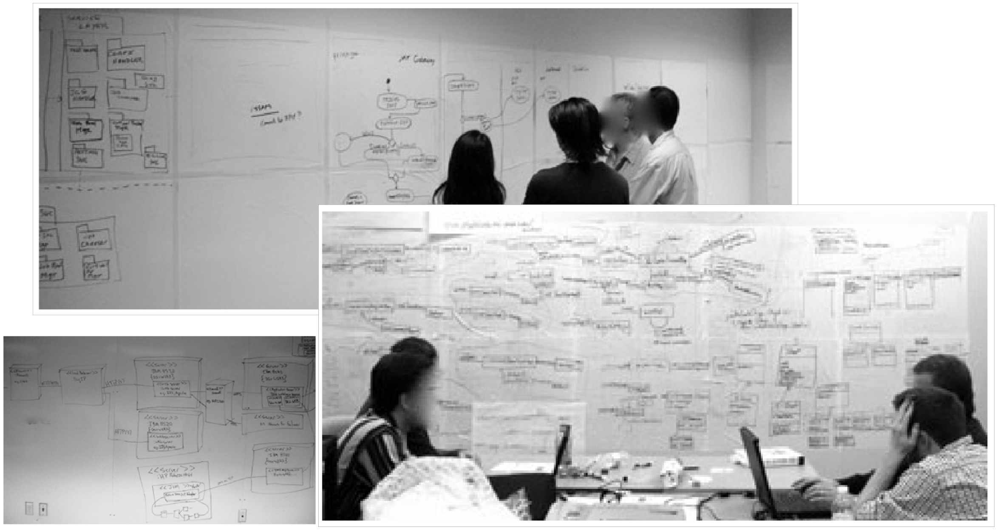
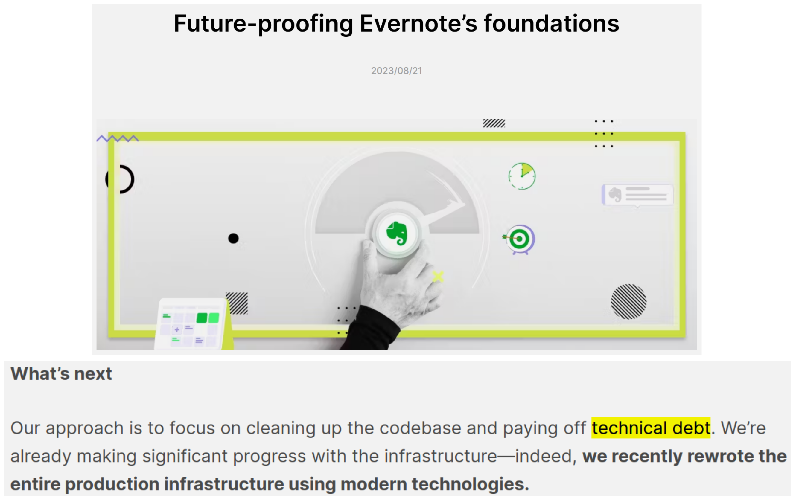
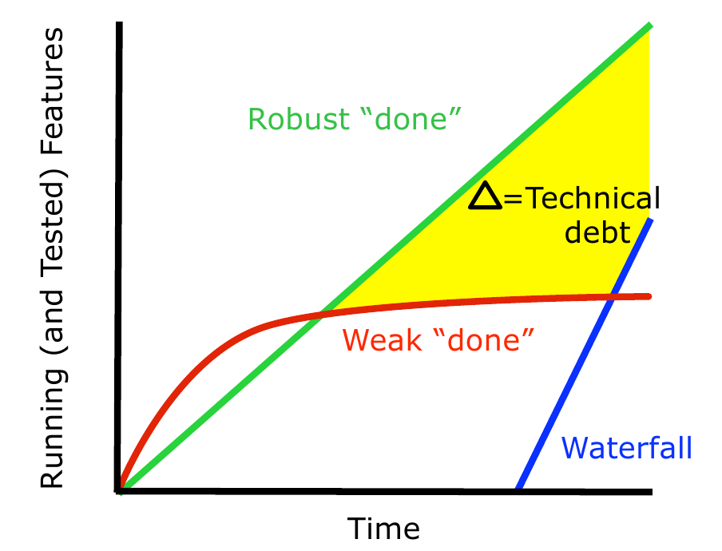

# 7i_GPS-T04-Técnicas-ArquitecturaYDeudaTécnica


##  *Arquitectura y diseño ágiles y la deuda técnica* **Gestión de Proyectos Software**

*Arquitectura y diseño ágiles y la deuda técnica* **Gestión de Proyectos Software**

## Contenidos


-  Arquitectura y diseño de software
    -  Una perspectiva  ágil  de la arquitectura de software
    -  Talleres de diseño ágil
    -  Talleres de documentación de la arquitectura del sistema
-  La deuda técnica

## ¿Construcción de software?


-  Plantear que el desarrollo de software es análogo a la construcción de edificios (el arquitecto crea los planos y los albañiles construyen el edificio) es una mala metáfora que no resulta útil
    -  El software no se construye (ni se fabrica), se diseña    
        -  La construcción debe ser automática gracias al compilador y los pipelines de integración y despliegue
    -  Las casas no suelen cambiar sustancialmente una vez se han construido, y los cambios que se hacen (p.ej., reformas) son poco frecuentes    
        -  El software puede cambiar radicalmente y los cambios hoy en día son muy frecuentes (incluso diarios)

## ¿Qué es la arquitectura de un sistema software?


-  La arquitectura de un sistema software es una propiedad del mismo, no una propiedad de su documentación
    -  La podemos documentar, podemos planificarla inicialmente y discutirla, pero la arquitectura real será la de aquello que finalmente creemos
-  Corolario 1: la arquitectura es dinámica
    -  Puede cambiar con cada línea de código añadida o quitada
    -  Evoluciona conforme se programa
-  Corolario 2: los diagramas y documentos no son el diseño real, el código fuente es el diseño real
    -  Aunque esto no significa que todo lo que nos importa de la arquitectura se pueda deducir del código fuente

## Por lo tanto...


-  La arquitectura de un software se “cultiva” día a día conforme se programa
-  Un supuesto arquitecto de software que no está en contacto con el código fuente no está en contacto con la arquitectura real
    -  Se les ha llamado “arquitectos de PowerPoint”, “arquitectos de torre de marfil” o “arquitectos astronautas” (tan lejos del código que igual podrían estar en el espacio)

## 


```
The Matrix Reloaded. (c) Warner Home Video. 2004
```


## Arquitectos astronautas


-  Los arquitectos astronautas no tocan el código y no pueden detectar cuándo este se degrada ni ayudar a corregir esta degradación
    -  Llega un punto en que los programadores ignoran a los arquitectos astronautas, porque hace mucho tiempo que estos últimos no saben casi nada sobre la arquitectura real del sistema
-  Los arquitectos astronautas crean grandes piezas de inventario (diseños grandes y muy detallados) 
    -  Desperdicio cuando hay que cambiarlos
    -  Dificultan trabajar en lotes pequeños

## ¿Pero diseñamos y documentamos la arquitectura o no?


-  El diseño por adelantado está bien
-  La documentación arquitectural está bien
-  Siempre que recordemos que
    -  La  arquitectura  diseñada inicialmente  puede mejorarse
    -  La arquitectura diseñada inicialmente  debe concretarse
    -  Los arquitectos tienen que  tocar el código
    -  El diseño debe ser  ágil

##  Talleres de diseño ágil

Talleres de diseño ágil

## Talleres de diseño ágil


-  Se pueden tener talleres de diseño al comienzo de la construcción de algo, y luego  just-in-time  cuando el equipo lo considere útil
    -  Participa todo el equipo (o todos los equipos involucrados)
-  Se diseñan los elementos a implementar en los próximos sprints, o la arquitectura global del sistema, según dónde estemos en el proyecto
    -  No para especificar cómo va a ser
    -  Sí para discutir cómo empezar (luego evolucionará)

## Talleres de diseño ágil


-  Se modelizan
    -  Interfaces de usuario (importante)
    -  Algoritmos e interacciones críticos (p.ej., con diagramas de actividad y autómatas finitos UML)
    -  Entidades importantes y modelos de datos (p.ej., con diagramas de clases UML)
    -  Vistas de componentes y conectores 
    -  Etc.
-  Al principio del proyecto, es importante modelizar en horizontal y superficialmente
    -  Un poco de todo, diagramas que den una visión global
    -  Pero puede ser interesante tomar algunas características que sean importantes o complejas y modelizarlas más en profundidad para explorar su problemática

## Talleres de diseño ágil


-  Según el número de participantes, suele funcionar bien tener grandes pizarras (o algo grande donde se pueda escribir)
    -  Cubrir todas las paredes de la sala con algo donde se pueda escribir no es descabellado
-  El software tipo CASE o de diseño de UML puede tener su utilidad,  pero no en un taller de diseño
    -  Lo que se busca es facilitar la colaboración, y esta clase de software no ayuda con esto
-  El formato taller permite discutir
    -  Uno de los valores principales de un diagrama es que permite discutir y probar alternativas mientras se crea
    -  Hacemos diagramas como soporte de la discusión sobre el diseño

## Talleres de diseño ágil




## Talleres de diseño ágil


-  Los modelos que hacemos en estos talleres no son especificaciones
    -  Los diagramas resultantes serán una inspiración, esbozos y guías, no una especificación
-  El código será el diseño real
    -  El diseño evolucionará conforme se programa y se aprende más del problema
-  La documentación de diseño detallada se puede crear después de que el código se haya completado si hace falta
-  Hay que tomar fotos de las pizarras y compartirlas con todo el mundo

## Talleres de diseño ágil


-  En un proyecto pequeño se puede avanzar bien sin talleres de diseño (aunque no sin diseño)
    -  Su valor aumenta conforme crecen los proyectos
    -  La integridad arquitectural de un sistema requiere que los desarrolladores tengan ideas compatibles y coherentes entre si    
        -  Los talleres de diseño contribuyen a esto
-  Los talleres de diseño permiten que todo el mundo se entere de las decisiones que afectan al diseño al mismo tiempo, sin pérdidas de tiempo
    -  Principio ágil: la conversación es la forma más eficiente y eficaz de transmitir contenidos
    -  Facilitan el aprendizaje de aquellos con menos experiencia
    -  Facilitan llegar a consensos, la coordinación de equipos y el intercambio de ideas

## Talleres de diseño ágil


-  Las personas no hemos evolucionado para usar ratones y mirar fijamente pantallas de ordenador
    -  Nos es más natural, y más agradable, pintarrajear las paredes y poder movernos con libertad
-  Las personas nos adaptamos bien a obtener información visualmente, por eso usamos notaciones gráficas como UML
    -  Pero no hace falta “pasarse” con el UML    
        -  Buscamos tener una conversación con un lenguaje cuya sintaxis principal sea compartida, no tratar de formalizar una especificación 
-  La duración de un taller depende del número de participantes y de las tareas a realizar
    -  Pueden ser horas o días (no muchos), pero siempre  timeboxed

##  Talleres de documentación de la arquitectura del sistema

Talleres de documentación de la arquitectura del sistema

## Talleres de documentación de la arquitectura del sistema


-  Tras un tiempo, y conforme las guías maestras de la arquitectura se vayan estableciendo, se puede llevar a cabo un taller de documentación de la arquitectura del sistema
    -  Para educar a nuevos desarrolladores y para facilitar que todo el mundo involucrado conozca el estado de la arquitectura del sistema
-  La documentación arquitectural resultante es útil como apoyo a la interacción entre personas
    -  Y puede ser imprescindible en un esfuerzo de desarrollo distribuido

## Diferencias con los talleres de diseño ágiles


-  Los talleres de diseño se hacen antes que el diseño real (el código)
    -  Proporcionan conversación, aprendizaje, especulación, guías y borradores en la pared
-  Los talleres de documentación de la arquitectura se hacen después de la implementación
    -  Describen el sistema como es en un momento determinado
    -  Son informativos, no creativos, y los participantes aprenden sobre la arquitectura real
    -  El formato no tiene que ser especialmente formal, y escribir en las paredes y guardar fotos sigue siendo útil

##  La deuda técnica ( technical debt )

La deuda técnica ( technical debt )

## La deuda técnica


-  Los atajos que tomamos deliberadamente para entregar antes algo que funcione se pueden ver como la adquisición de una deuda
    -  Es una deuda técnica
-  Estos atajos son cosas relativamente mal hechas que habría que mejorar lo antes posible
    -  Porque cuanto más tardemos en pagar la deuda técnica, más intereses acumulará
    -  La deuda y los intereses los pagaremos en tiempo de desarrollo en el futuro    
        -  Pagaremos toda la deuda refactorizando el código
        -  O seguiremos pagando intereses poniendo parche tras parche sin solucionar los problemas de raíz
-  Esta es una deuda técnica  estratégica
    -  Elegimos  tomar algún atajo en el desarrollo de un producto para poder ser los primeros en comercializarlo, o para poder empezar a generar algún beneficio

## La deuda técnica


-  También se habla de deuda técnica para referirnos a problemas típicos en desarrollo de software
    -  Mal diseño, o diseño desactualizado, bugs, cobertura de tests insuficiente, demasiados tests manuales, mala integración y control de versiones, falta de experiencia en la tecnología que usamos etc.
-  A este tipo de deuda técnica se la llama “deuda  ingenua ”, “deuda  no intencionada ”, “deuda  imprudente ” o simplemente “ chapuza ”
    -  No es intencionada    
        -  Puede ser por irresponsabilidad y/o accidente
    -  Se corrige principalmente con formación y decisiones empresariales acertadas    
        -  P.ej., invertir en formación para el personal

## La deuda técnica


-  Finalmente también hay una deuda técnica  inevitable
    -  Inevitable e imprevisible
    -  Por ejemplo, hay decisiones de diseño tempranas que tendremos que cambiar conforme aprendemos más del sistema que estamos creando

## Consecuencias de la deuda técnica


-  Punto crítico impredecible
    -  En algún momento, no predecible, se llega a un punto crítico
    -  Desde ahí, casi cualquier mínimo cambio puede crear grandes problemas
-  Tiempo de entrega incrementado
    -  Cuanto mayor sea la deuda hoy, menor será la velocidad (características implementadas por sprint) mañana    
        -  El tiempo que necesitamos para pagar los intereses o la propia deuda no lo usamos para implementar características útiles
-  Aumenta el número de defectos
    -  La deuda afecta cada vez a más cosas de las que implementamos, con lo que aumenta el número de defectos

## Consecuencias de la deuda técnica


-  Aumenta el coste de desarrollo y de soporte
    -  Cualquier cambio pequeño es más costoso en presencia de deuda técnica
-  Atrofia de producto
    -  Conforme más tardamos en añadir nuevas características o arreglar defectos en nuestro producto, este se vuelve menos atractivo para los clientes (actuales y potenciales)
-  Menor previsibilidad
    -  Cualquier estimación relacionada con el desarrollo será menos fiable en presencia de deuda técnica

## Consecuencias de la deuda técnica


-  Expectativas del producto disminuidas, frustración y menor satisfacción por parte de los clientes
    -  Puesto que la deuda hace más costoso cualquier desarrollo, las expectativas sobre el producto disminuyen    
        -  Los clientes ven que el producto no mejora, o incluso empeora, con el tiempo
    -  Como las expectativas de los clientes se ven reducidas, la empresa dedica menos entusiasmo a venderlo/usarlo    
        -  También porque los de ventas ven un producto que cada vez funciona peor y que por tanto les cuesta más venderlo

## 2014-01-04 


## 2015-09-01 


## 2020-09-17 


## 2021-07-21 


## 2022-11-16 


## 2023-08-21 




## Causas de la deuda técnica


-  Las causas son distintas según la deuda sea estratégica, ingenua o inevitable
-  Presión por cumplir con una fecha límite
    -  Tanto la estratégica como la chapucera pueden deberse a esta presión
    -  En determinado momento se comprueba que a la velocidad actual no se podrá cumplir con la fecha límite
    -  En lugar de reducir el alcance o alargar el límite (que sería lo ideal), se impone que el equipo debe aumentar su velocidad    
        -  Esto es la infame “calidad flexible”
    -  La consecuencia es deuda técnica
-  Una de las primeras cosas que se suele hacer es reducir el tiempo de pruebas
    -  Esto aumenta la deuda y tarde o temprano disminuye la velocidad, consiguiendo a medio plazo lo contrario de lo que se pretendía
    -  La deuda técnica se acumula    
        -  Acelerar el lanzamiento de la versión 1, incurriendo en deuda, va a retrasar el lanzamiento de la versión 2 que ahora tiene que arrastrar esta deuda acumulada

## Gestionar la acumulación de la deuda técnica


-  La deuda técnica es inevitable
    -  Tener un producto [casi] sin deuda es económicamente inviable
-  La gestión de la deuda técnica es un tema técnico y del negocio
-  Si se acumula mucha llegamos al punto crítico inmanejable
-  El primer paso es evitar crear deuda chapucera
    -  Para ello nos centraremos en un buen diseño, desarrollo dirigido por tests, integración continua, tests automáticos, refactorización...
-  Hay que tener una definición de “hecho” fuerte

## Gestionar la acumulación de la deuda técnica


-  Hay que entender las consecuencias económicas (el coste) de la deuda técnica
    -  Obvio: el coste de tener que arreglar, más tarde, lo que se hizo mal al principio
    -  No tan obvio: coste de oportunidad por estar pagando deuda en lugar de desarrollando nuevas características
    -  No tan obvio: como pagar la deuda no da beneficios inmediatos, muchas empresas lo retrasan    
        -  Pero retrasarlo implica estar pagando intereses durante más tiempo
-  Decidir sobre la viabilidad económica de adquirir deuda técnica no suele ser fácil
    -  La mayoría de empresas tienden a subestimar el coste de la deuda técnica

## Hacer visible la deuda técnica


-  Normalmente esta deuda es más visible para los desarrolladores que para la dirección de la empresa
    -  Aunque la dirección será perfectamente consciente de la deuda financiera de esa empresa
-  Aunque no haya (todavía) una forma clara de estimar el coste de la deuda técnica, cada organización necesita encontrar una forma de comunicarla a la dirección en términos económicos
    -  A veces mostrar la velocidad de los equipos en el tiempo (que disminuye con la deuda) puede ayudar    
        -  Con las debidas cautelas: la velocidad se suele medir en puntos de historia por sprint, pero los puntos de historia son una medida relativa
    -  Cualquier métrica que muestre que el tiempo de entrega de nuevas características es cada vez mayor también puede ser una buena opción

## Hacer visible la deuda técnica


-  Aunque a nivel técnico se sepa que hay deuda técnica, sigue siendo necesario concretarla
    -  Se pueden añadir como entradas del sistema de seguimiento de cambios/errores    
        -  “ Deuda: La clase A debería separarse en dos por modularidad”
    -  Se pueden añadir entradas de deuda a la pila del producto    
        -  Pueden de esta forma priorizarse, estimarse y añadirse a sprints y son visibles para el dueño del producto
    -  O se puede tener una “pila o tablero de deuda” separada y tomarla como una entrada más al decidir las tareas de un sprint

## Pagar la deuda técnica


-  Primero, hay deuda técnica que no debería pagarse
    -  La de un producto cerca del final de su vida
    -  La de un prototipo    
        -  Los prototipos  se tiran , no se deben usar como base para desarrollar cosas
    -  La de un producto desarrollado para tener una vida corta
-  Cuando hay que pagarla, se puede aplicar la “regla del Boy Scout”
    -  Deja el sitio de acampada más limpio de lo que lo encontraste    
        -  Cada vez que toques código, intenta dejarlo un poco mejor de lo que estaba
-  Esto tiene un coste añadido, y hay que cuantificarlo
    -  Se puede tomar un porcentaje de la capacidad del equipo en cada sprint que irá para el mantenimiento de la deuda

## Pagar la deuda técnica


-  Es mejor pagar la deuda poco a poco que de golpe
    -  Es como pagar la hipoteca mes a mes; poco a poco reduces el dinero que debes al banco
-  Tener sprints exclusivos de pago de deuda puede ser útil (o necesario) en alguna ocasión
    -  Pero suele indicar que no se le ha prestado la debida atención a la deuda técnica y que ha crecido sin control
    -  Y no encaja nada bien con una base de Scrum, que es completar características valiosas potencialmente entregables en cada sprint
-  Es mejor pagar antes la deuda que tiene intereses más altos
    -  Por ejemplo, la de un módulo que usan muchos otros, y que necesita desesperadamente una refactorización, antes que la de un módulo que no usa casi nadie

## La deuda técnica en una gráfica




## 
-  Deuda técnica en Google


-  Deuda técnica en Google

## Deuda técnica en Google


-  Las siguientes transparencias están basadas en un artículo publicado en 2012, centrado específicamente en la deuda técnica relacionada con la construcción automática
    -  Las cifras habrán cambiado, pero las ideas generales son igual de relevantes
-  El código de Google es enorme y se gestiona en general como un gran monolito
    -  Un único sistema de build (multilenguaje)
    -  Un único repositorio de código fuente
    -  Una única infraestructura de integración continua
    -  ...

## Deuda técnica en Google


-  Eso tiene ventajas
    -  Todo el mundo sigue las mismas reglas de estilo de codificación
    -  Las mejoras en automatización se aplican a todos los proyectos
    -  Se puede buscar en todo el código desde un único sitio
    -  Es fácil aprovecharse de otros proyectos
-  Pero también desventajas
    -  Una API de bajo nivel puede acabar siendo usada, en poco tiempo, por cientos de proyectos
    -  Si hay que hacer un cambio que en un proyecto pequeño sería una rápida refactorización con el IDE (p.ej., renombrar una clase), a esta escala puede tardar días o incluso semanas    
        -  No solo por lo grande que es el código, sino por lo rápido que cambia        
            -  De media hay 12 commits por minuto

## Dependencias innecesarias o indirectas


-  Hay proyectos que declaran dependencias innecesarias
    -  Exigen un trabajo adicional innecesario por parte de los sistemas de construcción y prueba
-  Hay proyectos que no declaran directamente dependencias que sí necesitan
    -  El proyecto Pr1 depende de Pr2 y de Pr3, pero solo declara Pr1 → Pr2
    -  Sin embargo, como Pr2 → Pr3, Pr1 puede usar Pr3 sin problemas y todo funciona...
    -  ...hasta que Pr2 deja de necesitar a Pr3 y lo elimina de sus dependencias, momento en el que Pr1 deja de funcionar

## Dependencias innecesarias o indirectas


-  Estos problemas se podrían abordar manualmente haciendo, p.ej., que un día estuviera dedicado exclusivamente a que cada proyecto revisara sus dependencias
-  Esta solución tendría varios problemas
    -  Como es manual, si el cambio es complicado o da muchos problemas, lo más fácil es dejarlo como estaba
    -  No evita que este problema vuelva a empezar a acumularse inmediatamente después de este día

## Dependencias innecesarias o indirectas


-  Una mejor solución es automatizar, al menos en parte, la solución
    -  Aprovechar adecuadamente el compilador para distinguir dependencias directas e indirectas en y generar un warning o un error por cada dependencia indirecta
    -  A partir de eso, se puede hacer que el sistema de construcción 
    -  Y  una vez eliminado este problema, y solo entonces , se puede hacer que las dependencias que no se usan se eliminen automáticamente    
        -  Si tratamos de eliminar las dependencias que no se usan antes de solucionar este problema:        
            -  Si Pr1 declara Pr1 → Pr2, y Pr2 declara Pr2 → Pr3, pero en realidad            
                -  Pr1 depende de cosas de Pr3 aunque no lo declare
                -  Pr1 no depende de cosas de Pr2 aunque sí lo declara
            -  Parece que la dependencia Pr1 → Pr2 no se usa, pero si la elimináramos automáticamente, Pr1 dejaría de funcionar

## Dependencias infrautilizadas


-  Otro problema ocurre cuando hay bibliotecas que se usan en muchos proyectos, pero la mayor parte de estos usan solo una pequeña parte de las mismas
    -  El tiempo de construcción de estos proyectos es el mismo que si necesitaran la biblioteca completa
-  La solución es modularizar mejor el código de esas bibliotecas
    -  Esto no es muy automatizable
    -  La solución en este caso pasa por crear herramientas que permitan a los desarrolladores visualizar y entender mejor las dependencias de su código para tomar mejores decisiones sobre modularización

## Proyectos zombie


-  Proyectos que ya no se mantienen, pero que todavía se usan en otros proyectos
    -  Los equipos que trabajan en los proyectos que usan estos zombies tienen que dedicar tiempo a entender y arreglar problemas y bugs en proyectos que deberían estar muertos y enterrados
-  Cuando un proyecto no se compila, puede ser un problema transitorio o puede ser que sea un zombie
    -  En Google decidieron que si algo no se compilaba correctamente durante al menos 90 días se declaraba oficialmente muerto
-  Después de esos 90 días, los proyectos pueden ser eliminados, con lo que se evita que se vuelvan zombies

## Acoplamiento excesivo


-  Cuando un proyecto depende de detalles de la implementación de otro en lugar de en sus interfaces públicas y documentadas se crea la peor clase de acoplamiento
    -  El otro proyecto no puede ser modificado libremente, porque cualquier cambio interno, aunque no altere su interfaz, podría romper al primero

## Acoplamiento excesivo


-  En un sistema como el de Google, donde por defecto todo el código de todos los proyectos es visible y fácilmente usable por todos los demás, este problema aparece muy a menudo
    -  La medida que se decidió aplicar fue hacer que por defecto los nuevos proyectos que se crearan fueran privados
    -  Esto buscaba enfatizar que ciertos proyectos no están pensados para ser reusables    
        -  Evitando así que se reuse un código que no tiene unas interfaces públicas adecuadas y bien documentadas
    -  La medida no evita el problema, pero lo reduce
    -  La medida encontró cierta resistencia interna en Google, pues parecía contraria a la filosofía de desarrollo de la empresa que algo fuera privado por defecto, pero el resultado fue positivo y no creó problemas    
        -  La lección aprendida aquí es que ciertas decisiones, si están respaldadas por análisis de coste-beneficio racionales y globales, deben poder ser tomadas incluso aunque no sean populares

## Bibliografía


-  Craig Larman & Bas Vodde.  Practices for Scaling Lean & Agile Development. Large, Multisite and Offshore Product Development with Large-Scale Scrum
    -  Capítulo 8 ( Design & Architecture )
-  Kenneth S. Rubin.  Essential Scrum. A practical guide to the most popular agile process
    -  Capítulo 8 ( Technical Debt )
-  J. David Morgenthaler, Misha Gridnev, Raluca Sauciuc,  Sanjay Bhansali.  Searching for Build Debt: Experiences Managing Technical Debt at Google.  Proceedings of the Third International Workshop on Managing Technical Debt, IEEE (2012).

